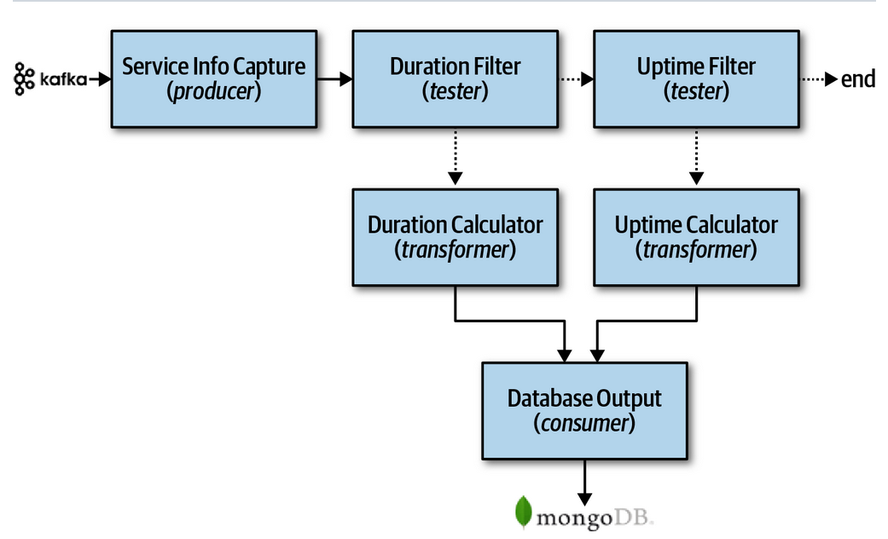

# 1. Programování a softwarový vývoj.

> Vývoj softwarových řešení, specifika implementace webových informačních systémů. Nástroje a prostředí pro softwarový vývoj rozsáhlých systémů. Základní koncepty softwarových architektur z pohledu implementace. Vícevrstvá architektura moderních informačních systémů, architektura model-view-controller. Persistence, ORM. Příklady z praxe pro vše výše uvedené. (PA165 || PV179)

[PA165 Enterprise Java](https://is.muni.cz/auth/el/fi/jaro2021/PA165/um/)

[PV179 Systémy v .NET](https://is.muni.cz/auth/el/fi/podzim2022/PV179/)

## Vývoj softwarových řešení
- Vývoj sw řešení se obvykle skládá z kroků:

    - Analýza     
    - Návrh
    - Implementace
    - Testování
    - Nasazení
    
    Více v otázce [Softwarové inženýrství](./s3_softwarove_inzenyrstvi.md)

- Klíčové je zajistit pravidelnou a dobře definovanou komunikaci mezi stakeholdery (nejen na začátku, ale i v průběhu vývoje), definovat ubiquitous (jednotný?) language a vynucovat jeho používání, aby v rámci úzce spolupracujících skupin nedocházelo k vytváření vlastních výrazů a následnému neporozumnění mezi skupinami.

- Při vývoji se často používá kontinuální integrace a nasazení (CI/CD), čímž se mohou vynucovat standardy (dobré pro udržitelnost kódu) a spouštět se automatizované testy. Bývá součástí verzování kódu.

- klíčovou součástí analýzy a návrhu bývá dekompozice (a abstrakce) na komponenty, při které dělíme komplexní systém na jednodušší nezávislé části, abychom nemuseli neustále držet v hlavě kontext celého systému. Cílem je minimalizovat závislost mezi komponenty a dodržovat SOLID principy. [Více v Kvalita kódu](./2_kvalita_kodu.md).

- komponenty systému mají dobře definovaný kontrakt, nezávisí na konkrétních implementacích, ale na abstrakcích (e.g. parametr metody je typu interface, ne konkrétní struktura)

## Specifika implementace webových informačních systémů

- Webové informační systémy se obvykle skládají z několika částí:
    
    - **Uživatelské rozhraní/frotnend/klient** je zpřístupněno uživateli skrz prohlížeč. Základními stavebními kameny jsou HTML, CSS a JavaScript/Web Assembly. Tradičně šlo o **multipage aplikace** renderované na serveru (šablonovací systémy jako python\jinja, rust\askama, php má šablonování přímo v sobě), po každém požadavku proběhlo překreslení. Nedávno byl trend **singlepage** aplikací renderovaných na klientovi (založeny na JS frameworcích jako React, Vue, Svelte, Solid, nebo WASM (aktuálně defaultně) rust\yew), kde po iniciálním načtení aplikace putovaly mezi klientem a serverem jen data. Aktuální trend je používat fullstack/meta frameworky (NextJS, SvelteKit, rust\leptos...), kde prvotní vykreslení je na serveru a následně se web chová jako SPA (ale umožňuje vícero modů fungování, třeba plně static-site generation). Toto platí zvlášť pro menší projekty, protože fullstack framework umožňuje vývoj frontendu i backendu na jednom místě.
    - **Aplikační server/backed** slouží k vykonávání aplikační logiky, zpracovává požadavky klienta a odpovídá na ně, zajišťuje autentizaci a autorizaci. Stav systému propisuje do databáze, obvykle je server bezstavový. Použávají se general-purpose programovací jazyky (Rust, JS/TS, Go, C#, Python, Java).
    - **Databáze** uchovává stav systému. Tradičně se používá relační databáze (Postgres, MySql, Oracle), ale může být vhodnější použít dokumentovou (MongoDB) či grafovou (Neo4j).

Webové informační systémy mají tyto specifika:
- **snadnost aktualizací klienta**, na rozdíl od desktop aplikací není potřeba ze strany uživatele nic explicitně stahovat a instalovat
- nutnost **responzivního a přístupného uživatelského rozhraní**, ke kterému uživatelé mohou přistupovat i z mobilních zařízení, prohlížeče usnadňují implementaci přístupnosti (vada zraku, přístup pouze pomocí klávesnice...)
- většinou **tenký klient**, aplikační logika se provádí z pravidla na serveru.
- webové systémy bývají (pokud není řešeno jinak) přístupné z celého internetu, proto je důležité vhodně řešit **autentizaci a autorizaci**, a jejich **zabezpečení proti útokům** (například SQL injection, XSS, CSFR, více níže).
- mohou být používané větším množstvím uživatelů, proto je vhodně třeba řešit škálování (vertikální větším výkonem nemusí stačit, horizontální vícero stroji nemusí být vždy aplikovatelné). Aplikační servery je možné díky jejich bezstavovosti škálovat horizontálně, databáze se obvykle řeší vertikálně, či použitím distribuované databází (Cassandra). Základem zvyšování výkonu systému je kešování (Redis).
- Obvykle se používá model klient-server

### Útoky
- **SQL injection** do vstupního pole vložíme specifický string, který dokáže způsobit akci v databázi (e.g. vstup `ahoj; DROP TABLE Users; --`)
    - obrana pomocí prepared statements
- **Session hijacking** útočník se zmocní cookie/tokenu, který se používá pro prokázání identity. Tokeny ukládáme jako cookie (nejbezpečnější, pro mobilní aplikace je v pohodě local storage)
    - obrana pomocí nastavení cookie jako "Secure" (lze poslat jen skrz https) a "HttpOnly" (nelze číst/upravit pomocí JS)
- **Cross site scripting (XSS)** - útočník vloží na web obsah, který je validní html/js a oběti se zobrazí/spustí při načtení stránky. 
    - obrana pomocí sanitizace vstupů
- **Cross site request forgery (CSRF)** - útočník připraví a pošle klientovi URL odkaz vyvolávající akci na serveru. Případně je na toto URL přesměrován uživatel z útočníkova webu. 
    - obrana pomocí CSFR náhodných tokenů (jednorázově vydaný s GET požadavkem dávající uživateli přístup k akci)
    - obrana pomocí cookie atributu "SameSite", který modifikuje, kdy se cookie posílá při cross-site požadavcích.
    - obrana pomocí explicitního potvrzení (nebo MFA) u důležitých akcí
- **Clickjacking** útočník na svém webu zobrazí průhledný ifame nad svou stránkou. Uživatel si myslí, že kliká na tlačítko útočníkova webu, ale ve skutečnosti kliká na web v iframe, čímž může vyvolat nechtěnou akci
    - obrana pomocí `X-Frame-Options` hlavičky
- **Phishing** útočník vytvoří vizuálně identický web, na kterém chce po uživatelích přihlášení
    - obrana pomocí kontroly domény uživatelem, nutný trénink uživatelů
    - pomoct může přizpůsobení webu - pokud je uživatel zvyklý vídat u kritických akcí svou fotku a všimne si, že na útočníkově webu chybí, může pojmout podezření

### Auth
Více v [Bezpečný kód](./dev_3_bezpecny_kod.md)

#### Autentizace 

- ověření identity
- **Session based** - uživatel poskytne údaje, server vydá cookie, kterou si udržuje (db/paměť). Uživatel následně s každým požadavkem zasílá cookie, podle které server ověří a rozpozná uživatele
- **Token based** - uživatel ověří svou identitu, server zapouzdří údaje o uživateli do tokenu, který podepíše, čímž zajistí, že je možné detekovat modifikaci. Uživatel následně zasílá token, kterým prokazuje svou totožnost, mohou zde být i informace o právech. Na rozdíl od sessions nemusí díky certifikátům servery nic držet v paměti, jde o řešení vhodné pro použití s vícero servery/systémy, nebo když se uchovávají sessions v databázi a databáze začíná být bottleneck. Tokeny se nedají revokovat ze strany serveru => dává se časově omezená platnost
- pokud nám nevadí používat autorizaci poskytnutou střetí stranou, bývá nejbezpečnější a nejjednodušší řešení použít federalizovanou identitu. Pokud opravdu chceme ukládat uživatelská hesla, ukládáme heše (se solí) získané aktuálně doporučovaným Argon2 (může se změnit).

#### Autorizace

- ověření práv k určité akci

### Používané technologie

- **HTTP basic** - http header `Authorization: Basic <data>`, kde `<data>` jsou `<jmeno>:<heslo>` v base64
    - `-` hlavička je viditelná (=> použij aspoň https), údaje se zasílají s každým požadavkem
- **TLS certifikáty** - server musí poskytnout certifikát, klient může poskytnout certifikát, čímž se autentizuje
- **OAuth2** - protokol pro poskytnutí autorizace třetím stranám, funguje na principu vydávání tokenů (Refresh token, Access token)
- **OpenID Connect** - nadstavba nad OAuth2, přidává autentizaci a informace o identitě uživatele. Používá se pro federalizovanou správu identity (single sign-on). *Klient* je aplikace, která potřebuje autentizovat uživatele. *Autorizační server* autentizuje uživatele, vydává token autorizující držitele k přístupu ke *scopes* obsahující *claims* (e.g. scope profil pro claimy id, email, name, picture, locale...) umístěných na *resource serveru*. Resource server slouží jako endpoint pro poskytování claimů na základě scopes v tokenu
- **SAML** - xml protokol pro výměnu autentizačních a autorizačních dat, starší než oauth/oidc
- **Kerberos**

## Nástroje a prostředí pro softwarový vývoj rozsáhlých systémů
Pro vývoj rozsáhlých systémů se používají následující typy nástrojů

- **Editory a vývojová prostředí** v ideálním případě (pokud jazyk podporuje Language Server Protocol) zavisí na preferencích vývojáře. Je možné použít od jednoduchých editorů až po plně integrovaná vývojová prostředí (vim/neovim, vscode, jetbrains produkty).
- **Verzovací systémy** umožňují správu verzí zdrojového kódu a spolupráci vývojářů (git, SVN). Obvykle běží na platformě, která může být hostovaná (github, gitlab), nebo kterou si hostujeme sami na vlastních serverech (gitlab). Platformy obvykle nabízí víc, než jen správu zdrojového kódu (CI/CD, issue tracking..)
- **Nástroje pro správu projektů** slouží pro správu úkolů, sledování chyb a komunikaci v týmu (Clickup, Jira, ale i třeba Github).
- **Nástroje pro testování** umožňují vytvářet a spouštět testy, simulovat uživatelské interakce, ověřovat funkčnost systému (Jest, cargo test, Insomnia, Postman)
- **Nástroje pro kontinuální integraci a nasazení** automatizují spouštění testů a sestavení výsledného produktu (github workflows, gitlab CI/CD, circle ci, Travis CI, Jenkins).
- **Monitoring a logování** slouží pro sledování výkonu systému a analýzu chyb a problémů (Grafana)
- **Dokumentační nástroje** popisující fungování systému a jeho částí. Dokumentaci zdrojového kódu je vhodné z něj generovat, aby se minimalizoval problém neaktuálnosti (cargo doc, OpenAPI (machine-readable JSON/YAML formát, je možné ho generovat z anotací, nebo z něj generovat příklady, dokumentaci), pro jednoduchý formátovaný text Markdown). Dokumentace je důležitá zvlášť pro vystavované API
- **Kontejnerová prostředí** slouží pro minimalizaci rozdílů mezi prostředími, usnadňují reprodukovatelnost, ve kterých aplikace běží (vyvojové, testovací, produkční) (Docker, Podman).
- **Nástroje pro analýzu kódu** kontrolují dodržování standardů, zajišťují určitou kvalitu kódu, hledají potenciální chyby/slabá místa (cargo clippy, ESLint, SonarQube).

## Základní koncepty softwarových architektur z pohledu implementace, Vícevrstvá architektura moderních informačních systémů, Architektura model-view-controller

- **model Klient-Server** - klient slouží jako uživatelské rozhraní. Server zpracovává požadavky zasílané klientem a odpovídá na ně. Server dle požadavku klienta provádí aplikační logiku, přistupuje k databázi...

- **architektura MVC - model, view, controller** - architektura oddělující systém na model, view a controller. model obsahuje data a business logiku. View  je zobrazením těchto dat a controller slouží k manipulaci nad modelem. Jde o cyklický vztah:  -->

    `USER  (uses)>  CONTROLLER  (manipulates)>  MODEL  (updates)>  VIEW  (shown to)>  USER`

    - oddělení logiky zvyšuje modulárnost kódu, který je pak snadnější upravovat, testovat, udržovat 
    - e.g. multipage web

- **Vrstvená architektura** - Dělí monolitický systém na vrstvy, každá je zodpovědná za určitou část aplikace. Vrstva využívá služeb vrstvy pod ní. Každá vrstva může být otevřená/uzavřená, otevřené vrstvy je možné přeskočit.
    - **Presentation** - closed, UI, klient
    - **Business** - closed, zpracovává business logiku
    - **Service** - open, obsahuje sdílené komponenty business vrstvy (autentizace, logování)
    - **Persistence** - closed, slouží k přístupu do databáze
    - **Database** - closed, čistě databázová vrstva

    - jednoduchá na vývoj, levná, vhodná pro projekty s velmi omezeným časem/rozpočtem, vhodná pokud si nejsme jistí co použít
    - není odolná vůči chybám, pád části = pád celého systému, relativně dlouhý startup
    - vrstvu je možné nasadit samostatně a zlepšit tak škálovatelnost systému
    - e.g. eshop

- **Pipeline architektura** - monolitická, funguje na principu MapReduce, skládá se z 
    - **pipe**, point-to-point komunikace
    - **filter**, komponenty transformující data, bezstavové, ale mohou zapisovat do db. Filter se má soustředit čistě na jednu úlohu. Jsou typy
        - **Producer** - zdroj, iniciátor akce
        - **Transformer (map)** - transformuje vstup na výstup
        - **Tester (reduce)** - testuje kritérium a potenciálně vyprodukuje (mimo předání dat bez modifikace dál) výstup, který může vyvolat akci (zápis do datbáze)
        - **Consumer** - ukončuje akci
    - e.g. unix terminal
    

- **Microkernel architecture** - monolitická, dělí systém na jádro (core) a (ideálně) plug-in komponenty, aplikační logika je v těchto komponentech.  Jednoduchá rozšiřitelnost, adaptabilita, customizace
    - Jádro obsahuje minimální nutnou funkcionalitu, která se rozšiřuje skrz pluginy
    - Pluginy by měly být nezávislé, připojitelné za běhu, mohou mít vlastní db, mohou být vzdálené a komunikovat s jádrem přes e.g. REST.
    - Pluginy jsou obvykle dostupné z nějakého registru, kde jsou data jako název, kontrakt, detaily pro připojení pluginu.
    - Důležité je dobře definovat standardizované kontrakty, které musí pluginy splňovat

    - e.g. VS Code - jádro je textový editor, pluginy jsou extensions

- **Servisně orientovaná architektura (SOA)** - hybrid mezi monolitem a microservices.
    - separátní UI (může jich být více), separátně nasazené služby (obvykle 4-12), každá se soustředí na jednu úlohu (nebo část systému), sdílená db, služby jsou interně tvořeny vrstvenou architekturou/děleny dle domény
    - Pokud služba využívá část databáze, kterou žádná jiná služba nevyužívá, je možné tuto část oddělit do vlastní databáze.
    - pokud chceme jednotné API, používá se vrstva fasády, která přeposílá komunikaci jednotlivým službám
    - ACID transakce (microservices mají BASE), fajn pro konzistenci a integritu, ale úprava znamená nutnost testu celého systému
    - fajn pro domain driven design bez přílišné složitosti
    - fajn když potřebujeme ACID

- **Microservices**
    - cílem je vysoká nezávislost jednotlivých služeb, mohou být implementovány v různých programovacích jazycích
    - každá služba se stará o nutné minimum, služby fungují nezávisle
    - nesdílí se DB
    - duplikace je akceptovatelná, když se sníží provázanost

## Persistence, ORM
- zabývá se uchováním dat mezi jednotlivými běhy aplikace/restarty systému/požadavky klienta
    - **Relační databáze** - nejběžnější způsob uchovávání data v sw systémech. Data jsou strukturována do tabulek obsahující sloupce, řádek tabulky = datový záznam. Vztahy mezi daty se řeší relacemi, odkazy na primární kíč jiné tabulky. Pro manipulaci nad daty se využívá SQL (structured query language). (Postgres, MySql, Sqlite). Jsou široce podporovány v programovacích jazycích, je potřeba dávat pozor na sql injection (rust/sqlx). Při použití SQL v aplikacích se doporučuje použít Repository/DAO pattern, případně CQRS.
    - **Objektově relační mapování (ORM)** umožňuje mapování objektového modelu aplikace na relační databázi. Výhodou je, že není nutné psát přímé SQL dotazy a kód je (měl by být) agnostický k použité databázi, může však vzniknout problém s neodstatečnou kontrolou nad dotazem/nutností tvorby specializovaných struktur/tříd. Složitější dotazy mohou být ve výsledku podobně komplikované, jako vlastní sql dotaz. Problém může působit i výkon (js\prisma, rust\diesel, java\hibernate)
    - **Souborový systém** - data je možné ukládat přímo do souborového systému. Toto je vhodné třeba pro obrázky/pdf, ale je potřeba ošetřit, abychom neposkytli přístup k jiným částem systému, než k jakým chceme.
    - **NoSQL** - alternativa k relačním db, umožňují ukládání a manipulaci s nestrukturovanými daty. Oproti relačním databázím poskytují lepší škálovatelnost a flexibilitu, problém může být konzistence (často se používá duplikaci pro vyšší rychlost) (mongodb, cassandra)
    - **Cachování** -dočasné ukládání často používaných dat/výsledků operací. Lze provádět na úrovni RAM, před databází, před serverem... (redis, nginx)

## Dodatečné poznámky
**Validace** - systém dělá to, co se od něj čeká (v rámci požadavků)
**Verifikace** - systém dělá věci správně interně
**DAO** - data access object, abstrahuje přístup k databázi/persistenčnímu mechanismu
    - umožňuje výměnu persistenční technologie, aniž by bylo třeba zasahovat do jiných vrstev
    - usnadňuje testování business logiky
    - obvykle jeden na entitu, CRUD
**DTO a.k.a. Value Object** - data transfer object, zapouzdřuje data pro komunikaci mezi vrstvami
**Inversion of Control** - struktura má pole (třeba connection pool), které používá pro své fungování (závisí na něm). Nemá si pole tvořit sama, naplnit ho z parametru konstruktoru/jiným způsobem.
**Dependency Injection** - existují frameworky, které asistují s IoC pomocí injekce závislostí přímo do polí struktur "automaticky" (rust\di, java\spring)
**Aspect Oriented Programming** - technika, kde se definuje aspekt, který je volán pokaždé definované akci. E.g. pro logování - aspekt je definován jednou a je řečeno, že se má provádět pro všechny metody. Není nutné upravit každou metodu, aby explicitně logovala.

Software as a service, Platform as a service (staráme se jen o vývoj, vše ostatní zajišťuje služba, e.g. Heroku), Infrastructure as a service (pronajímáme si infrastrukturu, e.g. klasický cloud, AWS, azure, gcp...)

**CORS** - zabraňuje, aby skript z prohlížeče komunikoval se serverem odjinud, než z webové aplikace. E.g. pokud z klienta SPA myweb.com chci poslat asynchronní dotaz (pomocí fetch API) na other.com, tak pokud other.com explicitně nepovolí přístup, prohlížeč můj požadavek neodešle.

- **Message queue** - namísto synchronního zpracování je možné použít message queue (používá se často interně v distribuovaných systémech, není nutné okamžité zpracování, usnadňuje load balancing, je možný broadcast, zprávy mohou být persisted, ...) (apache kafka, rabbit mq). Možné problémy: delay/blížíme se plné frontě (=> flow control), cíl doručení není dostupný a je důležité doručit (=> ulož do error queue, aby bylo možné zprocesovat později/ručně), zpráva dorazí vícekrát (=> služby dělej idempotentní). Obecně dokumentuj možné nestandardní chování a způsoby řešení problémů, měj recovery mechanismy. Queue (musí se doručit aspoň jednomu) vs Topic (publisher-subscriber model).

- **Continuous integration** - pravidelně sestavujeme výsledný systém (děláme malé a relativně jednoduché změny), automaticky testujeme výsledek
- **Continuous delivery** - pravidelně sestavujeme výsledný systém tak, že by mohl být okamžitě vydán, automaticky testujeme výsledek
- **Continuous deployment** - pravidelně dodáváme, automaticky testujeme výsledek

- **Regresní testy** - provádí se po změnách, abychom detekovali nechtěné efekty

#### REST (Representational State Transfer)
- nejpoužívanější styl/způsob tvorby rozhraní webových aplikací (ne protokol), vychází z HTTP, požadavek má syntax `<metoda> <uri>`
- zdroje identifikovány URI, mohou mít různou podobu (JSON, XML, HTML, PNG...)
- užívá HTTP metod
    - **GET** - pro získání dat
    - **HEAD** - pro získání metadat - hlavička je totožná s GET, ale v odpovědi není přítomno tělo
    - **POST** - požadavek, aby cílový zdroj zpracoval data obsažená v těle. Obvykle se používá pro akce/přidání nového prvku do kolekce (login, přidání příspěvku...). V případě tvorby prvku bývá pravidlem vrátit nově vytvořené ID v odpovědi
    - **PUT** - jako post, ale součástí požadavku je ID. Prvek s tímto ID má být upraven novými daty (v těle), nebo vytvořen právě s tímto ID
    - **PATCH** - jako put, ale v těle nemusí být všechna pole upravovaného prvku - změnit se mají jen ta pole, která jsou přítomná
    - **DELETE** - požadavek o odstranení dat
    - dále existují **CONNECT**, **OPTIONS** a **TRACE**

*safe* metody nemění stav na serveru (get, head, options, trace)
*idempotentní* metody splňují vlastnost, že vícero identických požadavků má stejný efekt, jako jediný požadavek (všechny, kromě POST, PATCH (není zcela standardizované chování) a CONNECT) 
- RESTové služby jsou bezstavové (pro vyhodnocení požadavku by nemělo být nutné znát nic, co není v požadavku obsazeno, e.g. namísto `GET /nextPage` se použije `GET /pages/2`)
- některé metody jsou kešovatelné
- v komunikaci mohou být prostředníci (třeba cache, proxy, load balancer..), o kterých klient neví
**Best practices**
- konzistentní pojmenovávání zdrojů
- vztahy řešíme pomocí URI (e.g. `GET /users/1/orders` vrací objednávky uživatele 1)
- je v cajku udělat alias (e.g. `/me`, `/trends`)
- používání správných metod, přemýšlíme v rámci CRUD operací
- filtrování a řazení řešíme pomocí query parametrů (`/users?active=true&sort=name`)
- verzování API
- metody, které vytvářejí/upravují by měly vracet výslednou podobu
- aktuálně je preference pracovat s JSON
- používání správných HTTP návratových hodnot

#### HATEOAS (Hypermedia as the engine of application state)
- jakýkoliv zdroj (URI) vrácený serverem může být předmětem další komunikace
- k entitám přidáváme href

#### WSDL (web services definition language)
- standardizovaný způsob popisu rozhraní webových služeb (jméno, lokaci, podporované protokoly, operace, formát zpráv..), asociován se SOAP

#### SOAP (simple object access protocol)
- komunikační protokol pro web services, umožňuje výměnu dat, vzdálená volání funkcí
- slouží jako jednotná vrstva mezi službami (aktuálně se používá spíš gRPC)

#### Java specifické věci

**Servlety** jsou komponenty umožňující zpracování požadavků a zaslání odpovědi (a.k.a. handler). **Java Web Containers** poskytují servletům runtime a starají se o další věci (e.g. sessions), může v nich běžet vícero web aplikací ve WAR (web archive). Alternativně je možné použít lehčí variantu, e.g. spring boot **Java Server Pages** umožňují psát javu do html (server-side), obdobně jako php