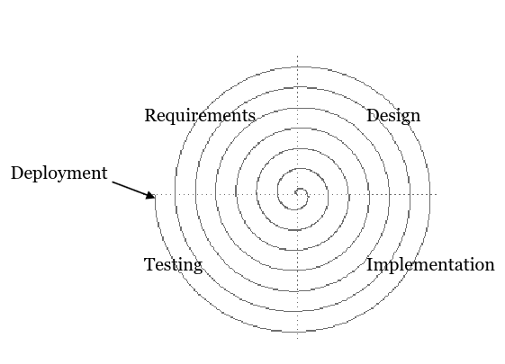
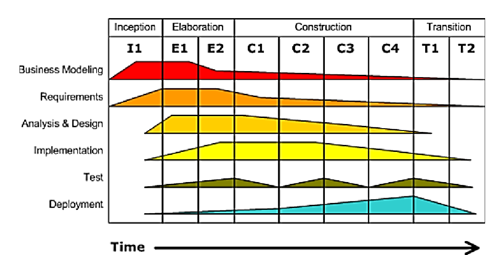

# Softwarové inženýrství

> Životní cyklus SW, proces vývoje a řízení softwarového vývoje. Metodika (Rational) Unified Process (UP, RUP), agilní metodiky a principy agilního vývoje SW. Nasazení a provoz softwarových systémů. Údržba softwarových systémů, znovupoužitelnost. Příklady z praxe pro vše výše uvedené. [PA017](https://is.muni.cz/auth/el/fi/podzim2020/PA017/um/cz/)

## Životní cyklus sw, proces vývoje a řízení softwarového vývoje

Vždy nějakým způsobem obsahuje fáze analýza, návrh, implementace, testování a provoz (včetně nasazení). Rozdíly jsou v tom, zda a jakým způsobem dělíme projekt na uchopitelnější části. Důsledkem toho jsou i různé způsoby, jakým se vývoj řídí.

Existuje několik základních modelů

- **Vodopádový model**
    - Skládá se z:
        - **Analýza**
            - sběr požadavků klienta
            - Je důležité rozlišovat mezi tím, co říká že potřebuje, a co skutečně potřebuje. Pro lepší představu můžeme sledovat, jak koncový uživatel pracuje se současným řešením.
            - zajímá nás **co** a **proč**, často ale klient zmiňuje **jak**. V takových případech je důležité se ptát **proč**. Může jít o legitimní důvod, ale také třeba o nevědomost.
            => studie proveditelnosti, dokument požadavků...
        - **Návrh**
            - návrh architektury, jednotek, výběr technologií, plán testování
            => diagramy (uml), wireframy, prototypy
        - **Implementace**
            - tvorba systému dle návrhu
        - **Testování**
        - **Provoz**
    - i.e. nejprve sesbíráme všechny požadavky, pak sw jako celek postupně navrhneme, implementujeme, otestujeme a nasadíme
    - Výhody:
        - snadný na řízení
        - pokud vše jde hladce, je to nejlevnější způsob
    - Nevýhody:
        - většinou všechno nejde hladce
        - špatně se reaguje na změny (musíme se vracet do předchozích fází modelu)
        - zákazník předem nedokáže přesně a úplně definovat, co potřebuje
        - v praxi nejsou kroky v tomto pořadí dodržovány (testovat chceme ideálně při vývoji, něco chceme ukázat netrpělivému zákazníkovi...)

- **Inkrementální model**
    - Projekt se rozdělí na inkrementy, části, které budou vyvíjeny a dodávány postupně, pro každý si uděláme jednoduchou rámcovou analýzu
    - Inkrementy se vyvíjí v pořadí podle priority
    - Po nasazení do systému máme o inkrementu od zákazníka zpětnou vazbu
    - O nutnosti změny se dozvíme dříve a její zavedení bude levnější (není třeba vše překopávat, přidáme změnový inkrement)

- **Spirála**

    - kombinace iterací a vodopádu, důraz na analýzu rizik
    - vývoj probíhá v cyklech, každý má několik fází
    - fáze
        - **Analýza**
        - **Návrh**
        - **Implementace**
        - **Testování, zpětná vazba a plán dalšího cyklu** - zpětnou vazbu používáme pro práci v dalším cyklu
    - oproti iteraci nemusíme mít po každé iteraci hotovou část nasazeného systému.
    - cykly aplikujeme i na jednotlivé fáze vodopádu
    - lépe pracujeme s nejistotou, ale trvá to dýl

- **Prototypování**
    - vytvoříme prototyp systému, abychom porozuměli, jakým způsobem chce zákazník systém používat a co od něj očekává
    - po analýze prototypu ho zahodíme a začneme práci na reálném systému, využijeme vhodný model

- **Model výzkumník**
    - navrhni systém a implementuj ho. Vyhovuje? Super. Nevyhovuje? Zpět k návrhu/implementaci
    - nelze pořádně řídit, neexistuje dokumentace, řešitelé jsou obtížně nahraditelní, jde o experimentování 

- **V procesní model**
    - alá vodopád, ale zobrazuje i různé testy k fázím (jednotkové, integrační, systémové, uživatelské, akceptační...)

Nezávisle na modelu je důležité nastavit správnou komunikaci, definovat a používat jednotný jazyk. Pokud chceme cokoliv řídit, je potřeba mít informace o aktuálním stavu, dodržování plánu, očekávaných změnách, problémech...

Hlavní metodiky řízení sw projektů jsou **prediktivní metodiky (e.g. RUP)** a **agilní (e.g. SCRUM)**.

## Metodika (Rational) Unified Process (UP, RUP)
- rigidní, důraz na procesy
- vhodná, pokud máme jasné a pevné požadavky
- vyžaduje podstatné plánování předem
- iterativní a inkrementální
- řízena riziky, use-case požadavky
- argitektura je středobodem
- umožňuje pevnou kontrolu nad procesy a týmem
- vhodná, pokud potřebujeme pořádnou dokumentaci (UML diagramy)
- hodí se pro velké a heterogenní produkty, velké týmy...
- Výhody:
    - zákazník není při vývoji potřeba, definice produktu je zakotvena v kontraktu (přesně ví, co dostane)
- Nevýhody
    - pracujeme s fixními deadliny, rozpočetem i funkcionalitou
        - v reálu se deadline a rozpočet může lehce měnit v závislosti na vývoji
    - změnové pořadavky jsou problém
    - potřeba více času k plánování
    - složitý kontrakt, je třeba myslet na všechno (exhaustive kritéria přijetí, penále...)

- iterace jsou seskupovány do fází
    - **Inception** (1 iterace)
        - řešíme feasibilitu, zachycujeme klíčové požadavky, rizika
        - na konci známe cíle
    - **Elaboration** (2 iterace)
        - řešíme požadavky, architekturu, hrajeme si s UML diagramy
        - na konci máme architekturu, návrh systému reflektující požadavky 
    - **Construction** (4 iterace)
        - tvoříme systém, testujeme, nasazujeme
    - **Transition** (2 iterace)
        - hledáme a opravujeme chyby, děláme manuály, poskytujeme konzultace

- iterace by neměla překročit 3 měsíce, přínos iterace je **inkrement**, každá iterace obsahuje workflows, které jsou více či méně přítomné. Pro každé workflow se používají určité UML diagramy
    - **Business modelování**
        - activity diagram
    - **Požadavky**
        - use case diagram
    - **Analýza a návrh**
        - sequence, collaboration diagrams
    - **Implementace**
        - class, object, component diagrams
    - **Testování**
        - use case, class, activity diagrams
    - **Deployment**
        - deployment diagram

RUP je konkrétní metodika stavějící na UP (přidává třeba jednotlivé role a odpovědnosti v týmu, konkrétní postupy...), UP je obecný rámec

## Agilní metodiky a principy agilního vývoje SW
- flexibilní, důraz na lidi
- vhodná, pokud se požadavky mění, není jasná kýžená výsledná podoba systému, nebo zákazník požaduje něco hmatatelného relativně brzo
    => není přesné datum dokončení
- vyžaduje minimální plánování předem
- klíčová je dobrá komunikace a spolupráce týmu
- automatizované testování
- variabilita funkcionality (vývoj postupuje tak, že když dojde čas/peníze, tak se ptáme zákazníka, zda něco přihodí, nebo zda vyškrtneme nějakou část systému)
- face-to-face komunikace, rychlé meetingy - rychlejší, získáme lepší porozumnění
- jednoduchá dokumentace - dokumentace těžko udržuje tempo s realitou, proto ji držme co nejjednodušší, ideálně navázanou na kód
- častá setkání se stakeholdery (sprint review), prezentace nové funkcionality (lepší, než jen popis)
- e.g. 
    - extreme programming - osvědčené postupy tahá do extrému (osvědčuní se reviews? => dělej reviews co to jde)
        - párové programování, důraz na testy, refaktorizaci, kód je single source of truth (dokumentaci generujeme z kódu, používáme schéma pro generování ostatních věcí...)
        - rychlá zpětná vazba, důraz na jednoduchost, malé inkrementy

### SCRUM
- nejšastěji využívaná agilní metodika
- iterativní, inkrementální
- jednoduchý, očeává se použití i dalších nástrojů/procesů
- vhodný pro menší týmy (<=15 lidí)
- hodí se, když máme tým schopný samostatnější práce, potřebujeme rychle vytvořit aspoň nějaký produkt

- role
    - **product owner** - reprezentuje stakeholdery, má největší přehled o požadavcích na produkt, spravuje product backlog
    - **scrum master** - zodpovědný za dodržování scrumu, řeší procesy
    - **tým vývojářů** - 3-9 lidí, soběstačný (má lidi na všechno) a sebeorganizující se, spravují sprint backlog, zodpovědní za doručení produktu

- artefakty
    - **product backlog** 
        - obsahuje veškerou zbývající požadovanou funkcionalitu ve formě **user stories** (jednotka funkcionality z pohledu uživatele)
        - každé story má **story points** reprezentující časovou náročnost odhadnutou pomocí planning poker
            - planning poker - pro každé story každý z týmu provede odhad, odhady se zveřejní najednou. následuje diskuze, dokud se na bodech za dané story všichni neshodnou
        - tvořen celým scrum týmem, spravuje ho product owner
        - v praxi jde o tabuli (reálnou/virtuální) se sticky notes
    
    - **sprint backlog** 
        - část product backlogu (množina user stories), která se má provést v daném sprintu
        - stories jsou rozděleny na jednotlivé tasky, u každého je určen časový odhad v hodinách
        - task má fáze Todo, In progress a Done
        - tasky si k práci vybírají vývojáři dle vlastního uvážení, ale žádné (ani user stories) nemohou být v rámci sprintu přidány/odebrány
            - bylo by nutné zrušit celý sprint product ownerem
        - spravován týmem vývojářů
    
    - **product increment**
        - všechny předměty product backlogu, které se splní během sprintu (a.k.a. to, co se za sprint stihne/udělá)
        - tvořen týmem vývojářů, testován zákazníkem, může být released product ownerem
        - je nutné, aby byl použitelný a byl splněn (dle definice scrum týmu)

- události
    - **project planning**
        - tvorba [project charteru](./4_projektove_rizeni.md#pmi-project-management-body-of-knowledge-pmbok)
        - tvorba product backlogu
        - výběr klíčových strategií (komunikace, rizika, řízení změn, kvalita...)
    - **sprint planning**
        - probíhá na začátku sprintu, cca 8 hodin
        - účastní se celý scrum tým
        - vytyčuje se cíl nadcházejícího se sprintu (a.k.a. co chceme udělat), vybíráme věci z product backlogu a přiřazujeme jim tasky
    - **sprint**
        - iterace soustředěná na vývoj funkcionality v spring backlogu, cílem je vytvořit použitelný a potenciálně vydatelný product increment
        - pracuje na něm celý scrum team
        - product owner řešní komunikaci, vývojáři vývojaří, scrum master sleduje dodržování procesů
        - analýza, návrh, implementace, testování
        - max 1 měsíc, všechny sprinty trvají stejnou dobu 
    - **daily scrum**
        - 15 minut každý den, účastní se vývojáři a možná i scrum master
        - co jsem dělal včera, co budu dělat dneska, narazil jsem na nějaké problémy?
    - **sprint review**
        - 4 hodiny, účastní se celý scrum team a klíčoví stakeholdeři (e.g. zákazník)
        - proběhne předvedení inkrementu
        - proberou se případné změny product backlogu
        - případně se přepočítá předpokládané datum dokončení
    - **retrospective**
        - 3 hodiny, účastní se scrum team
        - řeší se procesy, vztahy, nástroje, lidi
        - co nefungovalo, co můžeme zlepšit
        - ideálně se vymyslí jedno zlepšení procesů, které se v příštím sprintu bude používat

- SCRUM může skončit, když
    - product backlog je prázdný (vše hotovo)
    - dojde čas/peníze
    - udělali jsme poslední sprint a je sice co spravovat, ale defekty jsou přijatelné
    - product owner/stakeholder se rozhodne ukončit projekt

- návrh a architektura se mohou dělat průběžně pro jednotlivé user stories, nebo se do procesu zavádí jako standard (e.g. používáme vrstvenou architekturu, používáme tyto technologie...)

- kontrakt se obvykle určuje podle toho, kolik (a jakých) lidí bude za dané období na projektu pracovat
    - super na flexibilitu, ale těžko se určuje výsledná cena/deadline
- zákazník je zatažen do postupu vývoje, může hned dávat zpětnou vazbu, ale tento overhead vyžaduje extra čas

- balancuje se Čas, Cena a Rozsah funkcionalit

## Nasazení a provoz softwarových systémů
- před nasazením je důležité systém otestovat v prostředí, které bude co nejbližší tomu produkčnímu
- klíčové je v provozu logování událostí (abychom v případě chyby věděli, co se v systému dělo), monitoring, systém zpětné vazby
- nasazení zahrnuje přípravu prostředí (instalace os, databází...), lze automatizovat/zjednodušit použitím Platform as a Service, případně kubernetes
- před nasazením do provozu je fajn projít a zkontrolovat dokumentaci, která může být kvůli vývoji neaktuální
- součástí nasazení je i školení uživatelů, abychom předešli neúspěchu z důvodu neochoty/neznalosti používání
- součástí nasazení může být i customizace systému pro specifické potřeby zákazníka (pokud to náš systém umožňuje)

## Údržba softwarových systémů, znovupoužitelnost
- v závěru je fajn si udělat analýzu toho, co (ne)fungovalo, co zlepšit...
    - dosažená produktivida a kvalita
    - použitý proces, odchylky, důvody
    - plán vs realita a důvody (čas, peníze, chyby, FP/LOC...)
    - rizika (plán vs realita, jak jsme řešili rizika a problémy)
    - pracnost (i dle etap)
    - souhrn defektů
    - kauzální analýza - analýza odchylek výkonu u použitého procesu (jak a proč)
    - použité technologie a jejich hodnocení
    - popsat v dokumentu tým a jednotlivce, na které je možné se případně obrátit (třeba když se řeší problém v dalším projektu)
    - aktiva procesu - co vzniklo a může být použito i v jiných projektech (třeba knihovny, checklisty...)
- údržba se může dělat jako samostatný projekt, mohou na to být specializované týmu
- řeší se oprava (i bezpečnostních) chyb, aktualizace a vylepšení (ideálně nějakým způsobem automatizované, ale může být fajn potvrzení uživatele), správu změn (co se jak a proč změnilo)
- znovupoužitelnost se obvykle řeší v rámci jednotlivých služeb/programů/komponent, ale ne znovupoužitím struktur mezi různými projekty (pokud nejde o specializovanou knihovnu) - mohli bychom mít problém v případě změny