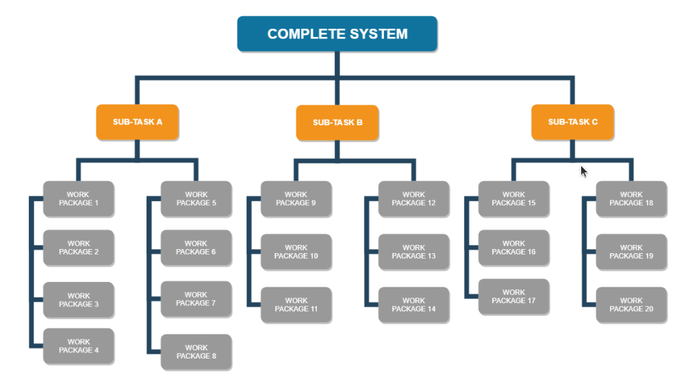
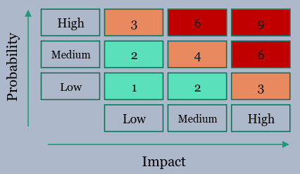
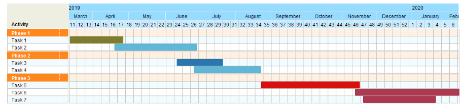
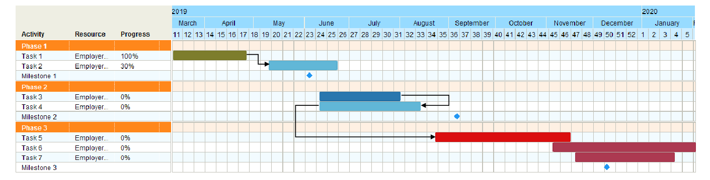
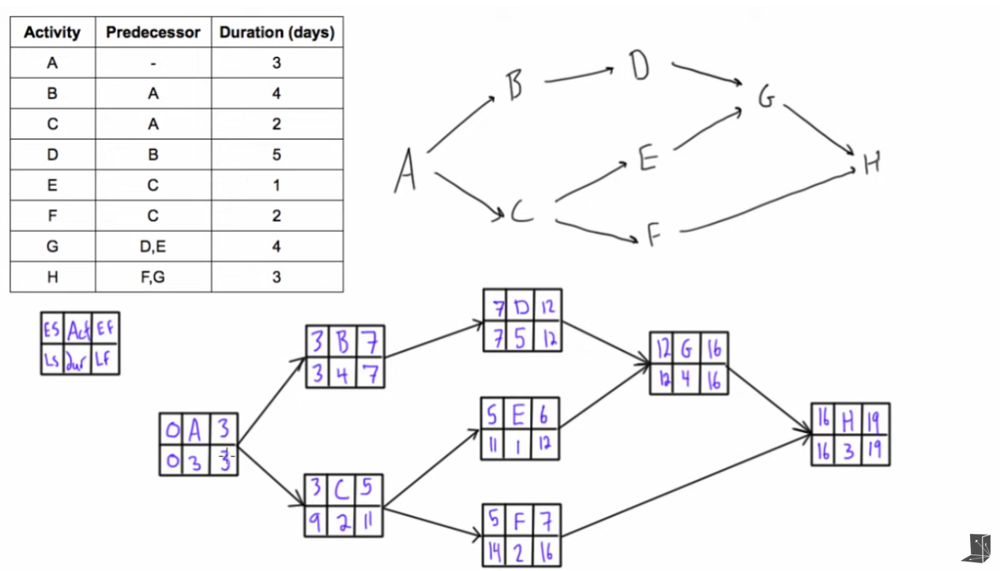
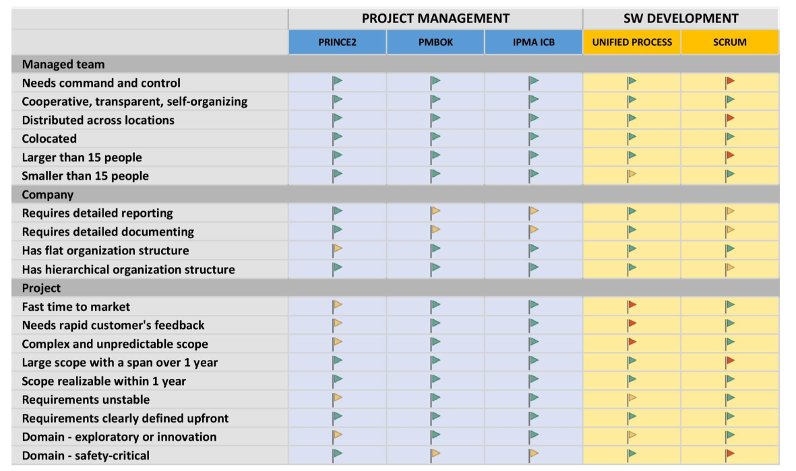
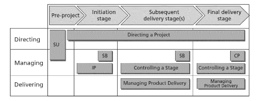

# Projektové řízení. 
> Plánování, řízení rizik, role modelů v projektovém řízení. Ganttovy diagramy, síťová analýza, metoda kritické cesty (CPM), Program Evaluation and Review Technique (PERT). Mezinárodní standardy a metodiky projektového řízení (PMI Project Management Body of Knowledge, PRINCE 2). Příklady z praxe pro vše výše uvedené. [PA179](https://is.muni.cz/auth/el/fi/jaro2022/PA179/um/)

## Plánování

Je třeba rozlišovat mezi
- **Projekty**
    - dočasné - mají start i konec, typické fáze (příprava, provedení, uzavření, případně fáze sw životního cyklu)
    - přinášející změnu, dodávají hodnotu stakeholderům (všem zúčastněným; uživatelům, zákazníkům i dodavatelům produktu...)
    - unikátní - každý má svá specifika (požadavky, zákazníky, tým...), nejedná se o každodenní rutinnou práci firmy
    - plánované
    - opakovatelné prvky projektu (či celé projekty) jsou **procesy** - řízené událostmi, bývají dobře definované (jak postupovat), vizualizované flow chartem
        > proces je opakovatelná série aktivit s definovanými vstupy, výstupy, nástroji, technikami...
    - bývají spojené s rizikem - spojené s unikátností (nikdy jsme to nedělali), deadliny, děláme nějakou změnu
    - **řízení**
        - balanc mezi časem, cenou a rozsahem/kvalitou
        - začneme užíváním standardů (PRINCE2, PMBOK, IPMA), abychom efektivněji komunikovali, koordinovali, zvýšili důvěru stakeholderů, transparentnost, abychom znovu neobjevovali vymyšlené
- **Programy** - skupina dočasných, vzájemně provázaných projektů řízená jako skupina abychom dosáhli cílů, které projekty sdílí
    - **řízení**
        - správa rizik
        - odstraňování omezení a konfliktů z projektů
        - v projektech se přemýšlí a plánuje i s ohledem na jiné projekty programu
- **Portfolio** - skupina projektů a programů, řízená k dosažení dlouhodobých strategických cílů
    - a.k.a. co dlouhodobě nabízíme
    - **řízení** 
        - monitoringem výkonu firmy
        - výběrem a prioritizací programů a projektů

Pro konkrétní projekt je potřeba si zvolit vhodný přístup **prediktivní** nebo **agilní** [viz otázka 3](./3_softwarove_inzenyrstvi.md).

### Agilní plánování
Dále je potřeba u plánování projektů sepsat [Project Charter](./4_projektove_rizeni.md#pmi-project-management-body-of-knowledge-pmbok) popisující základní informace o projektu (proč, co, kdo, kdy, jak, za kolik...), sepsat podrobnosti klíčových strategií (komunikace, rizika, kvalita, změny) a nějakým způsobem začít plánovat práci (product backlog, řešení architektury...).

### Prediktivní plánování

Sepisuje se **Project Initiation Documentation** obsahující detailní Business Case, veškeré informace o projektu (proč, co, kdo, kdy, jak, za kolik), definují se klíčové strategie (komunikace, rizika, kvalita, změny), vše se dokumentuje, vytváří se příslušné registry, vše se schvaluje product boardem (zástupci exekutivy, inženýrů a zákazníků). Do PID se pak zapisují i změny a průběh, aby bylo možné porovnat plán a realtu, je dostupný všem v rámci projektu. 

Dělá se detailní analýza požadavků, spousta Use case diagramů, detailní rozsah sloužící jako základ pro ocenění, design mockupy. Tvoří se **specifikační dokument** produktu - obsahuje požadavky, rozbití systému na komponenty (včetně detailního popisu až po pole vstupních formulářů), očekávánou kvalitu, akceptační kritéria.

Dělá se **projektový plán** (proč, co, kdo, kdy, jak, za kolik...) - **Work Breakdown Structure** tvořená ze specifikačního dokumentu, počítá se čas a cena jedntlivých **Work Package**s (součást WBS, nejnižší jednotka) třeba pomocí [PERT](./4_projektove_rizeni.md#program-evaluation-and-review-technique-pert), jejich závislosti, tvoříme rozvrh (gantt/network diagram), přiřazujeme odpovědnosti (mělo by jít snadno najít aktivity člověka i všechny spojené s aktivitou).
*WBS*

## Řízení rizik
Postup:
1. Identifikace rizik
    - čerpáme z předchozích zkušeností, lesons learned... co a proč se stalo?
2. Ohodnocení rizik
    - každé riziko způsobí náklady, můžeme pro něj odhadnout cenu
    - každému přiřadíme pravděpodobnost a kritičnost dopadu, určíme následky
    
3. Určení odezev na rizika, možnosti:
    - akceptuj - no tak se to stane, no, nevadí, náklady na prevenci by byly vyšší než samotné riziko
    - vyhni se - nastavení plánu, aby problém nemohl nastat (e.g. použití jiné technologie, která tento problém nemá)
    - přesuň (třeba na někoho jiného) - e.g. tento komponent outsourcujeme se solidním SLA, nebo se pojistíme
    - zmenši - sniž pravděpodobnost/míru dopadu rizika, třeba důkladnějším systémem reviews
4. Stanovení monitoringu rizik
    - stanovení odpovědnosti za monitoring rizik
    - určení, kde budou rizika definována, kdy budou revidována a upravována
5. Vytvoření registru rizik

Možné zdroje rizik (nejčastější tučně):
- uživatel - **nemožnost/neochota zapojit se**, odpor ke změnám
- požadavky - změní se, **špatně pochopené**, blbě definované, nejasné či neadekvátní, **přijdou pozdě změny**
- složitost projektu - komplexní doména, použití nové/nezavedené technologie
- management - **neefektivní řízení**, špatně zvolená/použitá metodika/standard, **špatný odhad nákladů/zdrojů/času**, špatně určená komunikace, **nezkušený manažer**
- tým - nezkušenost, **málo lidí**, osobní konflikty
- firemní prostředí - nestabilní, změna vedení...
- **subdodavatelé** - opoždění, nedostatečná kvalita, komunikace...

### Specifika prevence u agilního řízení rizik
Prevence:
- **Transparence a zpětná vazba**, abychom předešli nedorozumnění v týmu
- **Používání user stories** - jsou snadno pochopitelné pro zákazníka, dají se dobře ověřovat
- **Jasná definice, co znamená "hotovo"**
- **Krátké iterace** - brzo zjistíme, co je případně blbě
- **Feature groomingy** - krátké meetingy k jednotlivým featurám, kde jsou přítomni všichni důležití lidé a zhodnocují se rizika a implementace

## Role modelů v projektovém řízení

Těžko říct, co se tím myslí; v přednáškách PA179 žádná významná zmínka o modelech nebyla :thinking:
Datové modely? Modelování komunikace, financí, rizik?

V řízení lze modely použít při plánování projektů pomocí [síťové analýzy](./4_projektove_rizeni.md#síťová-analýza), [metody kritické cesty](./4_projektove_rizeni.md#metoda-kritické-cesty-cpm).

Dále je možné modelovat procesy (komunikace), finance, rizika... a na těchto modelech hledat kritická místa, zkoumat co by kdyby...

## Ganttovy diagramy
- nástroj pro plánování (nejen) projektů
V základu toto:

    ale lze rozšířit...

- y osa obsahuje úlohy (případně zdroje)
- x osa zobrazuje čas
- úloha jako uzel/obdélník (šířka udává časovou náročnost), případná hrana značí vztah
- je možné přidat
    - milestones
    - progress
    - zdroje (kdo co dělá, dávají se místo událostí na osu y), pak řešíme problém plánování job-shopu
    - omezení, precedenční podmínky (úloha musí být započata až po dokončení jiné úlohy, něco je možné paralelizovat...)
- obvykle minimalizujeme makespan (čas dokončení poslední úlohy a tedy i celého projektu)

## Síťová analýza

Metody pro modelování souboru činností vedoucích k dosažení nějakého cíle (i.e. projektů).

Cílem je projekt naplánovat, minimalizovat prostoje a náklady, určit termíny, celkovou dobu trvání projektů, identifikovat kritické úlohy v projektu. 

Používá se pro to síťový graf hranově/uzlově orientovaný - úlohy jsou na hranách/uzlech. Uzlově orientovaný umožňuje snadno modelovat precedenční podmínky, lze snadno použít pro metodu kritické cesty.

## Metoda kritické cesty (CPM)

Metoda pro identifikaci vzájemně závislých aktivit, které mají vliv (jsou kritické) na dobu dokončení projektu a nemohou být opožděny bez prodloužení dokončení projektu.

[Postup](https://www.youtube.com/watch?v=4oDLMs11Exs)

- uděláme si graf závislostí, určíme si dobu trvání aktivit
- v prvním průchodu jdeme start => konec, řešíme earliest start/completion time. Když vedou 2 do 1, bereme maximum těch 2.
- v druhém průchodu jdeme konec => start, řešíme latest completion/start time. Když vedou 2 z 1, bereme minimum těch 2.
- kritická cesta obsahuje aktivity, které mají earliest & latest finish time identický
- slack/float udává, o kolik můžeme danou aktivitu opozdit, aniž by došlo ke zpoždění projektu (`latest completion time - earliest completion time`)

## Program Evaluation and Review Technique (PERT)

Technika k odhadu času k dokončení tasku. Bereme **optimistický** odhad, **pesimistický** odhad a **nejpraděpodobnější** odhad

`očekávaný = (optimistický + 4 * nejpravděpodobnější + pesimistický) / 6`

Pokud máme informace o úrovni platů implementátorů tasků, můžeme dopočítat odhadovanou cenu.

## Mezinárodní standardy a metodiky projektového řízení 
- standardy projektového řízení PRINCE2, PMBOK, IPMA ICB popisují obecnější způsob řízení
- metodiky sw vývoje (RUP, SCRUM) řeší řízení v rámci vývojového týmu, jsou specifické pro vývoj SW

### PMI Project Management Body of Knowledge (PMBOK)
- **procesně orientovaný** standard, podrobně popsaná sada good practices
- snadno se používá jako handbook pro vhodné znalostní oblasti a nástroje/techniky při životním cyklu projektu
- vhodný, když
    - manažer potřebuje tipy na nástroje a techniky, jaké by měl použít, ale aspoň trochu tuší co a jak

- 49 procesů (série aktivit s definovanými vstupy, výstupy, nástroji a technikami) dělených do
    - 5 procesních skupin, logické dělení procesů podle fází (inicializace, plánování, provedení, monitoring a řízení, uzavírání)
    - 10 vědomostních oblastí/disciplín projektového managementu, každá má vlastní procesy
        - Integrace 
            - tvorba **Project Charter**u
                - **Business case (proč)** - cíle projektu, hrubá cena, rozpočet, rizka 
                - **Project outcome (co)** - popis, hlavní cíle a požadavky
                - **Stakeholders (kdo)** - externí i interní, řešíme jejich role, potřeby, zapojení a odpovědnosti
                - **Management approach (jak)** - popis použitých standardů, nástrojů, metodik, životního cyklu projektu...
                - **Schedule (kdy)** - hrubý plán projektu, fáze, milestones, Ganttův diagram..
        - Rozsah (scope) - sesbírání požadavků, definice, validace a řízení rozsahu funkcionalit systému, tvorba Work Breakdown Structure
        - Plán - definice a určení pořadí aktivit, odhady časů aktivit, tvorba a řízení plánu
        - Cena - odhad cen a rozpočtu aktivit nebo jednotek práce pomocí Work Breakdown Structure, řízení ceny a rozpočtu
        - Kvalita - plánování, řízení a kontrola kvality
        - Zdroje - odhad nepeněžních a lidských zdrojů, jejich získávání a řízení, tvorba a správa týmů
        - Komunikace - plán, správa a kontrola komunikace a informací o projektu
        - Riziko - identifikace, kvalitativní (míra doparu) a kvantitativní (pravděpodobnost) analýza rizik, jejich monitoring, plán a procesy reagující na rizika
        - Dodavatelé - produkty a služby pocházející mimo náš tým, kontrakty, objednávky, SLAčka, výběr dodavatelů, monitoring výkonu dodavatelů
        - Stakeholdeři - zúčastněné osoby; jejich identifikace, plánování a správa zapojení stakeholderů do projektu

### PRINCE 2 (PRojects IN Controlled Environment)
- standard pro řízení obecného projektu
- předepsaný postup, krok za krokem (spousta formulářů na vyplňování, checklisty)
- součástí není správa požadavků, rozpočtování
- vhodný pro
    - nutnost velkého reportování
    - nutnost kompletní projektové dokumentace
    - tým vyžaduje řád a kontrolu
    - manažery s málo zkušenostmi, hodí se mu podrobný popis postupu

- fáze (hrubě odpovídá UP inception, elaboration, construction a transition)
    - **Starting up** 
        - tvorba **Project brief**
            - řešíme feasibilitu, zachycujeme klíčové požadavky, rizika
            - popis významných požadavků s dopadem na architekturu
            - identifikace actorů
            - identifikace dalších systémů, se kterými máme komunikovat
            - na konci známe cíle, hrubou architekturu
            - co se používá pro podobné systémy? s čím máme zkušenosti?
            - určení použitých technologií
            - určení orientační ceny, časového plánu a rizik
        - plán další fáze
            - **Work Breakdown Structure**
            - identifikace aktivit, dependencí
            - odhad trvání aktivit, stanovení milestones
            - definice rolí a odpovědností
            - tvorba rozvrhu (Gantt/síťový diagram)
    - **Initiation** 
        - tvorba **Project Initiation Documentation** (dokument/vícero dokumentů)
            - obsahuje současný stav projektu, plány, Kdo, Co, Kdy, Jak, Proč, Za Kolik...
            - slouží k definici projektu, určení rámce...
            - schvaluje product board
            - detailní Business Case (důvody projektu, očekávání, cost-benefit analýzu, časovou škálu, ceny, rizika)
            - popis struktury managementu, rolí týmu
            - popis přístupu ke kvalitě, změnám, riziku, komunikaci
            - plán projektu
        - plán další fáze
    - **Delivery**
        - obvykle má více částí (iterací), každá max 3 měsíce, každá má definované měřitelné a ověřitelné milestones 
        - produktový manažer se stará o udržení ceny, termínů, rozsahu a kvality specifikované v PID
        - produktový manažer autorizuje, provádí reviews work packages, reportuje (pravidelně) status, změny, problémy a kvalitu výš, spravuje rizika a problémy
        - týmový manažer provádí týmové plánování (jednotlivých work packages), demonstruje kvalitu produktu, zajišťuje dodání work packages
        - mezi fázemi se hodnotí končící fáze a plánuje (zase WBS, gantt) další, aktualizuje se PID
    - **Close**
        - předání produktu (samozřejmě opět spousta protokolů), nasazení, uzavření všech dokumentů, PID, dokumentace, tvorba end report a lessons learned
        - případné předání projektu ops a maintenance týmu
        - tvorba SLA

- 7 principů (vše máme nějak zdokumentované)
    - **Kontinuální odůvodnění projektu** - proč to děláme? 
    - **Učení se ze zkušeností** -  co (ne)fungovalo
    - **Role a odpovědnosti** - přesně specifikovaná struktura týmu, vymezené práva a odpovědnosti
    - **Řízení po fázích** - po každé fázi děláme review Project brief, provádíme reporting vyššímu managementu
    - **Manage by exception** - řízení soustřeďujeme na části, které se nějak (negativně) vymykají. Nezasahujeme do toho, co funguje. Vytyčíme cíle a tolerovatelné odchylky v kvalitě, času, ceně a rozsahu, určíme zodpovědnosti za nepřekračování
    - **Důraz na produkt** - primární cíl je produkt, ne práce
    - **Přizpůsobení metodiky projektu** - není nutné PRINCE používat úplně doslovně, řádek po řádku. Ne všechny formuláře jsou vždy zcela relevantní

- 7 témat
    - **Business case** - obsahuje očekávané přínosy, rizika, časový a cenový rozsah, důvody projektu... Měl by být neustále aktualizován a držen validní po celou dobu projektu
    - **Organizace** - definice rolí a odpovědností, typy stakeholderů (dodavatel, business/zákazník, uživatel), 3 úrovně managementu (project board pro směrování projektu (obsahuje exekutivu, senior suppliera, senior usera), project manager pro řízení projektu, team manager pro dodávání produktu), manage by exception
    - **Kvalita** - monitoring, akceptační kritéria, určíme si strategii řízení kvality (nástroje, procesy), řešíme kvalitu produktu i manažerských výtvorů (plány, reporty)
    - **Plány** - plánujeme projekt i jednotlivé fáze, Gantt diagram, Work Breakdown Structure je základem plánování
    - **Rizika** - identifikace možných rizik, určujeme způsob reakce na dané riziko na základě ceny prevence, pravděpodobnosti a dopadu, uchováváme registr rizik
    - **Změny** - u požadavků na změnu řešíme prioritu, dopad, kritičnost, zkoumáme možnosti řešení, dle změny upravujeme záznamy a plán
    - **Postup projektu** - porovnáváme realitu s plány (čas, cena, kvalita, rozsah, rizika...), sledujeme zda stále projekt splňuje business case

- 7 procesů
    
    - **Úplný začátek projektu** - nastínění business case, přiřazení klíčových vedoucích osob, studování "lessons learned" předchozích podobných projektů, získání autorizace product boardu
    - **Inicializace projektu** - příprava strategií řízení (rizik, kvality, komunikace, konfigurce), projektového plánu, konkretizace business case, založení dokumentace
    - **Řízení fáze** - řeší produktový manažer, monitoring, reportování významných událostí, řídíme exceptions, revidujeme a schvalujeme práci/nové časti produktu
    - **Řízení dodání produktu** - to samé co řízení fáze, ale řeší to týmový manažer
    - **Směrování projektu** - vysokoúrovňová rozhodnutí, funguje po celou dobu projektu, plán nadcházející fáze, na konci projektu autorizujeme uzavření
    - **Řízení mezi fázemi (managing a stage boundary)** - plán nadcházející fáze, řeší produktový manažer, aktualizace business case a projektového plánu, report předchozí fáze
    - **Uzavření projektu** - řeší projektový manažer, evaluace, předání produktu, návrh board na ukončení

### IPMA ICB
*V otázce není, ale není na škodu znát*
- obecný standard pro vedení projektu
- narozdíl od většiny ostatních obsahuje podrobnou sekci o soft skills
- vhodný, když
    - projekt vyžaduje dobré soft-skills (komunikace, leadership, řešení konfliktů)
    - manažer je zkušený, zná procesy
    - není nutná spousta reportingu
- vhodné pro použití jako handbook pro různé manažerské kompetence
- kompetenční přístup, pro každou ICB popisuje požadované dovednosti a schopnosti, popis a metriky indikátorů kompetence
    > kompetence je aplikace znalostí (knowledge, informace & zkušenosti), dovedností (skill, schopnost aplikovat znalosti) a schopností (ability, použití dovedností efektivně, ve správný čas a na správném místě) k dosažení kýženého výsledku
    - kompetence perspektivy - metody a techniky pro interakci jedinců s prostředím
    - lidské kompetence - techniky pro jednání s jedinci/skupinami
    - praktické kompetence - metody a techniky pro úspěch projektu

### Metodiky
- popsány v [otázce 3](./3_softwarove_inzenyrstvi.md)

## Notes

Specifika IT projektů v porovnání s většinou průmyslových odvětví
- nepřesné/neznámé, časté a měnící se požadavky
- větší nutnost přizpůsobení produktu
- velká složitost
- náročné testování
- neustálý a rapidní vývoj technologií
- možnost globální spolupráce
- projekty mohou v rámci portfolia ovlivnit ostatní projekty (zvlášť při selhání)
- nutnost řízení rizik
- dokončené projekty je často třeba servisovat/poskytovat podporu 

IT Infrastructure Library (ITIL)
- best practices pro **řízení IT služeb**
- fáze
    - **Service strategy** - požadavky, strategie pro zajištění kýženého, finance, co vlastně budeme dělat
    - **Service design** - Service Level Agreement, řešení rizik, security & business compliance
    - **Service transition** - jak měníme stávající služby, řešení deploymentu, uložení získaných znalostí pro budoucí projekty 
    - **Service operation** - dokumentace pro uživatele/helpdesk, řešení incidentů/změnových požadavků/problémů, řešení identit a přístupu k systému
    - **Continual service improvement** - monitoring, logování, aktualizace běžící služby
