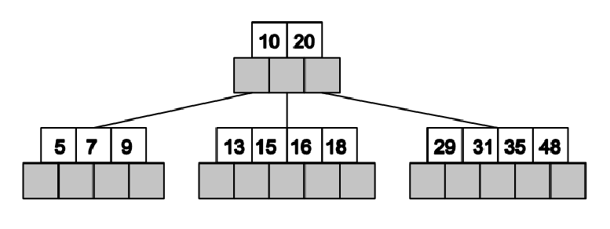
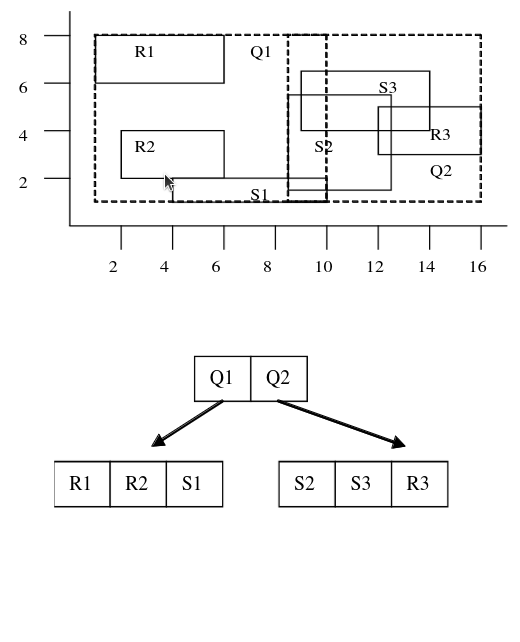

# Databáze
> Principy ukládání dat, databáze a souborové systémy. Kódování a komprese dat. Architektura relačních databází, dotazovací jazyk SQL a jeho části (definice, manipulace, transakce). Jazyk definice datového schématu, DDL. Jazyk manipulace s daty, DML. Relační algebra, integritní omezení, řízení transakcí. Indexování, hašování. Příklady z praxe pro vše výše uvedené. ([PV003](https://is.muni.cz/auth/el/fi/jaro2022/PV003/um/) || PV062)

## Principy ukládání dat, databáze a souborové systémy

Data se v praxi ukládají přímo do souborového systému, nebo do databáze (relační, dokumentové, grafové...).

### Souborový systém
- menší systémové nároky, jednodušší
- náročné zajištění konzistence, nutnost řešení zamykání souborů, problematický transakční přístup
- náročnější správa přístupových práv
- nutnost konzistentně řešit formát dat
- horší čitelnost & dokumentovatelnost datového modelu

- pro aplikace se hodí na ukládání velkých souborů (pdf, obrázky, video, statická stránka, pokud tedy nepoužijeme CDN), které je nepraktické uchovávat v databázi. Je nutné dávat pozor, abychom neposkytli přístup jinam než chceme.

### Databázový systém
- nezávislý na aplikaci, jednotné rozhraní pro všechny
- snadné zabezpečení, konzistence, souběžný přístup
- snadná čitelnost, dokumentovatelnost
- relační systémy korelují s ERD
- deklarativní přístup
- optížná implementace složitějších struktur (záleží však na systému)

## Kódování a komprese dat
TODO

## Architektura relačních databází

*Fun fact: Jaká architektura se v RDBMS používá? To se v předmětu `Architektura relačních databází` nedozvíte*

Nějaká jednoduchá architektura by mohla vypadat takto:
- databázový server 
    - přijímá, zpracovává a odpovídá na požadavky
    - autentizace, autorizace
- relační databázový systém 
    - aplikace pracující nad samotnou databází
    - umožňuje tvorbu tabulek/indexů... manipulaci s daty, jejich čtení...
    - zajišťuje integritu dat
    - vyhodnocuje a zpracovává SQL queries, provádí vnitřní optimalizace
    - může dělat kešování
- databáze - samotné místo, kde jsou data uložena

## Dotazovací jazyk SQL a jeho části (definice, manipulace, transakce)
Dotazovací jazyk SQL vychází z [relační algebry](./5_databaze.md#relační-algebra). 

Obsahuje konstrukty pro definici datového schématu, pro manipulaci s daty a pro transakční zpracování (viz další sekce).

## Jazyk definice datového schématu, DDL.

*Note: různé RDBMS podporují různé typy. Třeba TEXT v základu SQL definován není, ale v praxi je použití VARCHAR2 s fixní délkou příliš nepraktické, proto ho tu uvádím*

Tvorba tabulky

```sql
/* Blokový koment */
-- Inline koment
CREATE TABLE Products (
    id          INT PRIMARY KEY, --třeba u pg je možné použít SERIAL, abychom si nemuseli dělat sekvence
    cost        INT NOT NULL,
    ean         INT UNIQUE NOT NULL,
    name        TEXT NOT NULL,
    description TEXT,
    created_by  INT NOT NULL REFERENCES User(id)
    updated_at  DATETIME,
);
```

V praxi je lepší si generovat vždyky primární klíče - externí unikátní hodnoty nemusí být vždy zas tak unikátní/neměnné. Je lepší používat čísla, než stringy (stačí jedna operace porovnání => rychlejší, zvlášť, když jde o PK). Compound primary key je možný, ale opět bývá pomalejší.

Pro generování dalších hodnot ID se dřív používaly sekvence, dneska stačí hodit `SERIAL`, nebo `AUTOINCREMENT`.

Pro datum/čas používáme DATETIME. Pokud bychom použili INTy & unix timestamp, v roce 2038 bychom měli problém.

U cizích klíčů můžeme specifikovat `ON DELETE` `CASCADE` (se smazáním uživatele se smažou i jím přidané produkty), `SET NULL` (se smazáním uživatele se nastaví `created_by` na NULL, což ale kvůli našemu constraintu nepůjde). V aktuální konstelaci daného uživatele nemůžeme smazat.

Modifikace tabulky
- přidání sloupce, odebrání sloupce, zahození tabulky (selže, pokud na ni jsou reference z jiných tabulek)
```sql
ALTER TABLE Products ADD picture TEXT;
ALTER TABLE Products DROP COLUMN description;
DROP TABLE Products;
```

Je možné použít `IF EXISTS` a `IF NOT EXISTS`, aby nám skript nepadal při opakovaných createch/dropech, ale to se hodí hlavně pro hraní si.

V produkci použijeme migrační schéma obsahující UP a DOWN skripty, abychom mohli případně akce revertovat.

## Jazyk manipulace s daty, DML.

**Insert**

```sql
INSERT INTO Tabulka(sloupec_a, sloupec_b) 
VALUES (hodnota_a, hodnota_b);
```

Kontrolují se integritní omezení, v případě autoincrement/serial klíče ho není nutné explicitně uvádět. Obvykle příkaz vrací vložená data (včetně vygenerovaných hodnot).

**Update**

```sql
UPDATE Tabulka 
SET slopec_a = hodnota_a
WHERE ... --často klíč
```

Update bez WHERE může provést update všeho. Kontrolují se integritní omezení

**Delete**

```sql
DELETE FROM Tabulka WHERE ...
```

Delete bez WHERE může provést smazání celého obsahu

**Select**

Trochu nabušený select:

```sql
SELECT DISTINCT Tabulka.sloupec, B.sloupec FROM Tabulka
JOIN TabulkaB AS B ON Tabulka.cizi_id = B.id
WHERE price > 0
ORDER BY sloupec ASC
```
*Join jde přepsat pomocí WHERE*

Výsledek selectu lze dát do závorek a použít namísto nějaké tabulky, data mají požát tabulární strukturu.

Mezi daty se stejnou strukturou lze provést množinové operace `UNION`, `INTERSECT`, `MINUS`.

U `WHERE` můžeme používat i příslušnost v množině hodnot `IN`, rozsahu `BETWEEN ... AND ...`, logické operátory `AND`, `OR`... U stringů `LIKE` kde `?` zastupuje znak a `%` několik znaků.

**Pohled/View**

- Uložený a pojmenovaný select, který se vykoná s provedením dotazu
- view mají omezenou modifikaci dat (například nelze, pokud obsahuje agregaci, distinct, union...)
    => je lepší použít zdrojové tabulky

**Materializovaný pohled/view**

- View, jehož výsledek se předpočítává. Vrací se pak hodnoty přímo z nové tabulky, ale s každou změnou je třeba materializované view přepočítat (rychlejší čtení, pomalejší zápis).

**Agregační funkce**

Používané s `GROUP BY sloupec/sloupce`

*Pokud nepoužijeme `GROUP BY`, počítají se agregační funkce ze SELECTu*

- `COUNT(...)` - počet řádků, lze použít `COUNT(*)`
- `AVG(...)`
- `SUM(...)`
- `MIN(...)`
- `MAX(...)`

Lze použít `HAVING ...`, což je `WHERE`, ale s použitím agregačních funkcí.

## Relační algebra
**Relace** je podmnožinou kartézského součinu domén. Toto se promítne do databáze tak, že domény jsou datové typy sloupců a tabulka (složená ze sloupců) obsahuje pouze takové kombinace hodnot (řádky), jaké jsou v relaci.

Pro relační operace používáme relační algebru skládající se z 
- **množinových operací** (ale pro sjednocení, rozdíl a průnik musí být relace kompatibilní, i.e., mít stejnou hlavičku)
- **projekce** - i.e. výběr sloupců
- **selekce** - i.e. WHERE
- **přejmenování** - AS
- **spojení/join/součin relací** - JOIN
- **seskupení a agregace** - GROUP BY, AVG(...)...
...jednotlivé operace tedy odpovídají dotazovacímu jazyku SQL.

Existují dotazy, které nejsme schopní vyjádřit relační algebrou, třeba tranzitivní uzávěr.

*Tranzitivní uzávěr nad relací získáme tak, že se díváme na prvky množiny v relaci. Pokud je `a` v relaci s `b` a `b` v relaci s `c`, pak (aby bylo dosaženo tranzitivity) tranzitivní uzávěr obsahuje relaci `a` s `c`.*

## Integritní omezení

Součástí DDL, jazyku definice dat. Určitým způsobem omezují, jakých hodnot mohou pole nabývat. E.g. `NOT NULL`, `UNIQUE`, `FOREIGN KEY .. RERERENCES ..(..)`, `CHECK(price>0)`... Uvádí se na příslušný řádek (ideálně), tabulky, jako dodatečný řádek tabulky, nebo jako samostatný výraz `ALTER TABLE .. ADD CONSTRAINT ... NOT NULL (id)`.

## Řízení transakcí.
TODO

## Indexování

Index slouží ke zrychlení/zefektivnění častých dotazů nad tabulkou. Dotazy obsahující zvolený sloupec (či jejich kombinaci) budou rychlejší. Tradiční indexy fungují obdobně jako indexy v knihách, odkazy na řádky s danou hodnotou.

```sql
CREATE INDEX my_index ON Products (Price)
```

Pro indexy se mohou používat 
- **B+ stromy** - každý uzel obsahuje odkazy na uzly níže, nebo hodnoty (jedná se o listový uzel). Hodnoty jsou v listech vzestupně uspořádány, uzly v sobě mají i informace o intervalech daných odkazů/hodnot.
    

- **R stromy** - podobné jako B+, ale jsou vícedimenzionální, ve 2D fungují jako obdélníky, uzly potomků jsou obsaženy v rodičovských uzlech
    

## Hešování.
TODO


TODO: vysvetli acid, base