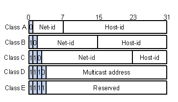

# Počítačové sítě

> Koncepty, principy, architektury. ISO/OSI a TCP/IP model, IP protokol, transportní protokoly (TCP, UDP). Protokoly na síťových vrstvách, funkce IPv4, pokročilé funkce IPv6. Peer-to-peer (P2P) sítě, ad-hoc/senzorové sítě, vysokorychlostní sítě, počítačové sítě a multimédia. Příklady z praxe pro vše výše uvedené. ([PA159](https://is.muni.cz/auth/el/fi/podzim2022/PA159/um/), PA191)

## Koncepty, principy, architektury.

> Počítačová síť je skupina počítačů a zařízení, propojená komunikačními kanály, která umožňuje komunikaci uživatelů sítě a sdílení prostředků (informací, souborů, dat, sw, hw).

Ideální síť je transparentní (uživatel si ani nevšimne, že komunikuje skrz síť), s neomezenou propustnostní, bezztrátová, bez latence, zachovávající pořadí paketů. V reálu sítě takovéto problémy a limitace mají.

Zákadní typy sítí
- **Connection-oriented (propojované)** - pro komunikaci se stanoví/vyhradí kapacita, která není využívaná nikým jiným (e.g. dřívější drátový telefon), snadno se zajišťuje kvalita služeb, v QoS tomu odpovídají integrované služby
- **Connection-less (paketové)** - kapacita využívána všemi komunikujícími, komunikátoři své zprávy dělí a balí na pakety, těžko se řeší kvalita služeb (e.g. Internet), v QoS tomu odpovídají diferenciované služby

K stanovení jednotných pravidel a způsobu komunikace slouží standardizované **protokoly**.

Architektury [peer-to-peer](./6_pocitacove_site.md#peer-to-peer-p2p-sítě) vs klient-server (klienti komunikují pouze se serveren, service discovery konfigurací klientů, klient iniciuje spojení)

Směrování probíhá pomocí směrovacích tabulek routerů - na základě adresy (a případně typu) paketu se podle tabulky určí další směr, hop-by-hop princip. Další destinace se určuje na základě nejdelšího CIDR prefixu adresy. Směrovací jsou obvykle aktualizovány distribuovanými algoritmy. Na routerech je možné pakety filtrovat (zatoulané, k zajištění QoS) a případně klasifikovat (při modelech pay-as-you-go). Směrovat je možné nejen pomocí nejkratší cesty, ale i s ohledem na aktuální stav/vytíženost sítě.

## ISO/OSI,  TCP/IP model

### ISO/OSI 

7 vrstev, každá zodpovědná za určitou funkcionalitu, vrstva komunikuje pouze se svými sousedy, každá vrstva slouží jako abstrakce
- **Aplikační** - síťová aplikace
- **Prezentační** - reprezentace dat
- **Relační (session)** - řešení uživatelsých relací (sessions)
- **Transportní** - komunikace mezi procesy
- **Síťová** - logické adresování v rámci sítě, routing
- **Datalinková** - fyzické adresování (MAC) 
- **Fyzická** - drát, bity, signály...

V praxi se ujal model TCP/IP, který jednotlivé vrstvy ISO/OSI slučuje.

### TCP/IP

4 vrstvy
- **Aplikační** 
    - poskytuje služby uživatelům (web, mail...)
    - používají se aplikační protokoly (HTTP, SMTP, DNS, FTP...), které jsou součástí aplikací, každý protokol definuje syntaxi, sémantiku, typy a pravidla výměny zpráv
    - rozlišujeme
        - peer-to-peer vs klient-server
        - pull (datový přenos iniciuje klient) vs push (datový přenos iniciuje server) model

- **Transportní** - TCP, UDP
    - bere **data**, transformuje je na **segmenty**
    - zajištění transportu segmentů do cílové aplikace, komunikace mezi procesy
    - adresování pomocí portu (16 bitové číslo 0-65535)
    - může poskytovat end-to-end spolehlivost, spojení (pakety jsou číslovány, záleží na pořadí, dodání je potvrzeno)
    - může poskytovat kontrolu spojení, quality of service
    - logický komunikační kanál, iluze přímé komunikace

- **Síťová (internet layer)** 
    - IP (internet protocol)
    - bere **segmenty**, transformuje je na **pakety**
    - zajišťuje přenos paketů mezi komunikujícími uzly (i napříč různými LAN), čímž de facto vytváří WAN
    - umožňuje adresování každého zařízení na internetu pomocí IP adresy (IPv4 32 bitů, IPv6 128 bitů)
    - zajišťuje směrování paketů - závisí na vytíženosti sítě a její topologii
        - topologie celého internetu se těžko určuje, dynamicky se mění
        - každý router řeší doručení paketu na své nejbližší sousedy ve snaze doručit paket blíže (domnělému) cíli na základě své **směrovací tabulky**
            - upravována manuálně (vhodné pro malé sítě), nebo automaticky pomocí distribuovaných algoritmů
                - **Distance Vector** 
                    - *vše co vím řeknu svým sousedům*
                    - protokol **RIP**
                    - sousedící routery si periodicky/při změně vyměňují směrovací tabulky ve kterých jsou informace o vzdálenostech (hop distance) k různým cílům (distance vector), princip [Bellman-Ford](https://www.youtube.com/watch?v=obWXjtg0L64) algoritmu
                    - používaný pro malé sítě, kde není redundance
                    - dále se používají IGRP, EIGRP
                - **Link State** 
                    - *všem řeknu informaci o svých sousedech*
                    - routery si vyměňují informace o stavu svch sousedů, je uchovávána topologie celkové sítě, každý si dopočítá svou routovací tabulku, pro cesty se používá [Dijkstra](https://www.youtube.com/watch?v=_lHSawdgXpI).
                    - protokol **OSPF**, open shortest path first
                    - metrikou (výhou hrany) je cena odvozená od šířky pásma, nižší je lepší
                    - robustnější, protože si každý počítá routing tabulky sám
                    - používaný pro velké sítě
                    - dále se používá IS-IS
                - **Path Vector**
                    - distance vector, ale vyměňují se nejen ceny cest, ale celé jejich popisy
                    - protokol **BGP (Border Gateway Protocol)**, umožňuje routing pravidla (policies), používá CIDR na zefektivnění routování
                    - používá se pro směrování mezi autonomními systémy
        - je možné použít interní (RIP, OSPF) pro naši doménu (autonomní systém) a externí routing (EGP, BGP-4) pro směrování mezi doménami (autonomními systémy)

- **Vrstva síťového rozhraní (network access layer)** - často se tato vrstva ještě rozlišuje na
    - **datalinkovou**  
        - bere **pakety**, transformuje je na **frame**y obsahující mimo jiné adresu odesílatele i příjemce (díky tomu se m.j. zařízení dozví, kdo na médiu komunikuje)
        - poskytuje adresování pomocí fyzických/MAC adres
        - zajišťuje spolehlivost fyzické vrstvy (detekce chyb & případná korekce, možné díky redundanci, e.g. paritní bit, Hammingův kód)
        - flow control
        - řeší koordinaci přístupu více zařízení ke sdílenému médiu (dělením na kanály, na základě rezervací, náhodnosti...) - MAC protokol
        - na této úrovni lze zapojovat sítě do topologií (běžné topologie bus, hvězda, kruh) 
    - **fyzickou**
        - poskytuje rozhraní ve formě **frameů bitů** 
        - poskytuje přístup k přenosovému médiu,
        - interně vrstva transformuje bitu na signály přenosového média, zajišťuje synchronizaci, multiplexing (skloubení více signálů/datových toků do jednoho pro přenos na sdíleném médiu, časový/frekvenční/vlnovědélkový multiplexing), demultiplexing...
        - médiem může být drátový/optický kabel, vzduch (pro bezdrátový přenos, rádiové/infračervené signály...)

## IP protokol

- Zajišťuje doručení IP datagramů (data rozřezané na kousky s obálkou) v rámci internetu host-to-host (i přes prostředníky, a.k.a. routery), síť je connection-less, paketová
- Best-effort služba, není garance o doručení.

Více v sekcích [IPv4](./6_pocitacove_site.md#funkce-ipv4) a [IPv6](./6_pocitacove_site.md#pokročilé-funkce-ipv6).

## transportní protokoly (TCP, UDP)

### UDP (User Datagram Protocol)

- jednoduchý, poskytuje nespojovanou, best-effort službu (spolehlivost si musí případně řešit aplikace)
- klíčová je jednoduchost => minimální režie, rychlost
- používá se pro jednoduchou request-reply komunikaci (DNS), real-time přenosy (livestream), multicast

Hlavička obsahuje
- Zdrojový port
- Cílový port
- Celkovou délku
- Checksum

### TCP (Transmission Control Protocol)
- poskytuje spolehlivou spojovanou službu, uchovává pořadí
- pracuje s byte streamy
- komunikace musí být ustanovena 3way handshake (syn, syn&ack, ack)
- komunikace je rozpoznatelná jen end-to-end, routery neřeší, že jde o spojení
- nepodporuje multicast

Hlavička obsahuje
- zdrojový port
- cílový port
- sekvenční číslo (v rámci toku)
- ack číslo - číslo dalšího očekávaného bajtu, potvrzuje přijetí dat
- délka hlavičky
- příznaky (ack, reset spojení, konec spojení...)
- velikost okna (pro flow control)
- checksum
- options

Tcp mění množství poslaných dat v průběhu komunikace, aby nebyl příjemce (Flow Control), nebo síť (Congestion Control) zahlcen/a, slouží k tomu **velikost okna**. Obecně to funguje tak, že při startu se exponenciálně zvyšuje velikost okna, dokud nedosáhneme učité hranice. Od této hranice lineárně zvyšujeme velikost, dokud nedojde ke ztrátě paketu. V ten moment snížíme velikost na hraniční hodnotu a pokračujeme v lineárním zvyšování rychlosti. Jednotlivé varianty si tuto metodu přizpůsobují, e.g. Tahoe po ztrátě jde na minimální velikost okna (jako na úplném začátku), Reno praktikuje popsaný postup.  

## Protokoly na síťových vrstvách
Aplikační - HTTP, SMTP, DNS, FTP...
Transportní - TCP UDP
Síťová IP - IPv4 (spolu s ARP, RARP, ICMP, IGMP), IPv6 (ICMPv6)
- pro směrování Distance vector: RIP, IGRP, EIGRP, Link state: OSPF, IS-IS
Vrstva síťového rozhraní - ethernet, 802.11 (Wi-Fi)

## funkce IPv4

Protokol umožňující komunikaci host-to-host.

- 32 bitů, 0.0.0.0 - 255.255.255.255
- typy adres
    - **unicast** - komunikace 1 na 1
    - **broadcast** - zpráva všem na LAN
    - **multicast** - zpráva těm, kteří se přihlásili k odběru dat na dané multicast adrese

Hlavička obsahuje
- verzi
- délku hlavičky
- type of service (pro zajištění quality of service)
- celkovou délku datagramu
- identifikaci, flags, offset (používá se při fragmentaci, rozdělení datagramu na vícero, pokud přenosová technologie nezvládá velikost)
- time to live (dekrementován na každém hopu/routeru, při hodnotě 0 je paket zahozen, slouží k eliminaci zatoulaných paketů)
- protokol - specifikace protokolu vyšší úrovně, ICMP, IGMP, TCP, UDP, OSPF...
- checksum hlavičky (ne těla, protože by přepočítávání trvalo déle, děje se na každém hopu kvůli změně TTL)
- adresa odesilatele i příjemce
- options - slouží pro testování, debugging, volitelná část díky poli "délka hlavičky"

IPv4 obecně
- spolupracuje s protokoly 
    - ICMP - poskytuje informace o stavu sítě (e.g. echo request/reply), poskytuje odesilateli inforace o chybě doručení (e.g. příjemce nedosažitelný, TTL šlo na nulu)
    - IGMP - správa skupin pro multicast, (od)registrace do skupin
    - ARP, RARP - překlad IP na MAC a obRáceně
- umožňuje multicast

Původně se IP adresy dělily pouze do tříd

kvůli nedostatku se začala používat i maska sítě (CIDR)

127.0.0.1 je loopback

## pokročilé funkce IPv6
- řeší problém nedostatku IPv4 adres 128 bitovou délkou
- 0000:0000:0000:0000:0000:0000:0000:0000 - FFFF:FFFF:FFFF:FFFF:FFFF:FFFF:FFFF:FFFF (možnost zkráceného zápisu vynecháním prefixových 0, případně až jedné sevkence 0)
- oproti IPv4
    - IPSec je povinnou součástí
    - delší adresa => možnost více zařízení v síti
    - jednodušší hlavička (chybí checksum (úplně odstraněn), options, fragmentation) s možností extension headers
    - podpora označování toků a jejich priorit
    - podpora bezpečnosti, šifrování, autentizace, integrity dat
    - podpora mobility - každé zařízení je někde doma, kde má svého *Home Agenta*. Pokud je zařízení mimo domov, posílá informace o své cizí adrese Home Agentovi, který se stará o případné přeposílání zpráv, nebo spolupracuje pro ustanovení přímého tunelu
    - podpora autokonfigurace zařízení
    - má i **anycast** - jako multicast, ale stačí, aby se data doručily jen jednomu členu skupiny
    - odebrána fragmentace při doručování, toto si musí ohlídat odesílatel. Pokud je datagram moc velký, je zahozen a vygeneruje se ICMP zpráva obsahující zprávu o maximální velikosti na daném linku (procesu určení správné velikosti se říká **Path MTU Discovery** - pošli datagram, když se nevejde, fragmentuj na hodnotu dle ICMP zprávy, opakuj proces. MTU = maximum transmission unit)
    - odebrání checksumu (řeší se na nižší, nebo vyšší vrstvě)
    - broadcast nahrazen specifickými multicastovými skupinami (e.g. skupina routerů na LAN)

Hlavička (40B) obsahuje
- Verzi protokolu
- prioritu (obsahuje i pole, které může indikovat, zda byla po cestě zaznamenáno zpoždění)
- label toku (pakety jednoho toku musí být zpracovány stejným způsobem, volbu směrování lze kešovat)
- délka dat
- další hlavička - může být rozšiřující hlavička (auth, options...), nebo třeba TCP hlavička dat
- hop limit 
- adresy

Podpůrný ICMPv6 rozšiřuje funkcionalitu i o to co dělal IGMP a ARP.
- původní ARP nahrazuje **Neighbour Discovery Protocol**, který řeší
    - autokonfiguraci IPv6 adresy (možnost i bez DHCP serveru) na základě síťového prefixu (info od routerů), MAC adresy/lokálně unikátního ID
    - detekci kolizí adres IPv6 (odešle zprávu na svou adresu, pokud někdo jiný odpoví, máme duplikát)
    - určení MAC adres uzlů na stejném linku, sledování změn
    - určení sousedů, kteří mohou přeposílat pakety dál
    - sledování dostupnosti sousedů
    - funguje díky komunikaci přes multicast skupiny

(Pod)síť definována pomocí CIDR notace (všichni v síti sdílí stejný prefix)

*Přechod z IPv4 na IPv6*
- nutnost úpravy legacy systémů
- složitější zpracovávání IPv6 adresy
- ideální je dnes dělat aplikaci fungující s obojím, alternativně je potřeba použít enkapsulaci (tunelování) IPv6 do IPv4 paketů, nebo překládání (NAT) 

## Peer-to-peer (P2P) sítě
TODO

## ad-hoc/senzorové sítě
TODO

## vysokorychlostní sítě
TODO

## počítačové sítě a multimédia
TODO

## Notes

**CIDR** - kromě IP adresy uchováváme i masku sítě (e.g. 147.209.5.0/24 říká, že relevantních je jen prvních 24 bitů). Umožňuje subneting a efektivnější směrování - pokud máme v tabulkce adresy se stejným prefixem a stejnou cestou, můžeme říct, že naší cestou mají chodit pakety pro celý prefix 

**Piggybacking** - Pokud chceme odesilateli poslat nějaká data a zároveň potvrdit příjem dat, můžeme tyto informace spojit do jednoho paketu 

**NAT** Překlad adres na rozhraní sítě. E.g. pro naši síť máme 1 veřejnou IP adresu. Aby se zajistilo správné směrování všem v síti, musí se na rozhraní překládat veřejná adresa na interní adresu.

**SSL** 
TODO

Pro zefetkivnění směrování je možné použít **Multiprotocol Label Switching** - pro předpokládané/známé toky definujeme cesty, každému toku dáme label a směrujeme jen podle labelů (je možné nastavit i více cest, třeba jako backup, nebo pro distribuci pro load balancing).

**Flow control** se řeší pro příjemce, **congestion control** se řeší pro síť