# Analýza a návrh systémů

> Objektové metody návrhu informačních systémů. Specifikace a řízení požadavků. Softwarové architektury, komponentové systémy. Návrhové a architektonické vzory. Rozhraní komponent, kontrakty na úrovni rozhraní, OCL. Modely softwarových systémů, jazyk UML. Příklady z praxe pro vše výše uvedené. ([PA103](https://is.muni.cz/auth/el/fi/podzim2021/PA103/um/), PV167, [PV258](https://is.muni.cz/auth/el/fi/jaro2021/PV258/um/))

## Objektové metody návrhu informačních systémů.

Přístupy a postupy k návrhu IS založených na objektově orientovaném paradigmatu, kde jsou objekty spojením dat a metod nad těmito daty.

Při modelování systému je dobré definovat si jednotný jazyk, který reflektuje skutečnou terminologii pro danou doménu problému. Podle toho volíme jména funkcí/tříd, aby bylo pokaždé všem (od doménových expertů po vývojáře) jasné, o čem se mluví. Podstatná jména používaná v jednotném jazyce obvykle v kódu reflektují třídy/rozhraní, slovesa zase metody/funkce.

Objektové paradigma si dobře rozumí s principy abstrakce, což lze aplikovat nejen na úroveň objektů, ale i komponentů - základních stavebních jednotek, ze kterých se skládá architektura systému.

Mezi metody se řadí:
- modelování domény pomocí [UML](./dev_1_analyza_a_navrh.md#modely-softwarových-systémů-jazyk-uml), v různých částích vývoje se zabýváme různými úrovněmi detailů
- dekompozice systému do menších, koherentních částí
- aplikace návrhových a architektonických vzorů, které popisují řešení na dobře známé a často se opakující problémy v (nejen) objektovém světě.

## Specifikace a řízení požadavků.

Požadavky na systém se dělí (obvykle je mezi kategoriemi tenká hranice a závisí i na formulaci) na:
- **Funkcionální požadavky** - jaké funkce zákazník od systému očekává, jedná se o business logiku, uživatelské požadavky, řeší se programově, v implementaci
- **Nefunkcionální (non-functional/quality) požadavky** - jaké technické nároky jsou na systém, použité technologie, OS, garance dostupnosti (availability), response time, internacionalizace a lokalizace, řeší se návrhem, architekturou i kódem

Součástí řízení požadavku je
- porozumnění doméně problému 
- sběr požadavků od stakeholderů - klíčem je ptát se PROČ, ne CO a JAK 
- analýza a jednání (hej, toto není možné/hej, nestačilo by vám to udělat takto?...)
- specifikace požadavků - úprava do jednoznačné/formální podoby (use case). Je jasné, v jakém momentě můžeme považovat za splněný.
- validace požadavků - ověření, že formalizované požadavky odpovídají skutečným potřebám
- prioritizace požadavků - umožňuje soustředit se na kritické části (dle potřeb zákazníka) a blbosti případně vynechat, pokud nebude čas/rozpočet.

Dobrý/dobře specifikovaný požadavek
- reflektuje skutečné potřeby zákazníka a je v něm obsaženo PROČ (abychom mohli vybrat nejvhodnější řešení, ale může obsahovat návrhy)
- má jasné kritérium splnění, je měřitelný a testovatelný
- má prioritu
- je úplný

Obecně platí, že čím později se požadavek změní, tím nákladnější bude jeho implementace.

Požadavky se modelují pomocí **use case diagramu**, uchovávají se v **use case dokumentu** (forma: id, jméno, actor(s), popis, trigger, pre/post conditions, příklad typického flow, priorita, výjimky, častost používání...). Požadavky jsou také formalizovány v jednoduché formě pomocí **user stories** - krátké, výstižné popisy (As `role` I want to `akce` So I can `zdůvodnění`), srozumitelní zákazníkovi (+ obsahují akceptační kritéria, prioritu, story pointy...).

Pro **určení priority požadavku** lze použít například:
- klasické ohodnocení 1-10
- binární strom - požadavky jsou uchovávány v uzlech. Vkládaný požadavek srovnáváme s uzly od kořene. Pokud je vkládaný požadavek prioritnější, jdeme doprava. Jinak jdeme doleva. Vložený požadavek bude listem stromu.
- MoSCoW - požadavky dělíme na Must (kritické), Should (důležité), Could (bylo by fajn mít) a Won't (aktuálně to nemáme v plánu)

Non-functional requirements platí vždy, je třeba je brát v potaz i s nově příchozími functional požadavky => máme pro ně vyhrazené místo (e.g. wiki), kde jsou důkladně popsány. Můžeme na konkrétní NFR poukázat v user stories (e.g. u FR `jako uživatel chci mít přístup k aktuálním datům senzoru` linkneme NFR `systém poskytne odezvu do vteřiny` a `data ze senzorů se do systému dostanou nejpozději minutu po naměření`).


## Softwarové architektury, komponentové systémy.

Sw architektura určuje, jakým způsobem je systém strukturován, jakým způsobem je dělen na komponenty/moduly a jak mezi sebou jednotlivé komponenty/moduly interagují a jak jsou jednotlivé části systému nasazeny na hw.

SW architektury (vyšší úroveň abstrakce) a architektonické vzory (nižší úroveň abstrakce) jsou obecná řešení architektur systému. Uvádím jen seznam, podrobně jsou popsány v [části otázky 1](./1_programovani_a_softwarovy_vyvoj.md#základní-koncepty-softwarových-architektur-z-pohledu-implementace-vícevrstvá-architektura-moderních-informačních-systémů-architektura-model-view-controller)
- **MVC/MVP/MVVM pattern**
- **Klient-Server** 
- **Peer-to-Peer** 
- **Layered architecture** - vrstvená architektura používá architektonický vzor Repository
- **Microkernel**
- **Pipes and filters**
- **Blackboard** - tabule je sdílená, jsou na ní data. Výpočetní agenti k tabuli přistupují a zpracovávají  data dle svých interních strategií. Klient následně vybere agenta, který přišel s nejlepším řešením, na základě čehož se aktualizují data na tabuli. Nedeterministický výpočet. e.g. použití různých algoritmů u kterých nevíme, jaký je nejlepší.
- **SOA**
- **Microservices**

Komponenty jsou spustitelné softwarové jednotky, která mají definované komunikační rozhraní, do vnitřního fungování nevidíme/nezajímá nás. Komponent by měl poskytovat logicky související funkcionalitu, funguje jako vrstva abstrakce. Komponenty mohou být vyvíjeny nezávisle na jiných komponentech, jsou nahraditelné (stačí splnit rozhraní a jeho kontrakt), znovupoužitelné. Komponenty mohou mít vnitřní stav, ten však může dělat problém u škálování (paralelizací komponentů), mohou být asynchronní, mohou se interně skládat z dalších komponentů...

Pokud systém vystavuje rozhraní používaná i někým jiným (klient), je fajn nějakým způsobem verzovat rozhraní. Díky tomu se předejde problémům při přidávání změn, nějakou dobu totiž můžeme podporovat vícero rozhraní, než se klient aktualizuje na novou verzi.

## Návrhové a architektonické vzory.

Návrhový vzor je obecné řešení k často se opakujícímu problému řešenému při návrhu sw, není potřeba kompletně vymýšlet vlastní řešení. Slouží nejen jako obecný návod pro implementaci, ale umožňují snadnější komunikaci v rámci týmu (e.g. tady použijeme Strategy pattern). Vzory je třeba používat s rozvahou, občas můžou být zbytečně obecné.

*Architektonické vzory jsou popsány v [předchozí podotázce](./dev_1_analyza_a_navrh.md#softwarové-architektury-komponentové-systémy)*.

[Pro pochopení a ukázky kódu](https://refactoring.guru/design-patterns)

### Creational patterns

Řeší tvobu a inicializaci objektů, poskytují jednoduché rozhraní skrývající složitou inicializaci.

#### Singleton

Zajišťuje, že daný objekt existuje v systému jen jednou (globální stav). V OO jazycích se řeší pomocí třídy s private constructorem a se statickou metodou `instance()` poskytující přístup k objektu drženému ve statickém atributu. *Metoda `instance() se obvykle stará i o inicializaci statického atributu* 

Singleton je mnohdy považován za antivzor, protože vytváří globální stav (namísto předávání stavu parametry) - blbě se to testuje, může být nutné zamykání globálního stavu pro thread safety, narušuje se single responsibility principle (singleton třída ovládá svou tvorbu).

E.g. DB pool

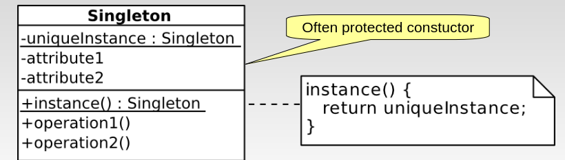

#### Factory method

Stará se o tvorbu konkrétních instancí objektů dle instance továrny (i.e., máme interfaces VehicleFactory a Vehicle. CarFactory bude dělat Car, zatímco stejné volání metody u PlaneFactory vytvoří Plane). Používá se pokud potřebujeme flexibilní a rozšiřitelný způsob vytváření objektů, nebo chceme oddělit logiku tvorby objektu od zbytku. Nevýhodou je nutnost tvorby nové Factory třídy a rozhraní.

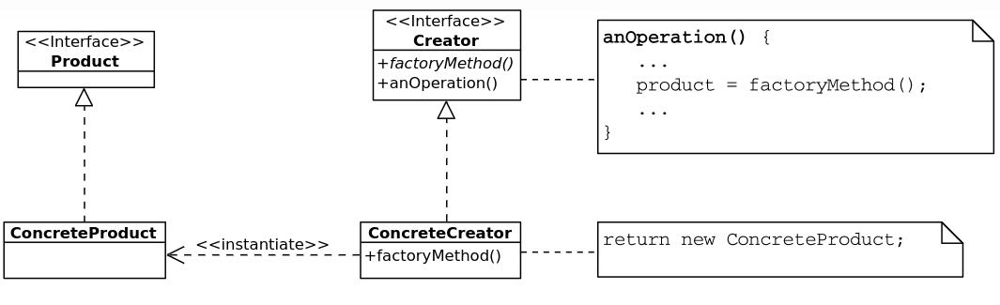

#### Abstract factory

Podobná factory method, ale je zodpovědná za více produktů. Instance této factory zajišťuje tvorbu vzájemně kompatibilních produktů.

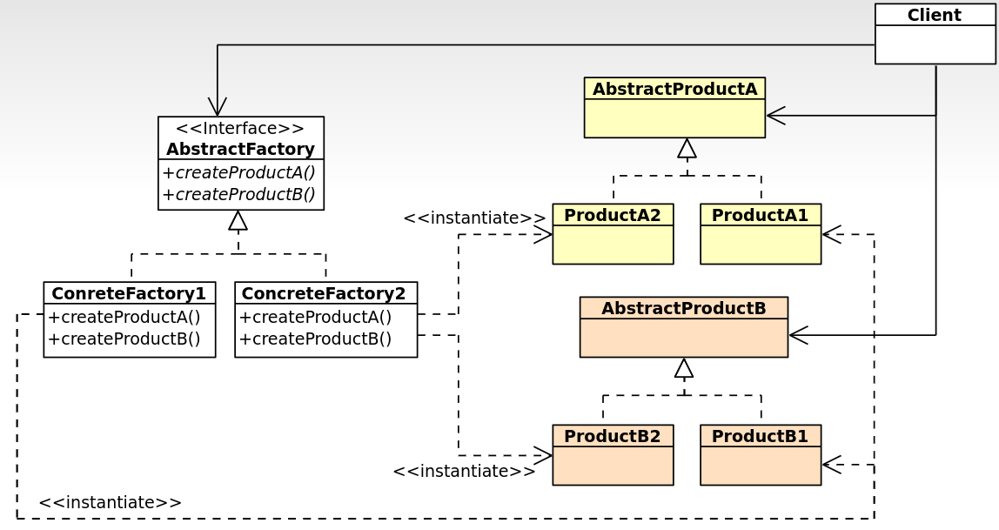

#### Prototype

Doslova trait `Clone`, vytvoří identickou kopii nějakého již existujícího objektu. Hodí se, pokud inicializace objektu je náročná, nebo neznáme konkrétní instanci (pracujeme s abstrakcí přes interface).

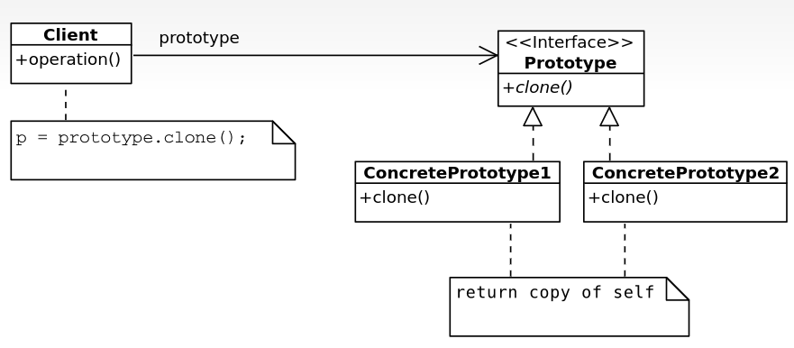

#### Builder pattern

Ke konfiguraci objektu při inicializaci používáme (deklarativním způsobem) metody příslušného `Builder` objektu, každá se stará o jeden aspekt. 

E.g. Inicializace http požadavku

```rust
let request = HttpRequest::get("www.mysite.com/content")
    .header("Authorization", "Bearer 8sa96d41a5s3fbwn")
    .queryParam("offset", 42)
    .build();
```

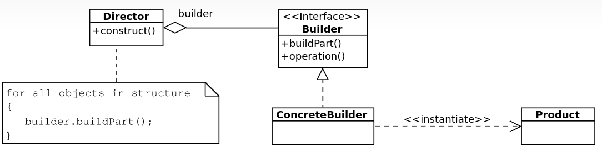


### Structural patterns

Řeší kompozici objektů do hierarchií, oddělení rozhraní a implementace.

#### Composite

Umožňuje tvorbu stromových struktur a poskytuje jednotné rozhraní k operaci na podstromu definovaném svým kořenem.`Component` je buď list `Leaf`, nebo uzel `Composite` obsahující potenciálně další `Component`y.

E.g. stavební prvky grafických rozhraní

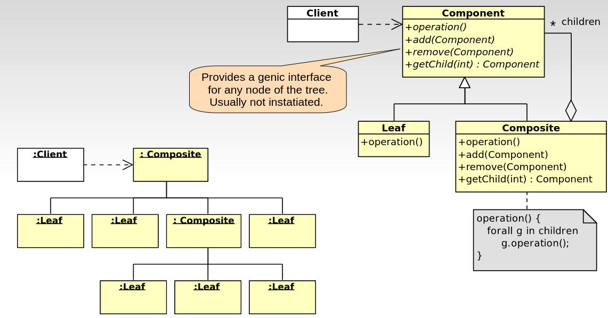

#### Adapter

A.k.a. Wrapper - zapouzdříme/poskytneme rozhraní nekompatibilní jednotce tak, aby se dala použít v našem systému.

E.g. integrace knihovny, případně můžeme adaptér použít k převodu mezi formáty (XML - JSON)

Adaptér lze implementovat ve všech populárních jazycích jako wrapper, je možná i implementace class adaptéru v jazycích podporujících mnohonásobnou dědičnost.

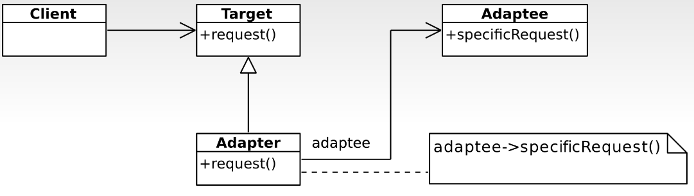

#### Bridge

Používá se k rozbití tightly coupled jednotek (nebo skupiny jednotek) pomocí abstrakcí (ty mohou mít vícero implementací, ale často nám bridge pomůže jen díky vytvoření abstrakce).

E.g. Fullstack aplikaci využívající templating rozbijeme na frontend a backend api.

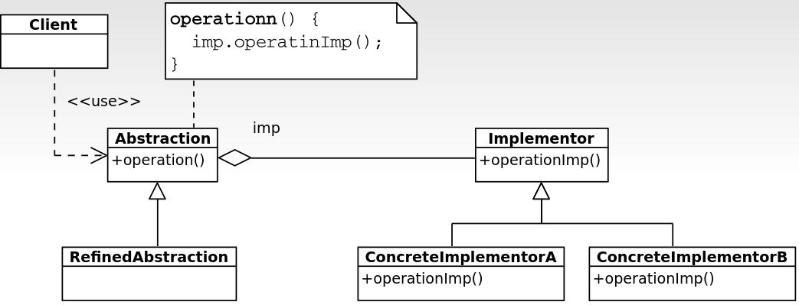

#### Decorator

Umožňuje rozšířit třídu, přidat k ní různé metody/atributy na základě použitého dekorátoru, dynamicky je přidávat/odebírat. Obdobně jako Adapter může obalit původní komponent, ale nemění rozhraní komponentu.

E.g. BufReader pro bufferované čtení (ze souboru), BufReader obaluje Reader a přidává buffer.

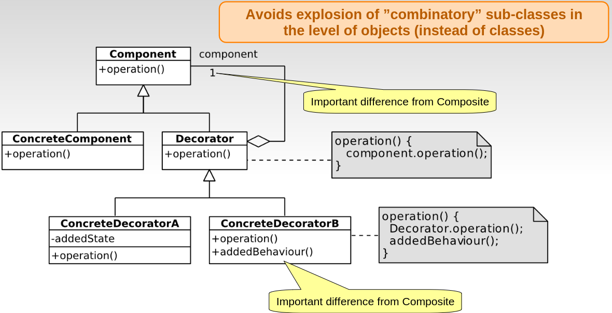

#### Proxy

Prostředník mezi objektem a volajícím, transparentně předává zprávu (a může provádět další operace, hlídat přístup k objektu, provést alokaci objektu on-demand...).

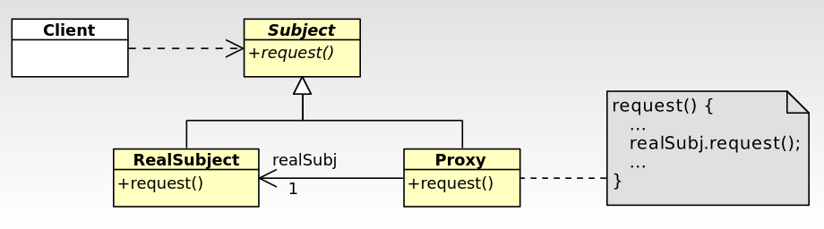

#### Facade

Poskytuje jednotné (a jednoduché) rozhraní složitějšímu subsystému.

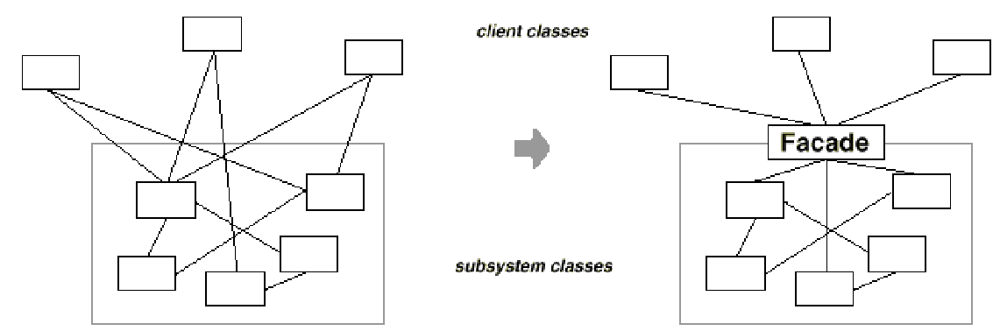

#### Flyweight

Sdílený objekt použitý na vícero místech - sdílený stav je uchováván v objektu, kontextuální stav se dodá skrz parametry volané metody. Slouží k úspoře paměti a/nebo výpočtu (pokud je inicializace drahá).

E.g. DB pool


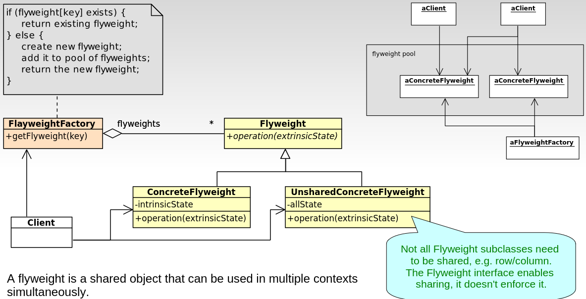

### Behavioral patterns

Řeší chování objektů a dynamické interakce mezi objekty.

#### Iterator

Poskytuje jednotné rozhraní k průchodu prvky kolekcí. Je to samostatný objekt (specifický pro danou strukturu), má metody jako `current()` a `next()` umožňující přístup k prvku, nebo posunutí interního ukazatele iterátoru na další prvek.

E.g. implementace `for-in/foreach`.

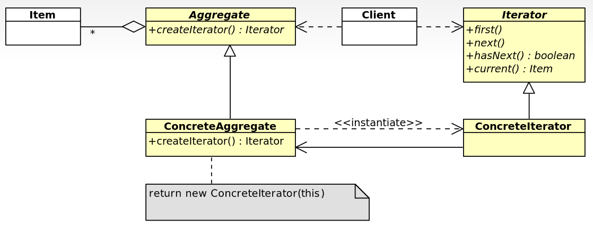

#### Strategy

Poskytuje rozhraní k výpočtu/operaci, které může klient použít bez znalosti konkrétní implementace a jejích detailů. Díky tomu je možné konkrétní implementace pro výpočet snadno měnit, nebo jednotně používat funkcionalitu objektů s rozdílnými implementacemi. Klient přistupuje přes `Context`, který se stará o případnou volbu strategie. Konkrétní strategie lze měnit za běhu. *?Iterátor by se dal považovat za formu strategy?*

E.g. libovolné použití přístupu přes rozhraní, třeba výpočet trasy (pro auto, pro cyklistu, pro chodce..)

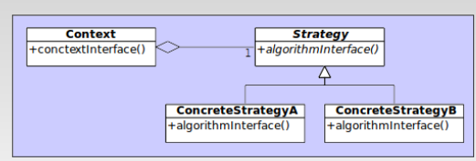

#### State

Obdobný jako Strategy, výběr implementace děláme na základě aktuálního stavu, který je možné měnit za běhu. O konkrétní stav (a výběr implementace) a jeho přeměny se stará `Context`, díky čemu izolujeme a můžeme jednoduše kontrolovat přechodu stavu v systému. 

Na rozdíl od `Strategy`
- daná implementace je vybrána na základě vnitřního stavu
- řešíme přechody stavu, stavy se můžou nahradit jiným stavem (=> stavy mohou mít referenci na kontext)
- neřešíme jeden specifický task, ale poskytujeme implementaci pro většinu věcí co `Context` nabízí

E.g. Vypínač má dva stavy (concrete state), Vypnutý Vypínač a ZapnutýVypínač. Interface Vypínač má metodu přepni(), čímž se změní stav (VypnutýVypínač na ZapnutýVypínač a opačně)

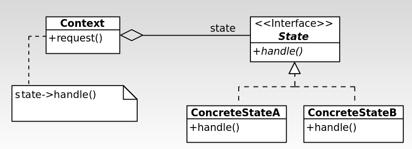

#### Memento

Uchovává předchozí stavy objektu, díky čemuž je možné přenést objekt do dřívějšího stavu. Používá se pro případy, kdy přímý přístup do atributů třídy není možný (private atributy).

E.g. použití při implementaci UNDO.

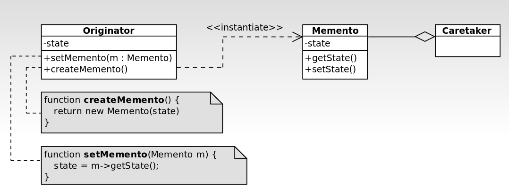

#### Observer

Umožňuje tvorbu mechanismu pro notifikace. Observery se registrují ke sledování Subjektu (ukládáme si reference observerů do vektoru). V momentě, kdy se subjekt změní (a měly by být observery notifikovány), stačí zavolat metodu notify, která projde observery a každého notifikuje (obvykle zavoláním metody).

Používá se pro nahrazení pollingu (opakovaně se ptám "už se událost stala?").

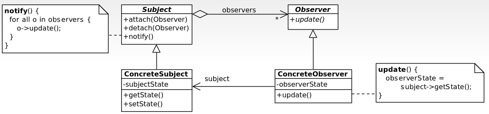

#### Visitor

Poskytuje jednotné rozhraní pro spuštění nějaké shodné akce nad objekty. Každý objekt má implementaci odlišnou, ale signatura pro všechny objekty je shodná (e.g. serializace různých struktur, bere Self, vrací String). Namísto abychom na základě typu struktury volali příslušnou metodu (`if let Vehicle::Car(_) = my_data { return serialize_car(my_data); }`), implementujeme metodu poskytnutou rozhraním (jen `serialize(&self)`). V diagramu je to metoda `accept(v: Visitor)`.

E.g. serde


## Rozhraní komponent, kontrakty na úrovni rozhraní, OCL

Aby mohl komponent komunikovat se svým okolím (být volán a případně vracet data), potřebuje nějaké veřejné rozhraní, kterému se říká **signatura**. Skládá se z poskytovaných operací (funkcí/metod) a jejich vstupních a výstupních parametrů.

U rozhraní nás zajímají i další omezení, které mohou upravovat (správné) používání rozhraní (*e.g. uživatel se může registrovat jen jednou*). Signatuře a omezení se souhrnně říká **kontrakt**. Kontrakt popisuje poskytnutou funkcionalitu za předpokladu, že dodržíme předem stanovené podmínky. 

Součástí kontraktu (v kontextu struktur/objektů) můžou být:
- **preconditions** - co musí platit před vyvoláním dané metody, aby metoda proběhla správně (e.g. máme dost peněz na účtu)
- **postconditions** - co musí platit po skončení dané metody, i.e., co metoda poskytuje (e.g. proběhne platba, z účtu se nám odečte příslušná platba)
- **invariants** - co vždy musí platit, váže se obvykle k objektům, nejen metodám (e.g. na debetním účtu není možné jít do mínusu)

**OCL (Object Constraint Language)** je deklarativní jazyk, který umožňuje popis kontraktů a jejich constraintů (omezení domén hodnot), včetně jejich zavedení do UML, a může být použit i pro jejich vynucování (e.g. generování kódu na základě kontraktu popsaného v komentáři/anotacích (v Javě `@`)).

Při definici kontraktů objektů s dědičností nesmíme porušit Liskov substitution principle, dědic může invarianty a postconditions pouze utahovat, ne je rozvolňovat (co platilo pro rodiče, musí platit i pro potomka). Naopak je to u preconditions, kde může dědic podporovat více vstupů než předek.

Příklady:

Auto (třída Car) nesmí překročit rychlost 240.
`context Car inv: speed < 240`
^ speed a self.speed (kde self je Car) jsou identické

Před odebráním prvku musí zásobník něco obsahovat, vrací to co bylo na vrchu zásobníku
```
context Stack::pop()
pre neniPrazdny: self.len() > 0
post vraciVrsekZasobniku: result = self@pre.top()
```

Po vložení prvku se zvětší zásobník
```
context Stact::push(element)
post: self.len() = self@pre.len() + 1
```

V OCL lze používat funkcionální přístup ke kolekcím (select, forAll...), řešit existenci (exists), provádět množinové operace (union, intersection...), používat booleovské operátory (or, and, implies...) a spoustu dalšího (proměnné, cykly...).

## Modely softwarových systémů, jazyk UML.

Modely sw systémů popisují systém vždy z nějakého zjednodušeného pohledu (model je už z definice abstrakce). Různé modely se zabývají různými aspekty/fázemi vývoje systému. Důležité však je, aby byly modely systému vzájemně konzistentní. Obecně lze rozlišovat na modely popisující strukturu a modely popisující chování.

**UML** je modelovací jazyk umožňující jednotný způsob vizualizace návrhu systému. Pro snadné verzování je fajn PlantUML (píšeme UML jako deklarativní kód, ze kterého generujeme příslušné diagramy).

Příklad interface

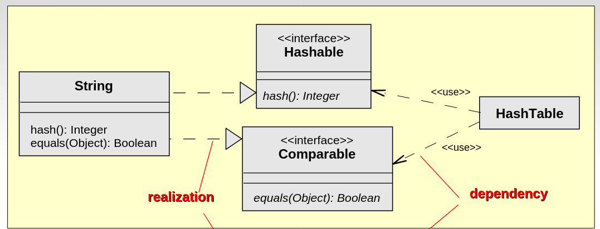

### Context diagram

Popisuje kontext a prostředí, v jakém systém má fungovat. Jsou zde znázorněny interakce s externími systémy a skupinami uživatelů.

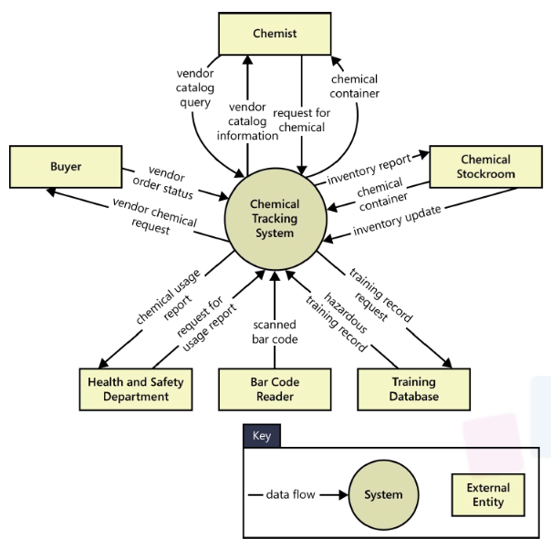

Neřešíme části, se kterými přímo neinteragujeme. Ty jsou vidět v [Ecosystem map](./dev_1_analyza_a_navrh.md#ecosystem-map). 

### Use case diagram

Zahrnuje všechny (uživatelé i jiné systémy), kteří budou systém používat ve formě actorů. U každého actora vidíme dostupné akce (use case) a případně vazby mezi akcemi (<--extend, include-->, spuštění další akce).

| 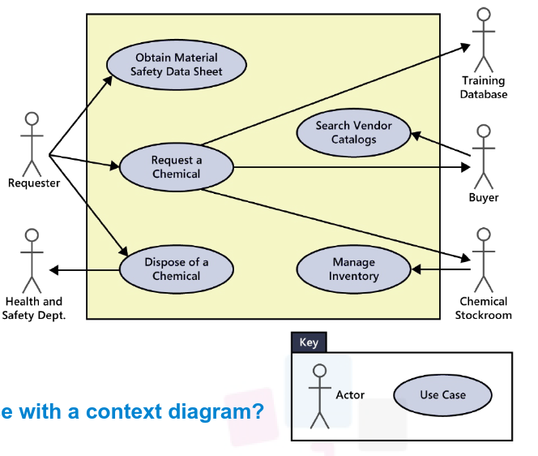 | 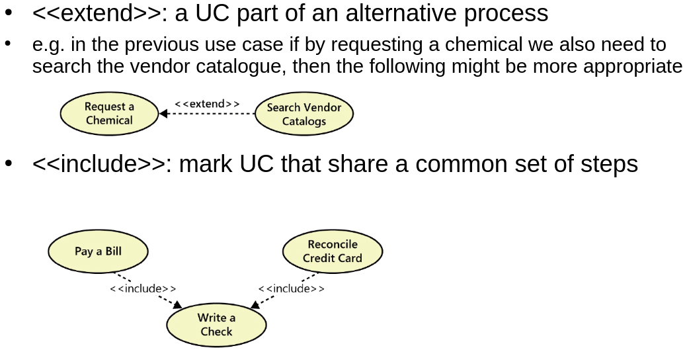 |
|---|---|

### Conceptual class diagram

Diagram tříd, ale neřešíme datové typy ani metody. Zajímají nás klíčové entity (struktury/třídy), jejich data plynoucí z požadavků, a vazby mezi entitami (kontext). Pomáhá ujasňovat terminologii.

### Class diagram

Statická reprezentace systému ve formě tříd, zobrazuje jejich metody, atributy a vzájemnou provázanost. Vztahy mají kardinalitu

**Asociace** - klasická šipka (nebo čára pro oboustranný vztah), popisuje vztah daných tříd
**Agregace** - bílý kosočtverec, popisuje, že třída obsahuje jinou třídu (u ní je kosočtverec)
**Kompozice** - černý kosočtverec, popisuje, že třída (s kosočtvercem) je nedílnou součástí jiné třídy

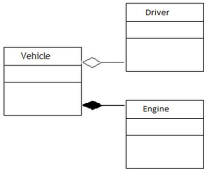

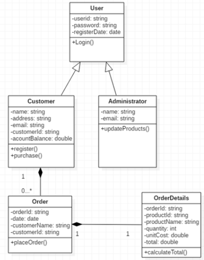

### Object diagram

Zachycuje systém za běhu v určitém čase, zobrazuje konkrétní objekty a jejich vazby.

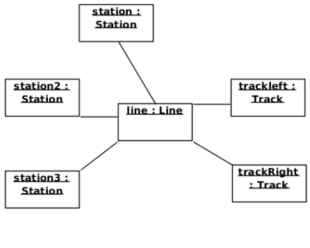

### Activity diagram

Popisuje workflow systému/komponentu (dle úrovně abstrakce), jednoduchý na pochopení i pro zákazníka.

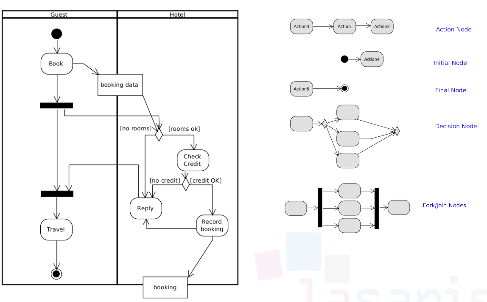

### Sequence diagram

Popisuje interakce v čase mezi jednotkami (třídami/komponenty/actory) systému

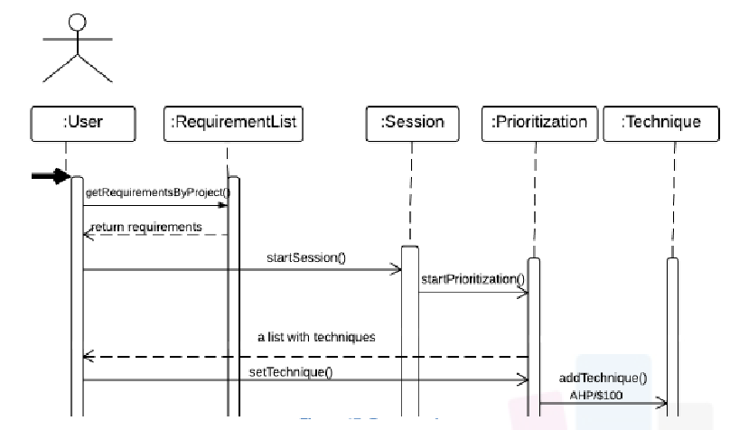

### Deployment diagram

Popisuje jednotlivé komponenty systému a jejich komunikační toky, včetně použitých technologií.

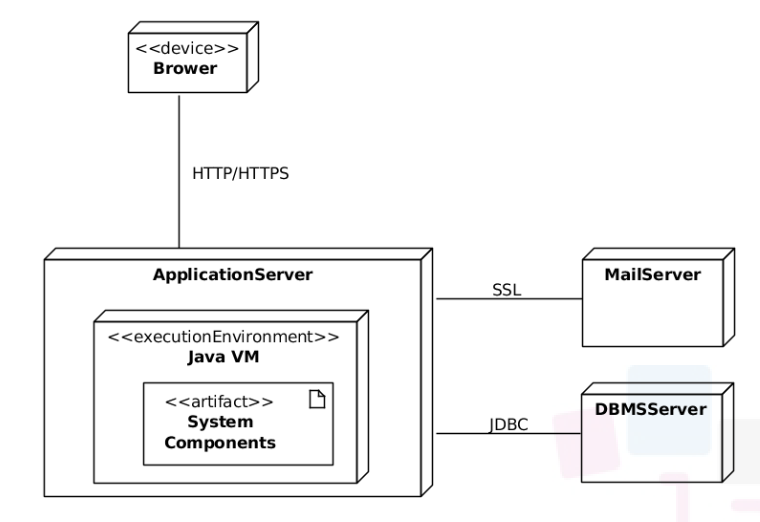

### Component diagram

Popisuje komponenty a jejich kompozici v sýstému.

Třídní/lollipop notace

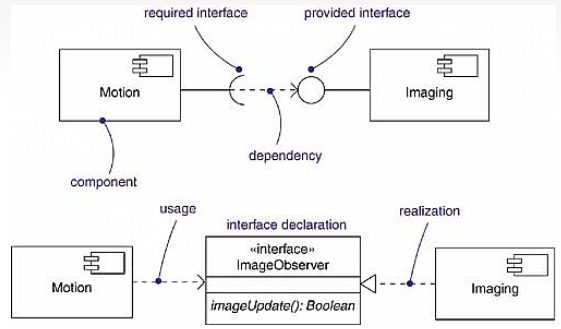

Komunikační rozhraní koponentů se nazývají porty, přímé spoje connectors.

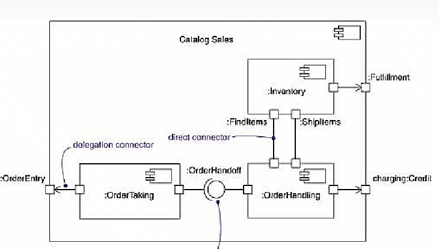

## Notes

**Verifikace vs validace** - validace ověřuje, že náš model odpovídá požadavkům, verifikace ověřuje, že naše implementace odpovídá našemu modelu, že je implementace kvalitní. E.g. u mostu by se validovalo, že je postavený v místě, kde je potřeba. Verifikovalo by se, že je postavený správně.

**Motivace objektových metod/návrhových vzorů**
- Systémy bývají složité, špatně se udržují a je náročné měřit/zajistit kvalitu, často se mění nároky
=> pomůže dekompozice systému do menších koherentních částí, které se lépe udržují/mění, snadněji se měří kvalita

Dekompozice podle [SOLID](./2_kvalita_kodu.md#solid-principy)
- single responsibility - každý modul/třída/funkce by se měly soustředit pouze na jednu část funkcionality (a tu zapouzdřovat)
- open/closed - každý modul/třída/(funkce) by měly být rozšiřitelné i.e. přidání změn způsobí minimální modifikaci kódu, většinou rozšiřujeme pomocí nových tříd/metod
- liskov substitution - každý (dědičně) nadřazený objekt by měl být nahraditelný podřazeným objektem, aniž by byl narušen původní kontrakt. E.g. nemůžeme vyhodit výjimku, když to nadřazený nikdy nedělal. Nemužeme brát u stejné metody konkrétnější argument, než jaký bere nadřazený objekt (je v pohodě brát abstraktnější). Nemůžeme vracet abstraktnější typ, než jaký vrací nadřazený. Je v pohodě přidávat funkcionalitu ve formě dalších metod.
- interface segregation - rozbíjíme velká rozhraní na menší, logicky související jednotky. Jen to, co klient opravdu může potřebovat.
- dependency inversion - závisíme na abstrakcích (rozhraní), ne na konkrétních implementacích

**Problém s cyklickou vazbou objektů** - e.g. v metodě toString() je potřeba vhodně řešit, abychom se necyklili. Proto může být vhodnější definovat si pro takové případy speciální objekty s jasnou hierarchií a bez cyklů

**Interface Definition Language** - popisuje rozhraní formou, která je nezávislá na použitém programovacím jazyce (e.g. OpenAPI Specification pro REST, protocol buffer pr gRPC, Web Service Definition Language pro SOAP, CORBA IDL). Obvykle je možné pomocí IDL schématu vygenerovat v daném programovacím jazyce kód/struktury, který poskytovatel implementuje a uživatel používá. Více v [otázce 7](./7_distribuovane_systemy.md).

**Event list** - seznam všech událostí, které mohou v systému nastat

### Ecosystem map

Znázorňuje celý kontext (včetně částí, se kterými přímo nekomunikujeme), ve kterém náš systém funguje.

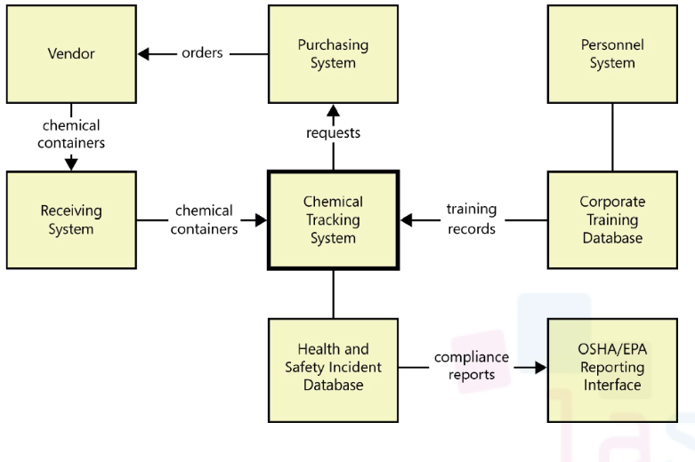

### Analytické vzory
Návrhové vzory nabízí řešení na často řešené problémy v návrzích systému. Tato řešení jsou místy až příliš sofistikovaná, takže se doporučuje složitější návrhové vzory používat z rozvahou, abychom problém *neoverengineeringovali*.

Accountability vzory *(přijdou mi ve slajdech popsány složitější, než jsou, proto popisuju koncepty/zapamatovatelné aspekty, zbytek si člověk dokáže odvodit. Odkazy vedou na příslušnou část s diagramem.)*
- [Party](./dev_1_analyza_a_navrh.md#party) - společný název (abstrakce) pro osobu či firmu, obvykle má kontaktní údaje (adresu, telefon, email...)
- [Organization Hierarchies](./dev_1_analyza_a_navrh.md#organization-hierarchies) - řešíme problém reprezentace organizace skládající se z často měnících se hierarchií organizačních jednotek (e.g. Korporace, Region, Pobočka, Oddělení... typy jednotek mohou být také předmětem změn). Řešením je stavební blok `Organizace`, která má 0..1 rodiče `Organizace` a  0..n potomků `Organizace` (rekurzivní vazba). Jednotlivé typy oddělení pak mohou dědit od `Organizace`.
- [Organization Structure](./dev_1_analyza_a_navrh.md#organization-structure) - To samé co organization hierarchies, ale přidáváme k tomu `TimePeriod` (pro verzování v čase), `Typ Organizační Struktury`, který může mít `Pravidla` zajišťující, že třeba oddělení nebude nadřízené divizi.
- [Accountability](./dev_1_analyza_a_navrh.md#accountability) - Organization Structure, ale Organizaci nahradíme Party (a vztahu říkáme accountability). Je tam opět `TimePeriod`, ale `Typ Organizační Struktury` se jmenuje `Accountability Type`. `Pravidla` pro vazby zahazujeme
- [Accountability Knowledge Level](./dev_1_analyza_a_navrh.md#accountability-knowledge-level) - Accountability, ale `Pravidla` pro vazby mezi jednotlivými `Party`s zase přidáme. `Pravidla` jsou definována pro jednotlivé `Accountability Type`s, každé definuje povolenou kombinaci `Party Type` potomka a rodiče v hierarchii. Úrovni, kde popisujeme pravidla (a kde tím pádem jsou i `Accountability Type`s a `Party Type`s) říkáme knowledge level, existuje jen pro zajištění správné kompozice (ale nemá moc význam pro day-to-day operace).

Příklad pro aplikaci accountability je ve [slajdech (str 35+)](https://is.muni.cz/auth/el/fi/podzim2021/PA103/um/02-03-Analysis-patterns.pdf#page=35).

Observations & measurements
- [Quantity](./dev_1_analyza_a_navrh.md#quantity) - kvantita má hodnotu a jednotku (v Rustu bychom použili Newtype pattern konkrétní jednotky a pomocí traitů implementovali funkcionalitu)
- [Conversion Ratio](./dev_1_analyza_a_navrh.md#conversion-ratio) - převedení jedné jednotky na jinou, samo o sobě funguje jen pro lineární vztahy
- [Compound Units](./dev_1_analyza_a_navrh.md#compound-units) - Jednotka může být buď `Atomic Unit` (e.g. kilometry), nebo `Compound Unit`, která má aspoň jeden `Unit Reference` obsahující mocninu (e.g. kilometry za hodinu). 
- [Measurement](./dev_1_analyza_a_navrh.md#measurement) - Reprezentuje výsledek měření. Každé měření bylo někým vykonáno (`Person`), zkoumalo nějaký měřený fenomén (`Phenomenon Type`) a zjistilo nějakou hodnotu, včetně jednotek (`Quantity`)
- [Observation](./dev_1_analyza_a_navrh.md#observation) - výše popsaný `Measurement` je typ `Observation`, stejně jako `Category Observation` umožňující zaznamenávat nekvantitativní měření s nějakou kategorickou hodnotou (e.g. počet lidí s danou krevní skupinou), kde nás zajímá konkrétní `Phenomenon` (e.g. A+), který je součástí `Phenomenon Type`.
    - je možné přidat i způsob měření `Protocol`, či sledovat přítomnost/nepřítomnost kategorického jevu, který může mít závislosti na (pod)jevech modelovaných pomocí `Observation Concept` (e.g. diabetik typu 2 je obecně diabetik)

### Diagramy analytických vzorů

#### Party
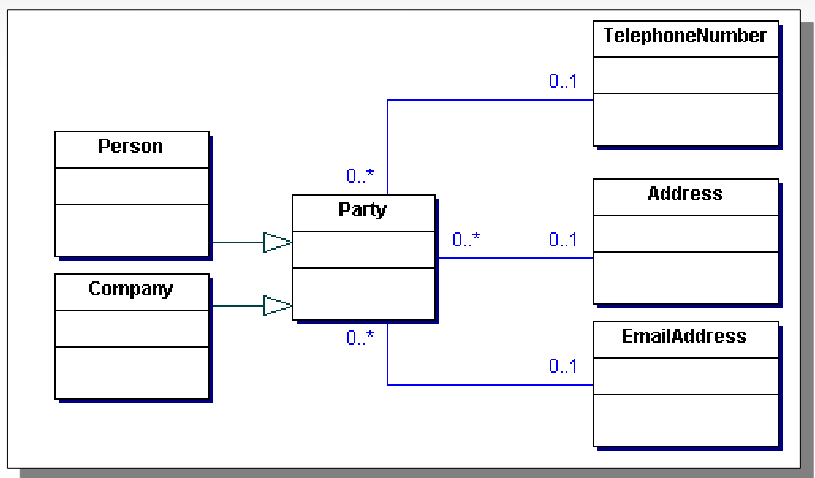

#### Organization Hierarchies
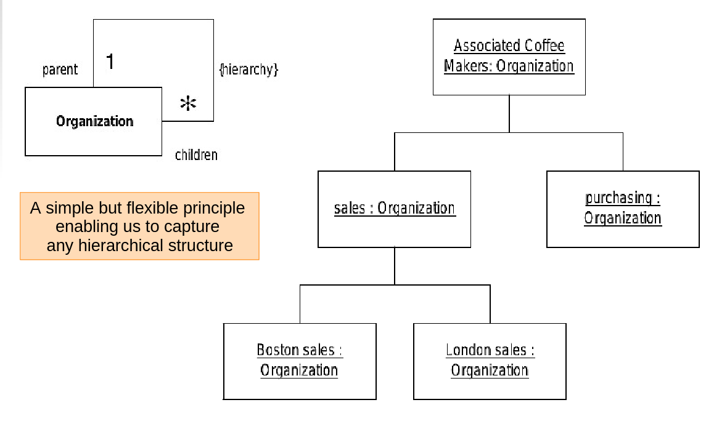

#### Organization Structure

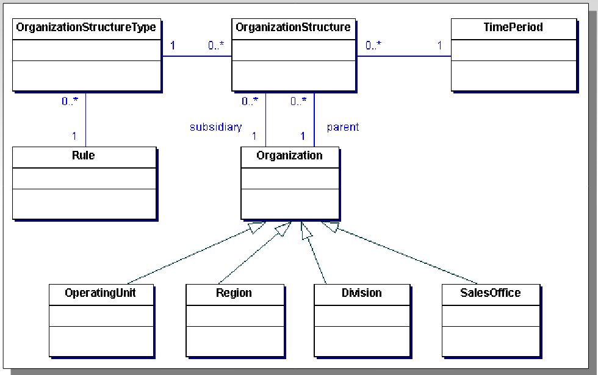

#### Accountability
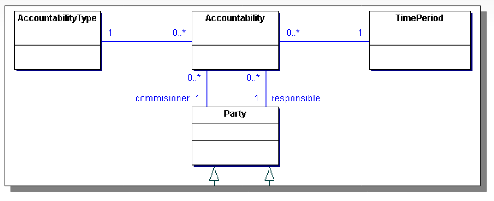

#### Accountability Knowledge Level
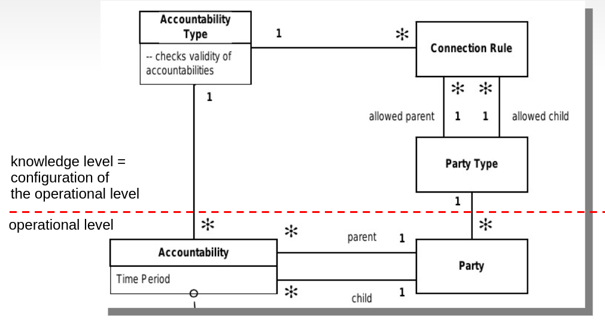

#### Quantity
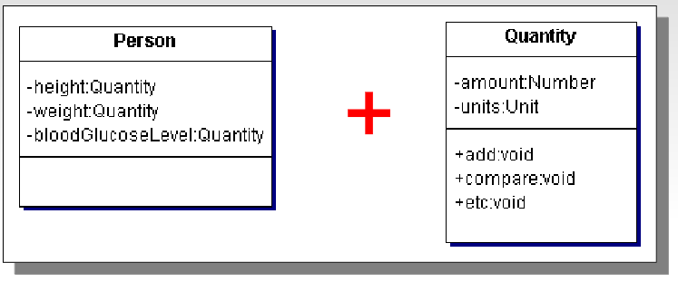

#### Conversion Ratio
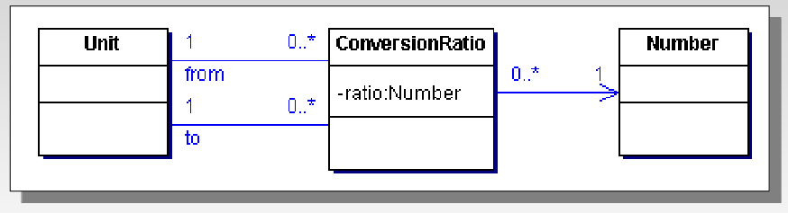

#### Compound Units


#### Measurement
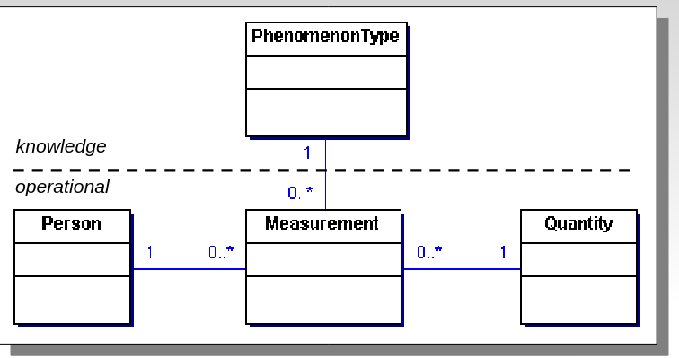

#### Observation
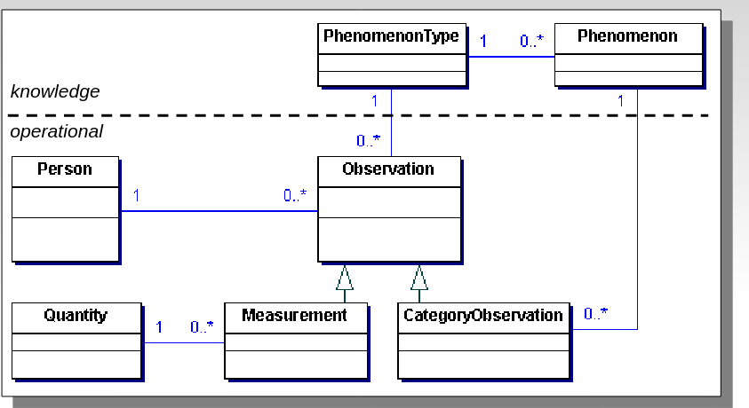

Včetně způsobu měření a logickými vazbami mezi (pod)jevy
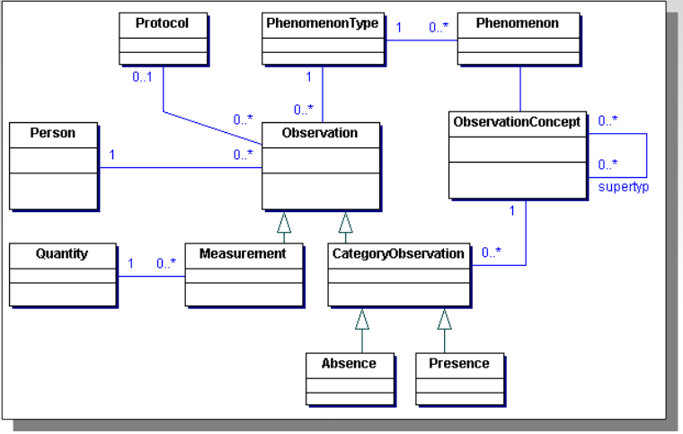