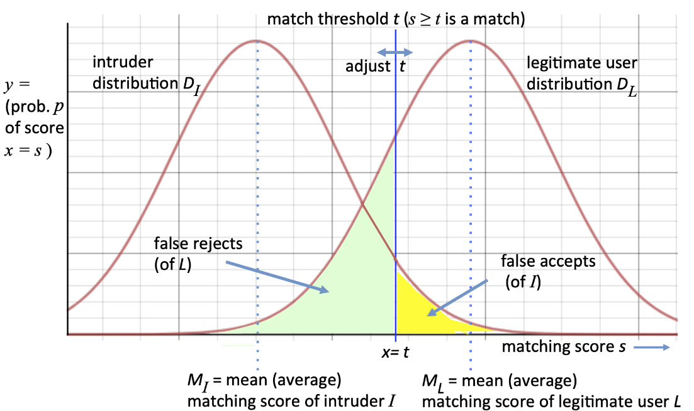

# Bezpečný kód.

> Bezpečný kód. Metody autentizace a řízení přístupu. Biometrické metody autentizace, jejich dopady a problémy. Elektronický podpis a jeho použití. Autentizace strojů a aplikací. Zásady a principy bezpečného kódu. Typické bezpečnostní chyby na úrovni kódu, souběžnost, ošetření vstupů. Detekce bezpečnostních zranitelností, penetrační testování. Příklady z praxe pro vše výše uvedené. ([PV157](https://is.muni.cz/auth/el/fi/podzim2021/PV157/um/), PA193, PV276)

## Metody autentizace a řízení přístupu.

**Klíčové pojmy**
- **Autentizace/verifikace identity** - verifikace/ověření identity - kombinace identity (e.g. jména) a důkazu (e.g. hesla)
- **Identifikace** - rozpoznání - rozpoznání entity v dané množině entit, subjekt nepředkládá identitu, ale systém se mu ji snaží přiřadit z databáze známých identit, e.g. otisk prstu na vstupních dveřích
- **Autorizace** - udělení práv k vykonání určitých akcí (e.g. autorizace terminálu k platbě vložením karty a pinu, zároveň se uživatel autentizoval pinem vůči kartě)

**Metody autentizace**
- na základě znalosti (pin/heslo)
- na základě vlastnictví fyzického tokenu (klíč/čipová karta, řeší se i cena padělání, obvykle velká za kus, ale funguje economies of scale, fungují legislativní postihy)
- na základě biometrie (otisk prstu, který nikdo jiný nemá)
- na základě fyzické/virtuální lokace (rychlá změna fyzické lokace může být varovný signál, přihlášení z určitého počítače s certifikátem může stačit k autentizaci)

### Autentizace tajnými informacemi

**Tajné informace** 
- cílem je autentizace uživatele
- v ideálním případě autorizovaným uživatelům nekomplikují fungování, ale co nejvíce znesnadňují zneužití utočníky
- řeší se
    - ukládání
    - bezpečnost (kvalita/složitost) vs zapamatovatelnost
    - jak bude probíhat kontrola
    - postup v případě kompromitace (změna hesla)
- je nutné dodržet
    - informace by měla být opravdu tajná, neměla by být odvoditelná (e.g. ne rodné jméno matky)
    - informace by měla být vybrána z velkého prostoru hodnot (e.g. vynucení čísel, speciálních symbolů, mixed case...)
    - informaci při autentizaci nepředáváme v čisté podobě (lze odposlechnout). Máme možnosti:
        - šifrujeme, v ideálním případě je šifrovaná celá komunikace
        - posíláme jen haš. Ten lze sice použít pro podvodnou autentizaci, ale nelze z něj odvodit heslo
        - používáme challenge-response, pomocí kterého se tajné informace nešíří
- může jít o pin/heslo/passphrase/identifikaci obrazové informace/spojení bodů v určitém pořadí...

**Hesla**
- skupinová (více uživatelů sdílí heslo) - mizivá bezpečnost
- unikátní pro osobu, pomocí hesla se zároveň uživatel identifikuje
- kombinace s uživatelským jménem
- jednorázová - jdou odděleným kanálem, obvykle součástí vícefaktorové autentizace, prokazujeme vlastnictví dalšího tokenu
- ukládají se [hašovaná](./5_databaze.md#hašování) (pokud nepotřebujeme získat původní heslo), ideálně včetně soli a pepře, nebo šifrovaná (problém je, že teď musíme chránit místo hesla šifrovací klíč), nikdy ne v plaintextu
    - **salt** - náhodně vygenerovaná data, která se ukládají zároveň s hašem a při hašování se přidávají k heslu, efektivně prodlužuje délku hesla a znemožní detekci stejných hesel dle shody hašů
    - **pepper** - data, která se při hešování přidávájí ke vstupu, jsou však utajená (neukládáme je vedle haše)
- nucená expirace hesla může mít za následek používání obecně slabších hesel
- dobrý kompromis mezi bezpečností a zapamatovatelností jsou hesla založená na frázích (se zakomponováním speciálních znaků/číslic), nebo lokálním důvěryhodným správcem hesel 

**Útoky na hesla**
- cílený (snažíme se zjistit heslo konkrétního uživatele) vs plošný (snažíme se zjistit heslo kohokoliv ze skupiny uživatelů)
- online (lze omezit počet pokusů) vs offline (kdy jsme se zmocnili souboru s haši/šifrovanými daty)
- odpozorování (vizuálně, phishing, nebo zachycení komunikace, sniffing)
- slovníkový (máme slovník často používaných hesel)
- hrubou silou
- zneužití mechanismu na obnovu hesla (mnohdy snadnější, než prolomení hesla)
- analýza zdrojového kódu nebo souborů verzovacího systému (často tam hesla nechávají vývojáři)
- použití iniciálního hesla z manuálu (e.g. často u routerů)
- krádež databáze/databáze, získání obsahu paměti/cache
- použití rainbow tables (předpočítané hodnoty a jejich haše), nástroje na prolomení heslovaných souboru (john the ripper)

**Jednorázová hesla**
- buď náhodně generovaná a zaslaná separátním (multifactor authentication)
- nebo **(Lamportův) řetězec haší**
    - na začátku si uživatel lokálně uloží heslo, který 1000x prožene hash funkcí, výsledek dá serveru
    - při každé autentizaci uživatel pošle předchozí hash (číslo 999, 998...). Server prožene tento předaný hash 1x hash funkcí a porovná s posledním uloženým hashem. Pokud výsledek sedí, uloží si předaný hash jako poslední uložený a považuje uživatele za autentizovaného. Útočník nemůže použít odposlechnutý hash, protože potřebuje předchozí hodnotu (a originál nezná).
- nebo přístroj (autentizační kalkulátor) generující náhodná hesla na základě času, princip generování je znám službě, která autentizuje. Je nutná synchronizace hodin/povolení několika hesel kolem předpokládaného okamžiku. (to už je spíš autentizace tokenem). Případně má autentizační kalkulátor klávesnici a používáme ho pro challenge-response

**PINy**
- obvykle velmi krátké -> omezujeme počet pokusů

## Biometrické metody autentizace, jejich dopady a problémy.

> Automatizované metody identifikace nebo ověření identity na základě měřitelných fyziologických nebo behaviorálních (založených na chování) vlastností člověka

Biometrická data je nejdříve třeba nasnímat (včetně kontroly kvality, extrakce charakteristik) a uložit, potom je možné je používat k autentizaci/identifikaci (pomocí srovnání charakteristik).

Na rozdíl od ostatních metod autentizace **musíme řešit variabilitu** uložených dat a nasnímaného vzorku, data nejsou nikdy zcela identická.
- velmi často závisí na měřících podmínkách, na samotném zařízení, stavu měřeného, schopnosti/motivace měřeného provést si měření správně...
- 100% shoda může znamenat problém - útočník se dostal k uloženým datům
- řeší se balanc mezi **false acceptance** (bezpečnostní problém) a **false rejection** (nepohodlí uživatelů)

Biometriky jsou vhodné jako doplňkové metody, pro přístup k tajnému klíči, autentizaci uživatele (ne dat/počítače)... ne pro použití jako samotný klíč

**Problémy biometrické autentizace**
- nikdy nejsou zcela bezchybné
- Failure to enroll - není možné získat biometrickou charakteristiku při registraci (e.g. někdo nemá prst, který chceme snímat)
- Failure to acquire/capture - není možné získat charakteristiku při autentizaci
- False positive identification - přijali jsme chybně (bezpečnostní riziko)
- False negative identification - zamítli jsme chybně (naštvanější uživatelé)
- fenotypické charakteristiky (e.g. geometrie ruky) se mohou v čase měnit
- genotypické charakteristiky (e.g. dna) je zase obtížné rychle vyhodnotit
- měření není dokonalé (prostředí, jiný měřák, nezkušenost/nespolupráce měřeného)
- měření může být nepříjemné
- metody mají různé charakteristiky rychlosti, spolehlivosti, příjemnosti, výpočetní náročnosti, míru vlivu prostředí...
- musíme řešit živost - jde skutečně o člověka, nebo třeba o umělý prst? je daný člověk na živu?
- jedna charakteristika může být použita ve více systémech, zveřejnění nesmí ohrozit soukromí
- biometriky nejsou tajné
- ochrana soukromí, legislativní omezení
- kvůli nepřesnostem/možným změnám/netajnosti není vhodné z biometrik generovat kvalitní kryptografické klíče

**Kontinuální autentizace** - subjekt kontinuálně sledujeme a snažíme se detekovat možné odchylky v chování, které by naznačovaly, že se jedná o útočníka, e.g. dynamika psaní na klávesnici

Forenzní systémy pro biometrickou autentizaci jsou přesnější, spolehlivější, dražší, mohou být pomalejší, vyžadují odborníky.

e.g. otisk prstu (tam sledujeme markanty), geometrie ruky, sken duhovky, sken sítnice, rozpoznání obličeje, rozpoznání hlasu, rozpoznání stylu interakce se zařízením (e.g. tempo psaní na klávesnici, dynamika podpisu), dna

## Elektronický podpis a jeho použití.

- zajišťuje **autentizaci** (že zpráva pochází od daného autora) a **integritu** (že zprávu nikdo nepozměnil) **podepisovaných dat**
- musí být ověřitelný třetí stranou
- nezajišťuje důvěrnost dat
- měl by obsahovat i datum/čas
- algoritmy **RSA, DSA**

Některé algoritmy umožňují obnovu dat na základě podpisu (v podpisu jsou nějakým způsobem data obsažena).

**Průběh podepisování**
1. vytvořím asymetrické klíče (veřejný, soukromý), veřejný klíč zaregistruju/vystavím, aby mohl být později použit k ověření
2. (pro každý podepisovaný dokument) - vytvořím hash (e.g. pomocí SHA-2) podepisovaného dokumentu, který podepíšu soukromým klíčem (asymetrické algoritmy bývají pomalé, takže nepodepisuju celý dokument)
3. podepsané dokumenty je možné ověřit pomocí mého vystaveného veřejného klíče 

**Certifikát**
- spojuje veřejný klíč a informace o subjektu, který veřejný klíč poskytuje
- společně je s informacemi o certifikační autoritě podepsán pomocí soukromého klíče **certifikační agentury**
    - vytváří se řetězec důvěry - pokud věříš autoritě, můžeš věřit i mně
- certifikační autorita 
    - zajišťuje, že daný subjekt opravdu vlastní soukromý klíč
    - autentizuje subjekt vystavující veřejný klíč (zajišťuje, že daný subjekt je tím, co tvrdí) 
    - potvrzuje platnost veřejného klíče daného subjektu svým podpisem (lze časově omezit)

**Použití podpisu**
- autentizace dat (podpis zprávy, který si mohou ostatní ověřit)
- autentizace počítačů/tokenů díky mechanismu **výzva-odpověď (challenge-response)**
    - jestli jsi opravdu vlastníkem soukromého klíče, tak podepiš tato vzorová data
- autentizace osob pomocí schopnosti spustit aplikaci na počítači/tokenu
- digitální podpis neprovádí člověk, ale počítač

Soukromý klíč je potřeba chránit, v případě vyzrazení se za nás může někdo vydávat.
- klíč bývá ideálně šifrován/blokován (e.g. vyžaduje zadání přístupového hesla/pinu)

## Autentizace strojů a aplikací.
TODO

## Zásady a principy bezpečného kódu.
TODO

## Typické bezpečnostní chyby na úrovni kódu, souběžnost, ošetření vstupů.
TODO

## Detekce bezpečnostních zranitelností, penetrační testování.
TODO

## Notes

**Základní pojmy**
- [hašování](./5_databaze.md#hašování)
- **klíče** - rozsáhlé řetězce bitů, náhodná čísla, prvočísla...
- **šifrování** - zajišťuje důvěrnost (transformace zprávy za účelem skrytí jejího obsahu před nepovolanými aktéry)
- kódování není šifrování (e.g. zakódované heslo v base64 lze snadno převést do původního tvaru bez jakéhokoliv klíče)
- základním principem kryptografie je **veřejný algoritmus** (dobře otestovaný, vytvořený bezpečnostními experty) a zajištění bezpečnosti pomocí **tajného klíče**. Spoléhat na bezpečnost algoritmu jen jeho (algoritmu) utajením není dobrý nápad.
- **symetrická kryptografie** - komunikující strany sdílí identický klíč, kterým se šifruje i dešifruje. Je to rychlejší, než asymetrická kryptografie, ale hůře se využívají, když vyžadujeme autentizaci (e.g. server by si musel bezpečně uchovávat klíč u každého klienta, zároveň je potřeba se na klíči nějak dohodnout, což může být odposloucháváno)
- **asymetrická kryptografie** - existují 2 druhy klíčů, veřejný (pro šifrování/ověření podpisu) a soukromý (pro dešifrování/tvorbu podpisu). Pokud chtějí 2 strany plně komunikovat (full duplex), pak každá potřebuje znát svůj soukromý klíč a veřejný klíč druhé strany. Pokud někomu prozradím svůj soukromý klíč, může se vydávat za mě.
- **šifrování v praxi** - kombinace symetrické a asymetrické kryptografie
    - pro komunikaci proběhne ustanovení symetrického klíče náhodným vygenerováním, klíč se bezpečně předá pomocí asymetrické kryptografie. Následně probíhá komunikace šifrovaná symetricky.

**SHA**
- secure hashing algorithm
- SHA-0 a SHA-1 jsou zastaralé a nepovažují se za bezpečné
- rodina hašovacích funkcí SHA-2, zahrnuje SHA-224, SHA-256, SHA-384 a SHA-512 (jména podle jejich délky v bitech)

**Čipové karty**
- součástí je paměť (RAM, ROM, EEPROM), procesor
- data se na kartě ukládají ve formě souborů, každému lze nastavit přístupová práva (volný přístup/přístup jen s pinem/zakázaný přístup)
- karta je schopná pracovat s kryptografickými algoritmy/protokoly
- lze provádět
    - fyzické útoky (preparace čipu, čtení paměti, využití záření/elektromagnetických polí), obvykle zanechávají viditelné známky útoku
    - logické útoky, vyžadují detailní znalosti o struktuře karty
        - časová analýza - sledujeme odezvu dle vstupu, 
            - jako prevenci se snažíme odstranit závislost délky zpracování na vstupu (e.g. vložíme fejkové instrukce)
        - výkonová analýza - odběrová, memory operace jsou levnější, než výpočty
        - indukce chyb - pomocí náhlých změn podmínek (napětí, teplota...) se snažíme změnit operační podmínky
        - útoky přes api - snažíme se využít možné chyby programátora
            - e.g. počítadlo pokusů by mělo nejdřív snížit počet pokusů, pak ověřit pin a v případě úspěchu resetovat počítadlo pokusů... jinak lze po zadání pinu a detekce neúspěchu rychle odpojit zdroj

TODO možná rozvést oauth, oidc, kerberos, saml, tls certifikáty, symetrické/asymetrické klíče, kryptografie bez klíčů, zpracování dat po blocích/v souvislém proudu