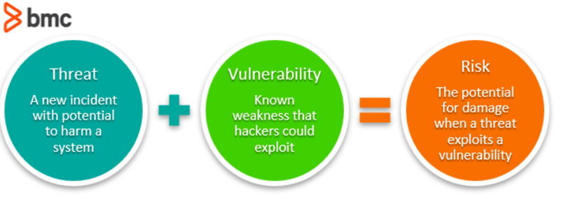
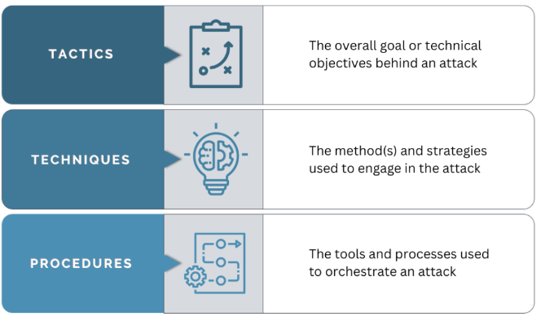

# Bezpečná infrastruktura.
> Aspekty ovlivňující bezpečnost systému na úrovni jeho infrastruktury, síťová bezpečnost. Kyberbezpečnostní hrozby a příklady útoků. Návrh bezpečnostních mechanismů, detekce zranitelností, penetrační testování, analýza bezpečnostních útoků. Příklady z praxe pro vše výše uvedené. (PA018 || PV276 || PA211)

### Aspekty ovlivňující bezpečnost systému na úrovni jeho infrastruktury
Aspekty ovlivňující bezpečnost systému na úrovni jeho infrastruktury jsou rozmanité a zahrnují řadu klíčových oblastí:
####  Fyzická bezpečnost
Ochrana hardwarových komponent, datových center a dalších fyzických prostředků před neoprávněným přístupem, poškozením nebo krádeží. Opatření pro vyšší bezpečnost mohou zahrnovat správné nastavení přístupu do datového centra, opatření proti požáru apod.
#### Zabezpečení dat
Opatření k ochraně dat uložených v systému. Zvyšování můžeme dělat například šifrováním, které ma za úkol znemožnit útočníkům získání hodnotných dat. Efektivní správa šifrovacích klíčů je zásadní pro zabezpečení dat; šifrovací klíče by měly být uchovávány odděleně od šifrovaných dat. Dnes je to běžné v cloudech, kde na to existují speciální resources. 
Jako příklad je také solení hesel. V historii se mnohokrát stalo, že unikly databáze uživatelů a solení pomohlo před odhalením hesel uživatelů v raw formě.
Další příklad zabezpečení dat je pravidelné zálohování, která ma za úkol obnovu např. v případě výpadku systému. U zálohování je také třeba dbát na více úrovní zálohování, když by jednotlivé úrovně selhaly, nebo byly zasaženy taky např. požárem datacentra.
#### Aktualizace a správa záplat
Pravidelné aktualizace softwaru a hardwaru, aby se zajistilo, že jsou všechny systémové komponenty chráněny proti nejnovějším bezpečnostním hrozbám. Většina aplikací používá nějaké dependence, nebo third party software. Jedná se o knihovny v kódu, SW pro DB atd. Staré verze těchto aplikací obsahují dost často již objevené vulnerability.
Je tak nutné sledovat a aktualizovat. Dnes již existuje SW, který dokáže tyto věci automatizovat jako např. Snyk. Je dobré dělat pravidelné bezpečnostní audity softwaru pro odhalení možných slabých míst.
#### Identity a přístupové managementy (IAM)
Správa uživatelských identit a jejich přístupových práv k zajištění, že jen oprávnění uživatelé mají přístup k citlivým systémovým zdrojům. Každý uživatel/admin by měl dostat přístup jen k částem, ke kterým ho přistupuje. Nemělo by se jít opačnou metodou, tedy povolit přístup ke všemu a následně omezovat, to je mnohem náchylnější na chyby.
Mnoho časté byly i útoky, kde nebyla víceúrovňová autentizace. Zaměstnanec se např. mohl přihlásit pouze SSH klíčem. Dnes je to ošetřeno již nutným přístupem do vnitřní sítě, 2FA atd. Politiky minimálních oprávnění a pravidelné revize oprávnění jsou klíčové pro zamezení nadměrného přístupu a potenciálního zneužití oprávnění. Víceúrovňová autentizace, včetně biometrických metod, může výrazně zvýšit zabezpečení přístupu k citlivým systémům.
#### Aplikační bezpečnost
Bezpečné programovací techniky a používání ověřených vývojových frameworků jsou klíčové pro prevenci zranitelností, jako jsou SQL injection nebo Cross-Site Scripting (XSS). Pravidelné bezpečnostní revize kódu a automatizované nástroje pro statickou analýzu mohou pomoci odhalit a opravit bezpečnostní slabiny v aplikacích. Častým problémem je i vypisování hesel a citlivých informací do logů.
#### Monitoring a logování
Monitoring a logování je důležité v případech, kdy máme podezření na průnik systému (dokážeme zpětně trasovat útočníka), nebo i k běžným kontrolám, co se v našem systému aktuálně děje. Bez správného logování a monitoringu ztrácíme přehled o vnitřním ději v systému. Automatizované nástroje pro analýzu logů a detekci anomálií mohou výrazně zlepšit schopnost identifikovat a reagovat na bezpečnostní hrozby v reálném čase.
#### Lidský faktor
Asi jen zmínit, že lidský faktor je jedním z nejčastějších příčin průniku do systému. Slabá hesla, špatná obezřetnost, nedodržování standardů nastavených firmou atd. Existuje mnoho bezpečnostních politik, které se snaží s lidským faktorem počítat a dělat doporučení i v závislosti na něj. Problémy: Je dobré, aby si uživatel měnil pravidelně heslo? Jaká je vhodná doba expirace přihlášení zaměstnance?

## Síťová bezpečnost
Síťová bezpečnost je klíčovým aspektem ochrany IT infrastruktury organizací před neoprávněným přístupem, útoky a poškozením. Většina útoků aspoň nějakým způsobem využívá síť. Kyberútoky většinou začínají útokem přes síť a také je nejjednoduší a nejlepší je eliminovat již přes síť. Zde jsou aspekty bezpečnosti

#### Firewally
Jedná se o zařízení nebo softwarové aplikace, které monitorují a kontrolují vstupní a výstupní síťový provoz na základě předem stanovených bezpečnostních pravidel. Firewally jsou první linií obrany v síťové bezpečnosti, protože filtrují nežádoucí síťový provoz.

#### Virtual Private Networks (VPN)
VPN umožňuje bezpečné připojení k síti přes veřejný internet tím, že šifruje data, která jsou přenášena mezi uživatelem a síťovými zdroji. To je zvláště důležité pro vzdálené pracovníky, kteří potřebují bezpečný přístup k firemním zdrojům. VPN je velmi často předpoklad, aby zaměstnanec mohl využívat firemní zdroje. Jde tak o snahu eliminovat komunikaci s vnější sítí na minimum.

#### Anti-malware a antivirové programy
Tato softwarová řešení chrání síť proti malware, virům, červům, trojským koním a dalším hrozbám. Velmi často obsahuje protekci jednotlivých endpointů, ale zároveň i monitorování sítě a detekci možných hrozeb a podezřelé aktivity.

#### Šifrování dat
Šifrování je klíčové pro ochranu citlivých dat během jejich přenosu po síti. Protokoly jako SSL/TLS jsou používány pro šifrování dat přenášených mezi webovými servery a prohlížeči. Šifrování lze vidět i v transportní vrstvě (TCP) a IPv6

#### Síťová segmentace
Rozdělení sítě na menší části (segmenty) může pomoci omezit šíření škodlivého softwaru a zvýšit výkon tím, že se oddělí citlivé oblasti sítě od ostatních. Využití lze například najít při testování škodlivého software. Lze omezit síť tak, že systémy, které dané hrozby spouštějí jsou na omezené síti (black network) a zamezí se tak možné lateral movement hrozbě po síti.

#### Správa přístupu a autentizace
Síťová bezpečnost zahrnuje také správu přístupu k síťovým zdrojům. To znamená ověřování uživatelů a zařízení, které se pokoušejí získat přístup do sítě, a zajištění, že mají příslušná oprávnění. Jsou tam jednotlivé části jako Identifikace, Autentizace a Autorizace

## Kyberbezpečnostní hrozby a příklady útoků 

Analýza rizik identifikuje možná rizika a identifikuje možná vylepšení. Útok je konkrétní akt prolomení bezpečnostních kontrol a vniku do systému, kde může udělat aktivní změny, nebo jen např. pasivně vytáhnout nějaká data. Útok nemusí být vždy úspěšný a může zůstat u stádia pokusu. Daný útok nemusí využívat jen jedné vulnerability/threatu, může se jednat o kombinaci, která dovolí útočníkovi proniknout do systému.

Na obrázku můžete vidět části konkrétního útoku. Příklad může být následovný:
Taktika: Eskalace privilegií a získání přístupu nad systémem
Technika: Využití vulnerability k prolomení SSH hesla uživatele + následné využití zastaralého balíčku v systému k získání sudo právům
Procedury: SW pro slovníkový útok pomocí hesla + CLI daného balíčku k získání přístupu

Existují různé katalogy technik, taktik atd. Nejdůležitější z nich je MITRE ATT&CK. Ten obsahuje matice taktik a technik. Daná společnost také hodnotí jednotlivé antiviry a protection software, jak velké množství daných hrozeb dokáže detekovat a reagovat na ně. Také hodnotí přesnost daného SW v popisu jednotlivých hrozeb

Cyber threat hunting je proaktivní hledání nových hrozeb a možných útoků. Je velmi důležitý při hledání 0-day vulnerabilit. To jsou vulnerability, které nejsou veřejně známé, tudíž proti nim nejsou vydané security patche a jsou skrz to nebezpečné. Může se stát, že útočník má k dispozici danou vulnerabilitu několik měsíců/let, než ji odhalí tvůrce systému. Kombinaci 0-day vulnerabilit využíval například spyware Pegasus k ovládnutí celého systému chytrých telefonů. Společnosti vypisují bug bounty program, který má motivovat "hodné hackery" k hledání těchto chyb a jejich reportování společnostem. Ty jsou následně peněžně ohodnoceny firmami. Firmy dost často mívají i svůj red team, který má za úkol prolomit systém, chovat se jako útočník a reportovat zjištěné slabiny.

#### Příklady útoků
- 0-day - Útoky využívající zero-day zranitelností, tedy slabých míst v softwaru, o kterých výrobce ještě neví a neexistuje pro ně záplata. Příkladem je Stuxnet, kybernetická zbraň, která využívala několik zero-day exploitů k napadení íránského jaderného programu. Jedná se o kategorizaci závažnosti hrozby spíše než o její typ.
- Malware - zahrnuje SW, který má za úkol škodit a nějak napadnout systém. Může zahrnovat mnoho různých typů škodlivého SW, který je dále kategorizován podle toho, jak má útočit. Na internetu existují databáze known malware souborů, které využívají většinou hash souboru. Příkladem databáze je VirusTotal.
- Ransomware - má za úkol zašifrovat data na daném systému a poté většinou vyžadovat výkupné. Aktuálně typ malware, který je nejvíc na vzestupu. Mohli jsme vidět útoky i na nemocnici v Brně. Speciálním typem jsou wipery, které mají za úkol data smazat.
- 0-click - hlavně u smartphonů. Jedná se o útok, který nepotřebuje jakoukoliv interakci uživatele a většinou po sobě zamaže i stopy. Příkladem je Pegasus, který dokázal infikovat zařízení uživatelů jen pomocí pouhého zavolání, které ani daná osoba nemusela přijmout.
- Phising - tyto útoky zahrnují posílání podvodných e-mailů, které se zdají pocházet z důvěryhodných zdrojů, s cílem získat citlivé informace, jako jsou přihlašovací údaje a čísla kreditních karet. Slavným příkladem je útok na Hillary Clintonovou během prezidentské kampaně v USA v roce 2016.
- DDOS - cílem těchto útoků je přetížit webové servery nebo sítě tak, aby se staly nedostupnými pro legitimní uživatele. Například v roce 2016 byl proveden masivní DDoS útok na službu Dyn, což vedlo k výpadku mnoha velkých webových stránek, včetně Twitteru a Netflixe.
- Insider threats - tyto hrozby pochází od jedinců uvnitř organizace, kteří zneužívají svůj přístup k citlivým informacím. Jeden z nejznámějších případů je Edward Snowden, který v roce 2013 ukradl a zveřejnil tajné dokumenty NSA.
- Lateral movement - útočníci používají k rozšíření svého dosahu v rámci síťové infrastruktury oběti po počátečním průniku. Tento pohyb umožňuje útočníkům získat přístup k dalším systémům a zdrojům v síti, často s cílem získat citlivé informace, způsobit škody nebo připravit terén pro další útoky.

Existuje software, který dokáže jednotlivé útoky monitorovat a detekovat (detect) a v případě zájmu uživatele i udělat protiakci. Může se jednat o zablokování malware souborů s negativním hashem, zablokování škodlivého procesu, revert souborů u ransomware atd.

## Návrh bezpečnostních mechanismů
Proces vytváření systémů, procesů a nástrojů, které chrání data, sítě a systémy před neoprávněným přístupem, zneužitím, ztrátou, změnou nebo poškozením
Důvěrnost (Confidentiality): 
Tento princip se týká ochrany informací před neautorizovaným přístupem nebo zveřejněním. Cílem je zajistit, aby měly k citlivým datům přístup pouze oprávněné osoby. To se obvykle dosahuje pomocí metod jako jsou šifrování, kontrola přístupu a autentizační protokoly. Mezi typ útoků, který nabouráva důvěrnost je například spyware.
Spyware má za úkol např. špehovat uživatele a odkrývat citlivé informace, ke kterým by měli mít přístup jen autorizované osoby.

Integrita (Integrity): Integrita zajišťuje, že data nejsou změněna nebo poškozena v neautorizovaném procesu. To zahrnuje ochranu proti neoprávněnému nebo náhodnému úpravě dat. Mechanismy zajišťující integritu zahrnuje hashování, digitální podpisy a systémy pro správu verzí. Při monitoringu systému se dosta často používá i kontrola hashování jednotlivých souborů.

Dostupnost (Availability): Tento princip zajišťuje, že data a informační systémy jsou dostupné a funkční pro oprávněné uživatele, když jsou potřeba. Dostupnost se zajistí pomocí redundance systémů, efektivního řízení síťových zdrojů, a plánováním obnovy po haváriích a katastrofách. Mezi útoky na dostupnost patří například ransomware, který znemožňuje fungování organizace a vyžaduje výkupné. Nejjednodušší a velmi klasický útok na dostupnost je potom DDOS.

Při návrhu bezpečnostních mechanismů je třeba brát v úvahu tyto důležité body:
1. **Identifikace rizik a hrozeb**

Musíme vědět, proti čemu vlastně systém chceme zabezpečovat. Je důležitá definice hrozby, případné vulnerability, nebo vlastnosti, kterou chceme posilovat. Je také možné definovat typ útoku, proti kterému chceme systém více zabezpečit. Zde si můžeme vybrat například DDOS útok pro příklad.

2. **Naplánování strategie**

Po identifikaci je důležité zvolit taktiku, kterou zvolíme pro zvýšení bezpečnostních mechanismů. U DDOS útoků můžeme zvýšit horizontální škálování, aby neměli DOS všechny systémy najednou, nebo se můžeme pokusit detekovat DDOS útoky a zabránit útočníkovi v dalších requestech/filtrovat je pomocí firewallu.

3. **Volba konkrétních nástrojů a postupů**

Následně zvolíme vhodné konkrétní nástroje a postupy, které aplikujeme. Můžeme vybrat konkrétní firewall, můžeme využít služby cloudu, které dané služby nabízí

#### Program informační bezpečnosti
**Program informační bezpečnosti** je komplexní rámec zahrnující různé aspekty, jako jsou logické, administrativní a fyzické ochranné mechanismy, procesy, obchodní postupy a lidé, kteří spolupracují na zajištění ochrany prostředí. Hlavními cíli jsou:

**Rovnováha mezi bezpečností a funkčností**: Program by měl vyvážit potřeby zabezpečení a podnikové funkčnosti, aby nedocházelo k negativnímu dopadu na produktivitu.

**Komplexní přístup**: Všechny prvky - lidé, procesy, data a technologie - musí být chráněny. Bezpečnost zahrnuje nejen technická řešení, ale i správné chování a postupy.

**Řízení rizik**: Obsahuje několik kroků, včetně posouzení a řešení rizik, a zahrnuje použití nástrojů jako je matice hodnocení rizik pro vizuální hodnocení a prioritizaci rizik.

**Bezpečnostní dokumentace**: Zahrnuje politiky, standardy, směrnice a postupy, které pomáhají zaměstnancům při správném rozhodování a dodržování právních požadavků.

**Standardy a frameworky**: Program by měl být založen na standardizovaných bezpečnostních frameworkách, jako je ISO/IEC 27000 nebo NIST 800-39, a musí být přizpůsoben podle potřeb organizace.

**Životní cyklus bezpečnostního programu**: Zahrnuje plánování, implementaci, provoz, monitorování a vyhodnocování, aby se zajistilo, že bezpečnostní opatření jsou vždy aktuální a efektivní.

Celkově program informační bezpečnosti vyžaduje komplexní a integrovaný přístup, který spojuje technické, organizační a lidské faktory k efektivní ochraně informací.

#### Příklady
##### Firewall
"Zeď" mezi vnitřní a vnější sítí. Umožňuje povolování/zakazování určitého typu komunikace podle definovaných pravidel. Brání síť před potenciálně škodlivou komunikací. Ideální je blokovat spíše většinu komunikace a dávat povolení pro chtěnou -> to však může způsobit problémy se stabilitou a chtěnou propustností.
##### Intrusion Detection System a Intrusion Prevention System
IDS je systém, který monitoruje síťový provoz za účelem detekce podezřelých aktivit, které by mohly signalizovat pokus o narušení nebo útok. IPS je rozšířením IDS, které nejen detekuje útoky, ale je také schopné provádět akce k jejich zablokování nebo zmírnění. Taktika detect and prevent.
Cisco Firepower je příkladem komerčního IPS. Tento systém poskytuje komplexní prevenci proti hrozbám, která zahrnuje jak funkce IDS, tak IPS. Cisco Firepower analyzuje síťový provoz a automaticky reaguje na detekované hrozby tím, že blokuje nebezpečný provoz nebo izoluje postižené systémy, aby zabránil šíření hrozeb v síti.
##### Antivirusový systém
Slouží na detekci, blokování a odstraňování škodlivého SW. Na rozdíl od IDS a IPS nemonitoruje síť, ale konkrétní systém/endpoint. Existuje mnoho typů antivirů, některé jsou určené čistě pro jeden systém, existují však i Sw, který má za úkol monitorovat všechny endpointy v organizaci. Statistiky a ovládání potom sdružuje do jednotného managementu. Důležité hlavně pro větší businessy.

## Detekce zranitelností
#### Slabiny a Zranitelnosti
Slabina je technická chyba v softwaru nebo hardwaru, obvykle způsobená chybným designem, architekturou nebo implementací. Tato chyba může vést k zranitelnosti, což je konkrétní případ slabiny, který lze zneužít. Příklady slabiny zahrnuje jednofaktorová autentizace a SQL Injection. Zranitelnosti, jako Eternal Blue, jsou konkrétními příklady, kde se slabiny stávají využitelnými. EternalBlue (CVE-2017-0144) - Zranitelnost v implementaci SMB protokolu ve Windows, kterou zneužil ransomware WannaCry k šíření mezi počítači. EternalBlue byl původně vyvinut NSA a unikl veřejnosti před jeho masivním zneužitím.

#### Oprava zranitelností
Proces opravy zranitelností zahrnuje identifikaci problémů a jejich řešení, často prostřednictvím aktualizací nebo záplat poskytovaných výrobcem. Toto řešení může být dočasným nebo trvalým a nemusí být vždy nejlepší dostupnou možností, přičemž někdy může být preferována kompletní aktualizace nebo změna produktu.

#### Management zranitelností
Tento proces zahrnuje sledování, analýzu a zmírňování zranitelností v kybernetických systémech. Zahrnuje objevení zranitelností, stanovení jejich priority, správu a opravu, a nakonec ověření, zda byly účinně odstraněny. Proces je závislý na efektivní správě kybernetických aktiv a zahrnuje sledování stavu každé identifikované zranitelnosti. Zranitelnosti lze definovat a objevovat penetračním testováním, automatizovanými nástroji, reporty od uživatelů, bug bounty programu atd.

#### Detekce a zjišťování zranitelností
Zahrnuje rozsáhlé hodnocení zranitelností v systémech. Používají se různé metody, včetně agentů pro záplatování, aktivního a pasivního monitoringu. Skenery zranitelností jako Nessus nebo OpenVAS jsou příkladem aktivního monitoringu. Zjišťování zranitelností je možné pomocí bug bounty programu, externím penetračním testováním, zřízení red teamu atd.

#### CVE a NVD 
Common Vulnerabilities and Exposures (CVE) je veřejný seznam známých zranitelností, poskytující pro každou zranitelnost unikátní identifikátor, popis a referenční odkazy. National Vulnerability Database (NVD) je americký vládní archív, který rozšiřuje informace poskytnuté v CVE, přidávajíc zde dopad, závažnost a další bodové informace ve formě CVSS.

#### CVSS a CCSS
Common Vulnerability Scoring System (CVSS) poskytuje standardizovaný způsob hodnocení závažnosti zranitelností. Hodnocení zahrnuje různé metriky, jako jsou dopad, složitost a využiteľnost zranitelnosti. CVSS nabízí dvě verze hodnocení - v3.1 a v2, s různými metrikami pro každou verzi. Přestože CVSS poskytuje užitečný rámec, nemělo by být využíváno jako jediný nástroj pro prioritizaci zranitelností, protože mnoho zranitelností s vysokým CVSS skóre nemusí mít veřejné exploitace.

#### Nástroje pro detekci zranitelností
K detekci a řešení zranitelností se používají různé nástroje a řešení. Skenery zranitelností jako Nessus, OpenVAS a Nexpose poskytují aktivní monitorování a identifikaci zranitelností. Komplexní řešení pro management zranitelností, jako Qualys, Rapid7 InsightVM, Tenable.sc a F-Secure Radar, poskytují holistický přístup k detekci, analýze a řešení zranitelností. Řadíme sem například Greenbone Vulnerability Management, který nabízí možnost vytváření a správy skenovacích úloh, včetně detailního nastavení cílů, harmonogramů a testů

## Penetrační testování
Penetrační testování je metoda ověřování bezpečnosti IT systémů simulací útoků pomocí stejných nástrojů a technik, jaké používá potenciální útočník. Cílem je identifikovat bezpečnostní slabiny v systému před útočníkem. Testy mohou provádět interní nebo externí týmy, přičemž frekvence testování závisí na charakteru testovaného systému. Interním týmům se říká velmi často red týmy.

Penetrační testování zahrnuje dvě hlavní oblasti:

**Technická rovina**: Zaměřuje se na testování implementace bezpečnostních opatření a na poskytování zpětné vazby a návrhů na nápravu vývojářům.
**Sociální rovin**: Zahrnuje komunikaci výsledků a zjištění s managementem společnosti, který má zájem o bezpečnostní stav systémů.

Pro úspěšné penetrační testování jsou nezbytné následující znalosti a dovednosti:

Orientace v oblasti CVE (Common Vulnerabilities and Exposures) a CWE (Common Weakness Enumeration).
Znalosti standardních technologií a schopnost identifikovat potenciální rizika.
Soft skills, včetně porozumění právním aspektům souvisejícím s ochranou soukromí.

Penetrační testování se dále kategorizuje podle:

**Testovacího týmu**: Externí versus interní týmy.
**Testovaného cíle**: Webové aplikace, infrastruktura, mobilní aplikace atd.
**Přístupu k systému**: Black-box (bez předchozích informací o cíli), Grey-Box (s některými informacemi), White-Box (s úplnými informacemi).

Životní cyklus penetračního testování zahrnuje následující fáze:

**Příprava**: Definice cílů, rozsahu testování 
**Plánování**: Přijetí dokumentace od klienta, výběr metodiky a vytvoření testovacího plánu.
**Testování**: Fáze zahrnuje průzkum (reconnaissance), modelování hrozeb, identifikaci zranitelností, zneužití (exploitation) a post-exploitation aktivity.
Penetrační testování využívá různé metodologie, jako je OWASP Web Security Testing Guide nebo NIST 800-115, a nástroje pro skenování sítě (např. Nmap, RustScan) a webové nástroje (OWASP ZAP, Burp Suite).

Podání zprávy je závěrečnou fází penetračního testování a zahrnuje technické detaily nálezů, návrhy na nápravu a prezentaci výsledků pro management. Zpráva by měla obsahovat disclaimery, rozsah, zhrnutí pro management, detailní popis nálezů a doporučení na zlepšení.

## Analýza bezpečnostních útoků.

Analýza bezpečnostních útoků je proces zkoumání a hodnocení útoků nebo pokusů o neoprávněný přístup k informačním systémům, který pomáhá pochopit jejich povahu, zdroje a důsledky. Tato analýza je klíčem k reakci na bezpečnostní incidenty a zlepšuje připravenost organizací na budoucí útoky. Proces zahrnuje:

**Shromažďování informací**: Získávání dat o útoku, jako jsou logy, sieťové pakety, systémové záznamy a incidentní zprávy, které poskytují kontext pro analýzu.

**Identifikace a klasifikace**: Analyzování charakteristik útoku, včetně použitých technik a cílů, pro klasifikaci útoku a zjištění, které další systémy mohly být ohroženy.

**Analýza příčiny**: Hledání príčin útoku, včetně vyhledávání zranitelností v softwaru, nesprávných konfigurací nebo sociálního inženýrství.

**Důsledková analyza**: Hodnocení dopadu útoku na organizaci, zahrnující ztrátu dat, finanční náklady a reputační škody.

**Návrh opatření**: Vycházející z analýzy se navrhují opatření pro zlepšení bezpečnosti, jako jsou aktualizace softwaru a zlepšení bezpečnostních politik a detekčních procesů.
