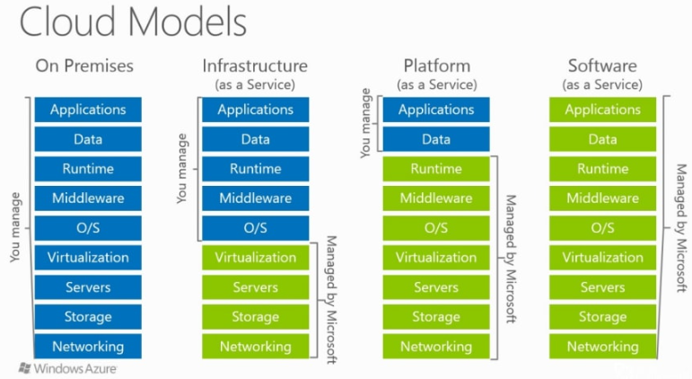

# Cloud computing
> IaaS, PaaS, SaaS cloud. Koncepty a principy návrhu a vývoje aplikací určených pro nasazení do cloudového prostředí. Cloudové služby v kontextu PaaS cloud, služby pro ukládání dat. Zajištění kvality aplikací v cloudovém prostředí, výkonnost, škálovatelnost, dostupnost, bezpečnost. Příklady z praxe pro vše výše uvedené.

## Cloud computing

Cloud computing je model poskytování výpočetních služeb prostřednictvím internetu, který umožňuje uživatelům přistupovat k široké škále zdrojů, jako jsou servery, úložiště, databáze, síťové komponenty, software a další služby. Tyto zdroje jsou hostovány a spravovány poskytovateli cloudových služeb a jsou uživatelům k dispozici na vyžádání, obvykle na základě předplatného nebo platby za využití.

Cloud computing nabízí několik klíčových výhod, jako je snížení nákladů na IT infrastrukturu, zvýšená flexibilita a škálovatelnost zdrojů, a také umožňuje uživatelům přistupovat k aplikacím a datům odkudkoliv, kde je připojení k internetu. Mezi výhody patří i dodržování předpisů a např. GDPR pro ochranu dat. Uživatel si většinou může určit, v jakém státě uchovávat data atd. Existují různé modely cloudových služeb, jako je veřejný cloud, soukromý cloud a hybridní cloud, každý s vlastními specifickými vlastnostmi a výhodami.

## IaaS, PaaS, SaaS

#### IaaS (Infrastructure as a Service)
**Definice**: Poskytuje výpočetní výkon, disková úložiště, síťová řešení atd. Můžeme si například na cloudu rezervovat VM s určitým provisioned HW a operačním systémem.
**Funkce**: Alokuje virtuální stroje (VM) podle požadavků zákazníka, odstínění od manuálního nastavení sítě, firewallu a hardwaru. Samotný software jako instalace dockeru a nastavování prostředí pro aplikaci řešíme už sami.
**Zodpovědnost zákazníka**: Správa operačního systému a vyšších vrstev infrastruktury. Musíme sami instalovat potřebný software, aktualizovat systém a SW. Částečně i nastavování síťových pravidel atd.
**Výhody**: Stabilita (provideři mají většinou implementovanou high availability, kterou bychom u klasické VM nedostali), jednoduchá vertikální škálovatelnost (dokážeme celkem jednoduše přidat HW pro virtualizaci a zaplatit více), nemusíme spravovat vlastní hardware. Oproti on-premise nulové počáteční investice do HW a možnost platby podle aktuálního vytížení systému.
**Nevýhody**: Závislost na externím systému, potřeba vlastní konfigurace a znalost požadavků. Ve výsledku není extra moc automatizované, je to podobné jako kdybychom dostali od nějakého hostingu přístup k virtuálnímu stroji/mašině. Pokud víme, že budeme mít stálé využití HW, jsou on-premise řešení dlouhodoběji levnější.
**Příklady**: Azure Compute, HPC, GCP Compute Engine, Azure Storage managed disk, Google Persistent Disk.
#### PaaS (Platform as a Service)
**Definice**: Kompletní vývojářské prostředí v cloudu. Píšeme aplikaci dle nějakého protokolu (C#, Python aplikace) a cloud nasazení vyřeší již kompletně za nás. Je možné využívat a instalovat dependence pro projekt.
**Funkce**: Odstínění od O/S,middleware úrovně (neřešíme záplaty systému, instalování potřebných dependencí). Cloud poskytuje celkové nastavení a deployment pro aplikaci, stačí jen nahrát kód do repozitáře a mělo by všechno proběhnout automaticky.
**Výhody**: Automatizované škálování a nasazování, větší bezpečnost na O/S, middleware vrstvách, jelikož jsou spravovány cloudem a aktualizovány. Opadá také práce a nutnost, která souvisí s udržováním těchto vrstev.
**Nevýhody**: Ztráta kontroly nad některými vrstvami, složitější debugování, nutnost dodržovat protokol pro daný typ aplikace (cloud povoluje jen drobnější změny)
**Příklady**: Azure Web App, GCP Cloud Run, Azure Storage, Amazon S3, Google Cloud Storage.
#### SaaS (Software as a Service)
**Definice**: Hotový software poskytovaný uživatelům.
**Funkce**: Uživatelé přímo využívají software bez potřeby jeho nasazování nebo správy zdrojů.
**Výhody**: Minimalizace nákladů a starostí o aplikaci. Používáme buď jako uživatel, nebo pomocí API a nestaráme se tak o nic jiného než odpověď a pricing za dotazy.
**Příklady**: Office 365, Google Apps (Gmail, Google Docs).
nějak sem to opravil, lepší?
