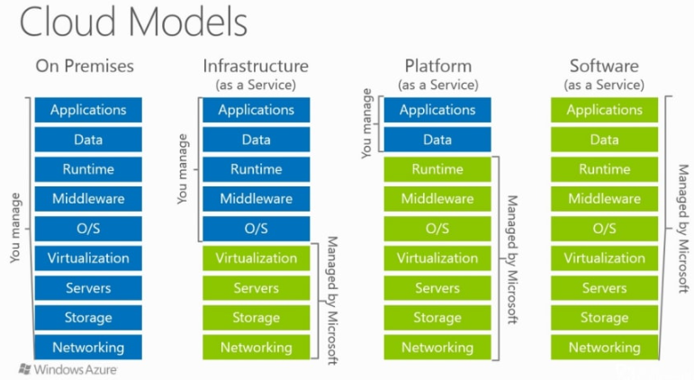
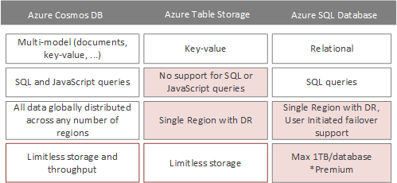
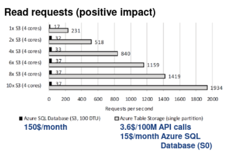
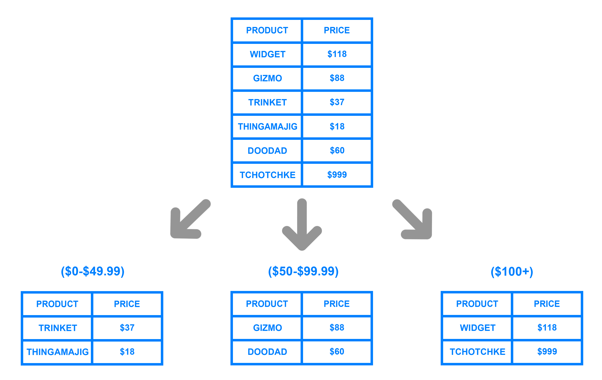
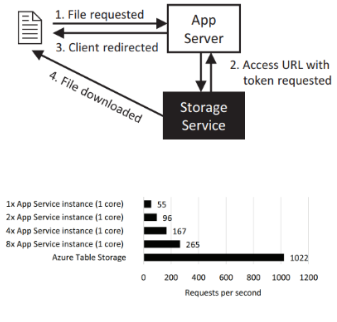
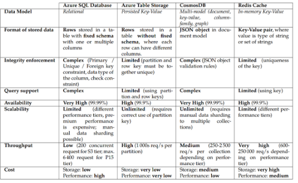

# Cloud computing
> IaaS, PaaS, SaaS cloud. Koncepty a principy návrhu a vývoje aplikací určených pro nasazení do cloudového prostředí. Cloudové služby v kontextu PaaS cloud, služby pro ukládání dat. Zajištění kvality aplikací v cloudovém prostředí, výkonnost, škálovatelnost, dostupnost, bezpečnost. Příklady z praxe pro vše výše uvedené.

## Cloud computing

Cloud computing je model poskytování výpočetních služeb prostřednictvím internetu, který umožňuje uživatelům přistupovat k široké škále zdrojů, jako jsou servery, úložiště, databáze, síťové komponenty, software a další služby. Tyto zdroje jsou hostovány a spravovány poskytovateli cloudových služeb a jsou uživatelům k dispozici na vyžádání, obvykle na základě předplatného nebo platby za využití.

Cloud computing nabízí několik klíčových výhod, jako je snížení nákladů na IT infrastrukturu, zvýšená flexibilita a škálovatelnost zdrojů, a také umožňuje uživatelům přistupovat k aplikacím a datům odkudkoliv, kde je připojení k internetu. Mezi výhody patří i dodržování předpisů a např. GDPR pro ochranu dat. Uživatel si většinou může určit, v jakém státě uchovávat data atd. Existují různé modely cloudových služeb, jako je veřejný cloud, soukromý cloud a hybridní cloud, každý s vlastními specifickými vlastnostmi a výhodami.

## IaaS, PaaS, SaaS

#### IaaS (Infrastructure as a Service)
**Definice**: Poskytuje výpočetní výkon, disková úložiště, síťová řešení atd. Můžeme si například na cloudu rezervovat VM s určitým provisioned HW a operačním systémem.
**Funkce**: Alokuje virtuální stroje (VM) podle požadavků zákazníka, odstínění od manuálního nastavení sítě, firewallu a hardwaru. Samotný software jako instalace dockeru a nastavování prostředí pro aplikaci řešíme už sami.
**Zodpovědnost zákazníka**: Správa operačního systému a vyšších vrstev infrastruktury. Musíme sami instalovat potřebný software, aktualizovat systém a SW. Částečně i nastavování síťových pravidel atd.
**Výhody**: Stabilita (provideři mají většinou implementovanou high availability, kterou bychom u klasické VM nedostali), jednoduchá vertikální škálovatelnost (dokážeme celkem jednoduše přidat HW pro virtualizaci a zaplatit více), nemusíme spravovat vlastní hardware. Oproti on-premise nulové počáteční investice do HW a možnost platby podle aktuálního vytížení systému.
**Nevýhody**: Závislost na externím systému, potřeba vlastní konfigurace a znalost požadavků. Ve výsledku není extra moc automatizované, je to podobné jako kdybychom dostali od nějakého hostingu přístup k virtuálnímu stroji/mašině. Pokud víme, že budeme mít stálé využití HW, jsou on-premise řešení dlouhodoběji levnější.
**Příklady**: Azure Compute, HPC, GCP Compute Engine, Azure Storage managed disk, Google Persistent Disk.
#### PaaS (Platform as a Service)
**Definice**: Kompletní vývojářské prostředí v cloudu. Píšeme aplikaci dle nějakého protokolu (C#, Python aplikace) a cloud nasazení vyřeší již kompletně za nás. Je možné využívat a instalovat dependence pro projekt.
**Funkce**: Odstínění od O/S,middleware úrovně (neřešíme záplaty systému, instalování potřebných dependencí). Cloud poskytuje celkové nastavení a deployment pro aplikaci, stačí jen nahrát kód do repozitáře a mělo by všechno proběhnout automaticky.
**Výhody**: Automatizované škálování a nasazování, větší bezpečnost na O/S, middleware vrstvách, jelikož jsou spravovány cloudem a aktualizovány. Opadá také práce a nutnost, která souvisí s udržováním těchto vrstev.
**Nevýhody**: Ztráta kontroly nad některými vrstvami, složitější debugování, nutnost dodržovat protokol pro daný typ aplikace (cloud povoluje jen drobnější změny)
**Příklady**: Azure Web App, GCP Cloud Run, Azure Storage, Amazon S3, Google Cloud Storage.
#### SaaS (Software as a Service)
**Definice**: Hotový software poskytovaný uživatelům.
**Funkce**: Uživatelé přímo využívají software bez potřeby jeho nasazování nebo správy zdrojů.
**Výhody**: Minimalizace nákladů a starostí o aplikaci. Používáme buď jako uživatel, nebo pomocí API a nestaráme se tak o nic jiného než odpověď a pricing za dotazy.
**Příklady**: Office 365, Google Apps (Gmail, Google Docs).
nějak sem to opravil, lepší?

## Vzory a principy návrhu cloudových aplikací:
Abychom plně využili možnosti cloudu, je třeba kromě klasických principů u aplikací myslet na tyto věci:
- **Škálovatelnost** - v cloudu je velmi jednoduché škálovat aplikaci vertikálně i horizontálně a měla by na to být připravená bez větších změn
- **Drobné chyby cloudu** - v cloudu se můžeme setkat se specifickými chybami jako milisekundové výpadky, nebo pomalý náběh u služby, která nebyla dlouho využívaná -> aplikace by s němi měla počítat
- **Chytré využívání zdrojů** - v cloudu je možné platit jen využívaný výkon aplikace, proto je důležité, aby aplikace využívala výkon, který opravdu potřebuje a zbytečně jim neplýtvala -> je také důležité rozmyslet se jaký typ služby a pricingu si vybereme, protože to dokáže dělat velké rozdíly

#### Výběr úložiště
Při výběru vhodného úložiště pro cloudové aplikace je třeba zvážit několik faktorů. Cloudové prostředí nabízí širokou paletu úložných možností, každá s vlastními specifikami, výhodami a omezeními. Například, Azure SQL Database nabízí bohaté možnosti dotazů a je ideální pro úložiště, které vyžadují silnou podporu transakcí a konzistence dat. Na druhou stranu, Azure Table Storage je vhodnější pro scénáře, které vyžadují vysokou propustnost a nízké provozní náklady, ale s méně náročnými požadavky na dotazy a konzistenci. Ve většině složitějších aplikací je vhodné kombinovat tyto typy databází, protože nejlépe chceme na různé use casy využívat jejich výhody. Zde jsou porovnány jednotlivé typy DB služeb u Azure (PaaS):

#### Materializované zobrazení vs cache-aside
**Materializované zobrazení** je užitečný pro situace, kde je potřeba optimalizovat čtecí operace. Materializované zobrazení předvyplňuje a udržuje data ve formě, která je přímo vhodná pro čtení, což může znamenat výrazné zlepšení výkonu pro často používané dotazy. Tento přístup je obzvláště užitečný, pokud jsou zdrojová data složitá a jejich příprava pro dotazy je náročná na výpočetní výkon.
Je třeba si uvědomit, že relační databáze jsou jedním z nejčastějších bottlenecků v aplikaci. Pokud si dotazy předpočítáváme, ušetříme složité dotazy na databázi. Materializované zobrazení nemusí mít vždy nejnovější data z relační databáze, to nám však nevadí. Můžeme aplikovat různé principy na invalidaci.
Na obrázku jde vidět o kolik dokáže být rychlejší NoSQL databáze s předpočítanými dotazy:

**Cache-Aside** má podobné využití jako materalizované zobrazení, je zde však mnoho rozdílů. Cache-aside vzor nepředpočítává data a jen cachuje ty, které si uživatel vyžádal -> není potřeba dávat stejný dotaz do DB dvakrát. Data jsou oproti materializovanému zobrazení většinou ve stejné podobě jako z originální databáze -> materializované zobrazení předpočítává většinou jiný typ dat a ukládá je někam. U cache-aside patternu se ptáme přímo relační databáze a pokud dotaz již přišel dřív, posíláme cachovaný výsledek -> u materializovaného zobrazení máme většinou odlišnou DB, kam se dotazujeme jinak než na relační. U obou přístupů můžeme nastavit politiku, jakým způsobem, nebo jak často mají být data přepočítána/invalidována -> to ovlivňuje efektivitu těchto přístupů a pravděpodobnost, že jsou k dispozici nejnovější data. Každý přístup je použitelný v jiných situacích. Materializované view jsou vhodné pro scénáře s komplexními dotazy, kde je přijatelná mírná zpoždění v konzistenci (třeba předpočítávání zdi na FB). Cache aside je vhodný pro aplikace, kde se opakují jednotlivé cally do relační databáze a nepotřebujeme tam úplnou nutnost aktuálnosti dat.

##### Sharding Pattern
Efektivní rozdělení (sharding) dat je klíčové pro škálovatelnost aplikací v cloudu. Tento vzor umožňuje rozložit data do více oddělených oddílů nebo shardů, což umožňuje lepší distribuci zátěže a optimalizaci výkonu. Hlavní výzvou je navrhnout správnou strategii rozdělení tak, aby bylo možné efektivně ukládat a dotazovat data. Nejčastější je indexování podle nějakého
klíče:

#### Hosting Statického Obsahu:

Při návrhu cloudových aplikací je důležité efektivně spravovat statický obsah, jako jsou CSS, JavaScript a obrázky. Tento obsah by neměl být hostován společně s dynamickým obsahem na aplikačním serveru. Místo toho je vhodnější využít služby jako Azure Blob Storage ve spojení se síťovým distribučním systémem (CDN), což může výrazně zvýšit rychlost načítání statického obsahu a snížit zatížení aplikačních serverů. Je třeba říct, že aplikační prostředky stojí většinou větší množství peněz než služby zaměření na statický obsah. Proto se vyplatí decoupling mimo aplikaci

**Vzor Valet Key**
Vzor Valet Key se používá pro poskytování bezpečného, ale omezeného přístupu k zdrojům. V cloudových aplikacích tento vzor umožňuje klientům přímý přístup k určitým zdrojům, jako jsou soubory uložené v cloudu, aniž by museli procházet aplikačním serverem. Tím se snižuje zatížení serveru a zvyšuje se efektivita přenosu dat. Buď jsou dané soubory přístupné všem uživatelům,
nebo aplikační server poskytuje uživateli klíč, pomocí kterého může k souboru přistoupit. Tato komunikace už jde mimo aplikační server:

#### Zpracování zpráv

Ve světě cloudových aplikací je často výhodné využívat asynchronní zpracování zpráv, což umožňuje efektivnější a škálovatelnější architekturu. Asynchronní zpracování je zvláště užitečné pro dlouhotrvající nebo náročné operace, kde by synchronní zpracování mohlo vést k časovým limitům nebo špatné škálovatelnosti. PaaS cloudu nabízí různé služby pro zasílání zpráv, které mohou být využity k oddělení různých částí systému a zlepšení celkového výkonu. Pokud naši aplikaci sestavujeme z různých služeb, microservices, je využití zpráv naprosto ideální pro komunikaci mezi jednotlivými částmi systému. Cloud většinou nabízí několik služeb, které jsou specializované na messaging a každá nabízí trošku odlišné řešení.

##### Asynchronní zasílání zpráv
Využívá fronty, kde se ukládají zprávy a potom má subscribery, kteří zprávy zpracovávají a dělají požadované akce. U microservices dokážeme udělat logiku tak, že se microservices spouští jen podle toho, jestli jsou ve frontě zprávy -> dobré škálování, kdy si dynamicky řekneme o potřebný počet workerů. Většinou máme víc front podle typu zpráv, kde tak můžeme specializovat jednotlivé workery. U zpráv, kde dáváme ke zpracování více workerů najednou musíme řešit, aby nebyly závislé na pořadí ve kterém přijdou -> případně implementovat prioritu. Musíme vyřešit i zachytávání zpráv, které se nepodařilo zpracovat -> pokus o jejich zpracování vícekrát. Zprávy ve frontě se můžou duplikovat, je třeba s tím počítat. Ještě existuje **topic** oproti queue, tam se počítá s tím, že se konzument přihlásí o odběr a jedna zpráva je doručena všem konzumentům topicu -> využití, když chceme předat zprávu všem napojeným aplikacím.

#### Mikroslužby
Mikroslužby jsou architektonický styl vývoje softwaru, kde aplikace jsou rozděleny do malých, nezávislých služeb. Každá mikroslužba je zaměřena na jednu specifickou funkcionalitu a funguje autonomně. Služba má vlastní část kódu, nesdílí ho s dalšími částmi aplikace. Při návrhu aplikací do cloudu je mikroslužby dobré brát v úvahu, dají se pomocí nich škálovat nějaké hodně vytížené endpointy, poskytují dobrou modularitu, škálovatelnost a elastičnost. Nemusíme psát celou aplikaci pomocí mikroslužeb, ale můžeme ji využít jen k části

#### Monitorování a správa
Cloudy nabízí velké monžnosti při monitoringu a následných napojených akcích. Můžeme kontrolovat využití našich systémů a pokud nestačí, tak naškálovat. To stejné můžeme udělat i opačným směrem k šetření prostředků. Cloudy potom nabízí i aplikace na logy, které dokáže analyzovat atd.

## Cloudové služby v kontextu PaaS cloud, služby pro ukládání dat
#### PaaS
PaaS (Platform as a service) je kategorie cloudových služeb, která poskytuje platformu umožňující zákazníkům vývoj, spuštění a správu aplikací bez složitostí spojených s budováním a údržbou infrastruktury typicky spojené s vývojem a spuštěním aplikací. Pokud máme například nějakou Python aplikaci, tak dodržíme nějaké protokoly, kde máme sepsané dependence, jaký je entrypoint aplikace a více neřešíme. Cloud se postará o vyrobení prostředí i nasazení aplikace. Příklady:

**Amazon Web Services (AWS)**: Služba od Amazonu, která automatizuje nasazení aplikací v cloudovém prostředí. Podporuje různé programovací jazyky a frameworky, jako jsou Java, .NET, PHP, Node.js, Python, Ruby, Go a Docker.

**Microsoft Azure App Service**: Nabízí různé nástroje a služby pro vývoj, nasazování a správu webových aplikací. Podporuje širokou škálu jazyků, včetně .NET, .NET Core, Java, Ruby, Node.js, PHP nebo Python.

**Heroku**: Velmi oblíbená cloudová platforma, která podporuje několik programovacích jazyků, včetně Ruby, Java, PHP, Python, Node.js, Go a Scala. Heroku je známé pro svou snadnou integraci, jednoduché rozhraní a rozsáhlou nabídku doplňkových služeb.
##### FaaS
Ještě více rozbíjí aplikaci na aplikační úrovni. U PaaS většinou nasazujeme celou aplikaci, nebo její větší komponentu (celý backend, celý plugin pro aplikaci). U FaaS píšeme jen konkrétní funkci/endpoint. Nestaráme se tak ani o nasazení aplikace a její chod. Funkce se spustí, když je např. příchozí request na endpoint, nebo zpracovává zprávu z napojené fronty, časový spouštěč atd. FaaS může sloužit jako prostředek k microservices. Nemusíme pomocí FaaS psát celou aplikaci, můžeme to použít jako podpůrný element pro nejvíc vytěžovaný endpoint atd.
#### Služby pro ukládání dat

U každého poskytovatele cloudu existují podobné služby, zde je konkrétní ukázka služeb od Microsoftu

**Azure SQL Database**:

Příklad využití: Tradiční podnikové aplikace vyžadující relační databázi s pevným schématem a pokročilou podporou SQL dotazů, jako jsou finanční systémy nebo CRM systémy. Klasická volba, pokud potřebujeme konzistentní databázi s ACID pravidly a nemusíme nutně škálovat. Čtecí operace se dají zvýšit pomocí master/slave replik.

**Azure Table Storage**:

Příklad využití: Aplikace vyžadující rychlý přístup k velkému množství nestructurovaných dat, jako je ukládání logů nebo dat senzorů v IoT scénářích. Když nepotřebujeme extra řešit konzistenci, chceme ukládat velké množství dat s vysoukým throughput za nízkou cenu. Je nutné správně nadesignovat partition klíče, abychom
využili clusterovací výhody služby.

**CosmosDB**:

Příklad využití: Globálně distribuované aplikace, které vyžadují nízkou latenci a škálovatelnost, jako jsou mobilní aplikace, webové aplikace a herní služby s požadavky na velmi rychlé čtení a zápis dat. Nejvíc podobná Azure Table Storage, ale poskytuje konzistenci dat. Je trošku dražší a těžší na implementaci.

**Redis Cache**:

Příklad využití: Aplikace s vysokým výkonem, které vyžadují rychlý mezipaměťový systém pro ukládání a získávání dat, jako jsou e-commerce platformy pro snížení doby načítání stránky nebo pro zvýšení výkonu databáze. Slouží spíš jako doplněk k předchozím aplikacím

##### Další příklady
**Azure blob storage**
Azure Blob Storage je služba pro ukládání velkého objemu nestrukturovaných dat, jako jsou soubory, obrázky, videa nebo zálohy. Poskytuje vysoce škálovatelné a odolné úložiště s možností přístupu k datům z libovolného místa pomocí protokolů REST nebo SDK.

**Azure data lake storage**
 Azure Data Lake Storage je škálovatelné a vysoce výkonné úložiště určené pro ukládání velkých objemů dat. Je optimalizováno pro analýzu a zpracování velkých datových sad pomocí nástrojů jako Azure Data Lake Analytics nebo Apache Hadoop.

#### Zajištění kvality aplikací v cloudovém prostředí, výkonnost, škálovatelnost, dostupnost, bezpečnost
##### Výkonnost
**Monitorování**: V cloudu je důležité monitorovat výkon aplikace a infrastruktury pomocí nástrojů pro sběr metrik a logů. Azure nabízí pro účely monitorování nástroje jako Logs, který zobrazuje záznamy získané z aplikací, dále nabízí Alerts, které zobrazují upozornění když aplikace nefunguje nebo má nějaký jiný problém a Metrics, které zobrazují statistiky a různá data sesbíraná z aplikace.

**Optimalizace kódu**: Aplikace, kterou nasazujeme do cloudu by měl využívat cachování, asynchronní zpracování, paralelismus a co nejmenší množství databázových dotazů případně by neměla obsahovat velké množství požadavků mimo vlastní aplikaci

**Testování zátěže**: V cloudu je nutné vědět, jakou předpokládanou zátěž bude aplikace obsluhovat. Následně je vhodné testovat jak se při této zátěži bude aplikace chovat a zda je schopná ustát větší než předpokládané zatížení. Je také důležité identifikovat problematická místa aplikace, kde nám vzniká bottleneck a odstranit je.
##### Škálovatelnost:

**Horizontální škálování**: Při návrhu je důležité mít na paměti, že aplikace bude nasazovaná do prostoru, který je velice snadné škálovat horizontálně a aplikace by měla této vlastnosti cloudu využít. Pokud se bude naše aplikace pouze škálovat vertikálně tak od určitého bodu bude navyšování ceny převyšovat nově získaný výkon. V případě horizontální škálovatelnosti můžeme dosáhnout lepších výsledků za nižší cenu. Azure nabízí v rámci služeb jako Azure App Service automatické škálování, případně můžeme využít nástrojů jako Azure Kubernetes Service na škálování našich aplikací. 

**Distribuovaná architektura**: Při návrhu aplikace, je vhodné rozdělit aplikaci tak, abychom mohli jednotlivé její komponenty škálovat nezávisle. Pokud správně aplikaci rozdělíme, tak můžeme flexibilně škálovat aplikaci podle zátěže na danou komponentu a využít elasticity, kterou cloud nabízí.
##### Dostupnost:
**Redundantní nasazení**: Cloud často nabízí v základu vysokou dostupnost, ale v některých krajních případech i toto může být nedostatečné. Pokud požadujeme velmi vysokou dostupnost aplikace tak je vhodné aplikaci nasadit do různých regionů. V takovém případě pokud dojde k masivnímu výpadku v jednom regionu aplikace je stále dostupná v regionu druhém. Při výběru regionu je nutné zvážit náklady v každém regionu, protože ceny se často liší. 

##### Bezpečnost:
**Identita a přístup**: Poskytovatelé cloudu často nabízí služby na správu identit jako Azure Active directory. Dále je důležité mít správně nastavenou autentizaci a autorizaci jednotlivých aplikací. Dalším důležitým faktorem je udržování nejnižších oprávnění tak aby aplikace nemohla provádět činnosti mimo rozsah, který je jí stanoven. 

